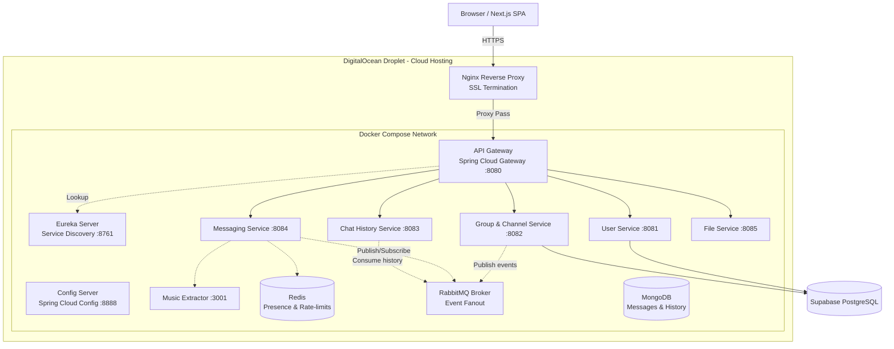

<div align="center">

# 💬 MiniDiscord

**A full-stack Discord clone built with Java Microservices & Next.js**

Real-time chat · Microservices architecture · Cloud-native deployment

[](https://github.com/PhatNguyenTT2/MiniDiscord/actions/workflows/deploy-backend.yml)

[Live Demo](https://minidiscord.vercel.app) · [API Endpoint](https://api.tuelord.site) · [Documentation](docs/)

</div>

---

## 🎯 Overview

MiniDiscord is a **multi-user chat server** inspired by Discord, designed as a highly scalable microservices system. It leverages real-time WebSocket communication, event-driven state orchestration via RabbitMQ, centralized service registry, and distributed persistence. The project demonstrates enterprise-grade backend patterns alongside a modern, fully-reactive frontend.

### Architecture at a Glance



---

## ✨ Features

### 🔐 Authentication & Users
- [x] **Email & Password**: Classical registration and login.
- [x] **Google OAuth 2.0**: Quick sign-up and authentication.
- [x] **Stateless Security**: JWT tokens with flexible duration.
- [x] **Profile Setup**: Manage display names, customize profile decorator frames, and upload status/avatars.

### 💬 Real-Time Messaging & Chat
- [x] **STOMP over WebSocket**: Instant, low-latency messaging.
- [x] **Typing Indicator**: Real-time broadcast showing who is typing in the channel.
- [x] **Reactions & Interactions**: Fast reaction emojis, replies, and pinned messages.
- [x] **Message Forwarding**: Share messages across servers or direct channels.
- [x] **Synchronized Deletion**: 
  - *Delete For Me* (restores local privacy in DMs and servers).
  - *Delete For Everyone* (broadcasts soft-delete flag, sanitizing content on the backend and leaving an elegant placeholder).

### 🎙️ HD Voice & Music Bot
- [x] **Voice Channels**: Low-latency voice conference rooms with active participant display.
- [x] **User Volume Controls**: Adjust the volume level on a per-member basis or mute them locally.
- [x] **Music Bot Playback**: Add a music bot to the voice channel (`/play <URL>`).
- [x] **Playback Control**: Control the queue (`/skip`, `/stop`, `/queue`) fetching audio streams and syncing them in real-time.

### � Servers & Permissions
- [x] **Server Management**: Create, customize, and manage servers & channels.
- [x] **Role Hierarchy**: Structured permissions (Owner, Admin, Member) with custom role configs.
- [x] **Invite Link Management**: Generate temporary/permanent join invitations complete with use counters.
- [x] **Cascade Destruction**: Leaving a server as the sole remaining owner automatically initiates a cascading database deletion of the server.

---

## 🛠️ Tech Stack

| Layer | Technology | Purpose |
|-------|-----------|---------|
| **Frontend** | React 19, Next.js 16 (App Router), Zustand, Tailwind CSS | UI rendering, client-side store logic, dark-mode design system |
| **API Gateway** | Spring Cloud Gateway | Path routing, JWT validation filter, CORS handling, rate-limiting |
| **Service Register** | Netflix Eureka | Dynamic microservice orchestration and status checkups |
| **Relational DB** | Supabase (PostgreSQL) | ACID transactions for User accounts, Servers, Roles and Room Memberships |
| **NoSQL DB** | MongoDB | Document storage optimized for cursor-paginated chat logs and message reactions |
| **Memory Cache** | Redis | In-memory distributed lock and temporary status presence tracker |
| **Message Broker** | RabbitMQ | Handles asynchronous service communication and WebSocket STOMP broadcasting |
| **Storage CDN** | Backblaze B2 | Reliable file-sharing, image uploads and attachments storage |
| **Audio Extractor** | Node.js + `play-dl` | Resolves YouTube URLs into raw audio streams for voice channel playback |

---

## 📁 Project Structure

```
MiniDiscord/
├── frontend/                      # Next.js Application
│   ├── app/                       # Routing pages
│   ├── components/                # Modular visual components
│   ├── stores/                    # Zustand stores (chatStore, voiceStore, etc.)
│   └── dictionaries/              # Multilingual translations (en.json, vi.json)
│
├── backend/                       # Java Microservices (Maven Multi-Module)
│   ├── common-lib/                # Shared utilities, JwtUtil, DTOs & exceptions
│   ├── discovery-server/          # Eureka registry (:8761)
│   ├── config-server/             # Distributed config loader (:8888)
│   ├── api-gateway/               # Spring Cloud Gateway (:8080)
│   ├── user-service/              # Account & Authentication (:8081)
│   ├── group-channel-service/     # Guilds, rooms, memberships, invitations (:8082)
│   ├── chat-history-service/      # paginated MongoDB messages (:8083)
│   ├── messaging-service/         # STOMP WebSocket server & Voice coordination (:8084)
│   ├── file-service/              # File uploads to Backblaze B2 (:8085)
│   ├── music-extractor/           # Node.js play-dl extractor (:3001)
│   └── docker-compose.yml         # Local stack orchestration configuration
│
└── docs/                          # Architecture details and deployment instructions
```

---

## 🚀 Getting Started

### Prerequisites
- **Java 17 & Maven 3.9** (or Docker to run multi-stage packaging)
- **Node.js 18+ & npm**
- **Docker / Docker Compose**

### Running the Project Locally

**1. Set up Environment Variables**
Configure a `.env` file inside the `backend` directory. Reference `backend/.env` for a list of required variables (such as `JWT_SECRET`, `GOOGLE_CLIENT_ID`, etc.).

**2. Spin Up Infrastructure & Microservices**
Deploy all database and message brokers, then build the service jar files and spin up the backend:
```bash
cd backend

# Build containers compiling Java jars internally
docker compose build

# Launch the entire backend topology
docker compose up -d
```

**3. Run the Frontend**
```bash
cd ../frontend
npm install
npm run dev
```
Open [http://localhost:3000](http://localhost:3000) to view the client dashboard.

---

## 📊 API & Signaling Gateway Reference

### Popular HTTP Gateway Operations (`:8080`)

| Method | Route | Purpose | Authorization |
|--------|-------|---------|---------------|
| `POST` | `/api/auth/register` | Create a new user profile | None |
| `POST` | `/api/auth/login` | Return JWT token on valid credentials | None |
| `POST` | `/api/auth/google` | Exchange Google OAuth code for session token | None |
| `GET`  | `/api/users/me` | Return active user information | JWT User |
| `GET`  | `/api/messages/search` | Search message history using text & filters | JWT User |
| `POST` | `/api/rooms/{id}/leave` | Drop server membership (cascade delete if empty owner) | JWT User |

### Real-Time WebSocket Events (`:8084/ws`)

| Destination / Topic | Event Type | Description |
|---------------------|------------|-------------|
| `/app/chat.send` | Client Output | Send a message to a channel |
| `/topic/room.{roomId}` | Server Broadcast | Broadcast real-time chats, messages and edits |
| `/topic/typing.{roomId}` | Server Broadcast | Broadcast typing indicators for channel members |
| `/topic/voice.{roomId}` | Server Broadcast | Sync voice state join/leaves and volume properties |

---

## 📄 Documentation Indices

- [Master Architecture & Database Plan](docs/plan.md)
- [Production Deployment Report](docs/deploy/report.md)
- [Infrastructure Setup & Verification Guide](docs/deploy/infrastructure_verification.md)
- [DevOps CI/CD Custom Pipeline Breakdown](docs/deploy/devops_deep_dive.md)

---

## 👨‍💻 Primary Authors

- **Phat Nguyen** — [GitHub Page](https://github.com/PhatNguyenTT2)

<div align="center">

Built with ☕ Java · ⚛️ React · 🐳 Docker · ☁️ DigitalOcean · 🍃 MongoDB · 🐇 RabbitMQ

</div>
