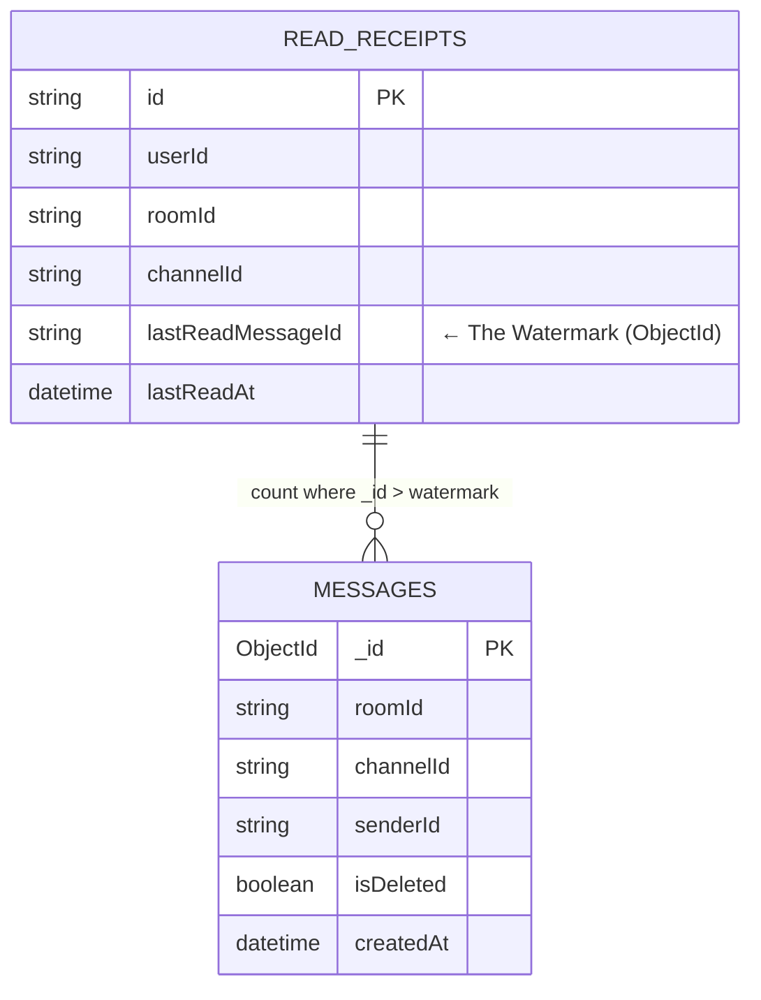
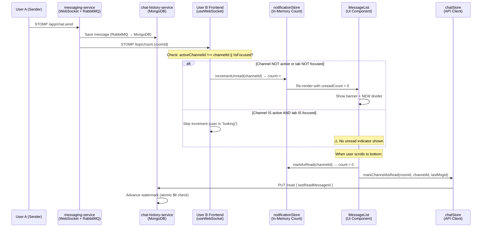
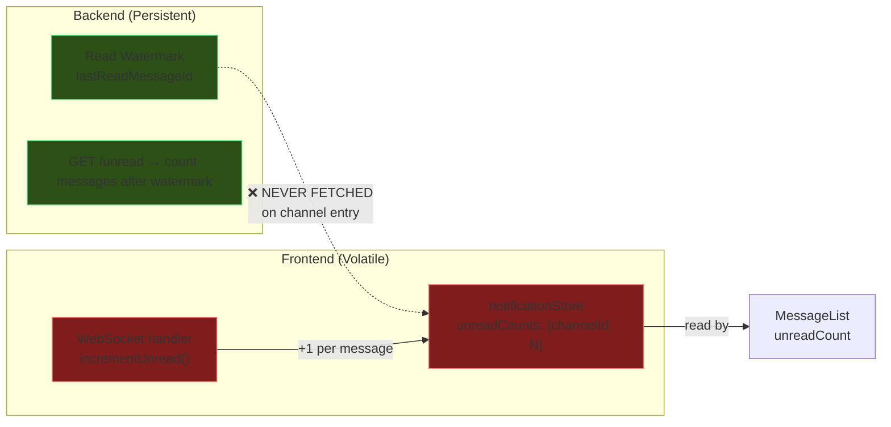

# Technical Report: Unread Message System Architecture

## 1. Current Mechanism: Watermark + Ephemeral Count Hybrid

MiniDiscord uses a **hybrid** of both approaches — watermark on the backend, ephemeral counting on the frontend. This is actually a sound architectural choice, but the two layers are currently **disconnected**.

### Backend: Watermark (Authoritative)

The `chat-history-service` stores a **Read Watermark** per user per channel:



**How unread count is computed** (not stored):

```java
// ReadReceiptService.getUnreadCount()
query.addCriteria(Criteria.where("_id").gt(new ObjectId(lastReadMessageId)));
query.limit(UNREAD_CAP); // 100
long count = mongoTemplate.count(query, "messages");
```

> [!IMPORTANT]
> The backend **never stores a count** — it computes it on-demand by counting messages after the watermark. This is the correct watermark pattern.

**Atomic watermark advancement** — prevents stale writes from slow tabs:

```java
// ReadReceiptRepository — only updates if new ID > current
@Query("{ 'userId': ?0, 'channelId': ?1, 'lastReadMessageId': { '$lt': ?2 } }")
@Update("{ '$set': { 'lastReadMessageId': ?2, 'lastReadAt': ?3 } }")
long updateLastReadIfNewer(String userId, String channelId, String newReadId, LocalDateTime now);
```

### Frontend: Ephemeral Counting (Volatile)

The `notificationStore` maintains an **in-memory counter** per channel:

```typescript
// notificationStore — volatile, resets on page refresh
unreadCounts: Record<string, number>  // { channelId: count }
incrementUnread(id)    // +1 on WebSocket message
markAsRead(id)         // reset to 0
```

This counter is populated **only** by WebSocket [incrementUnread](file:///e:/UIT/cv/MiniDiscord/frontend/stores/notificationStore.ts#53-61) events during the session. It is **never hydrated from the backend watermark**.

---

## 2. Data Flow: Full Lifecycle



---

## 3. The Disconnection — Root Cause of All 3 Bugs



| Bug | Disconnection Point |
|-----|-------------------|
| **Bug 1**: Auto-marked read on unfocused tab | `handleScroll` doesn't check `document.hasFocus()` → auto-scroll triggers clearance |
| **Bug 2**: Need scroll to trigger | `notificationStore` is always 0 on entry (no backend hydration) |
| **Bug 3**: No unread on entry | [fetchUnreadCount](file:///e:/UIT/cv/MiniDiscord/frontend/stores/chatStore.ts#76-89) exists in `chatStore` but is **never called** |

---

## 4. Industry Standards Comparison

| Aspect | Discord | MiniDiscord (Current) | MiniDiscord (After Fix) |
|--------|---------|----------------------|------------------------|
| **Backend Mechanism** | Watermark (`last_read_id`) | ✅ Watermark (`lastReadMessageId`) | Same |
| **Frontend Hydration** | Fetch watermark on channel entry | ❌ Never fetches | ✅ Fetch on entry |
| **Real-time Updates** | WebSocket increment | ✅ WebSocket increment | Same |
| **Tab Focus Handling** | Only mark read if focused | ❌ Marks read even if unfocused | ✅ `hasFocus()` guard |
| **Cross-tab Sync** | `READ_RECEIPT_ACK` via WS | ❌ No cross-tab sync | ❌ Future improvement |
| **Debouncing** | ~1-2s debounce | ✅ 500ms debounce | Same |

> [!NOTE]
> **Cross-tab sync** (where reading in Tab 1 clears unread in Tab 2) is a future enhancement. The backend would need to broadcast a `READ_RECEIPT_ACK` event via WebSocket back to all connected sessions of the same user. This is out of scope for the current bugfix.

---

## 5. Circular Dependency Analysis

**Question from review**: Is `chatStore ↔ notificationStore` circular?

```
chatStore.ts     → imports: authStore, api (static)
                 → imports: notificationStore (dynamic, line 99)
notificationStore.ts → imports: nothing from other stores
```

**Answer: No circular dependency.** `notificationStore` is a leaf node — it doesn't import any other store. The dynamic import in `chatStore.markChannelAsRead` was a defensive measure, not a necessity. **Static import is safe and eliminates the micro-delay noted in the review.**
