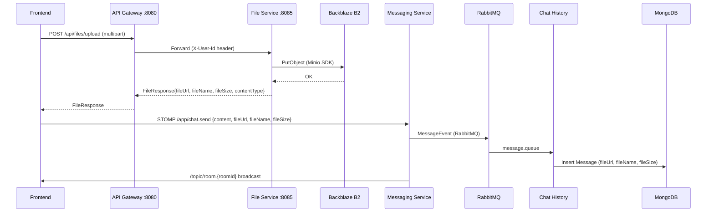

# Kết nối tính năng gửi file: Frontend ↔ File-Service ↔ B2

## Tổng quan

Sau khi phân tích toàn bộ codebase, pipeline gửi file đã được **xây dựng ~95%** end-to-end. Dưới đây là trạng thái hiện tại và các gap cần xử lý.

### Kiến trúc hiện tại (đã hoạt động)



### Trạng thái từng layer

| Layer | File | Status | Ghi chú |
|-------|------|--------|---------|
| **File Service** | [StorageService.java](file:///e:/UIT/cv/MiniDiscord/backend/file-service/src/main/java/com/discordmini/file/service/StorageService.java) | ✅ Hoàn chỉnh | Upload B2, validate MIME, return FileResponse |
| **File Service** | [FileController.java](file:///e:/UIT/cv/MiniDiscord/backend/file-service/src/main/java/com/discordmini/file/controller/FileController.java) | ✅ Hoàn chỉnh | POST `/api/files/upload`, DELETE `/api/files` |
| **File Service** | [SecurityHeaderFilter.java](file:///e:/UIT/cv/MiniDiscord/backend/file-service/src/main/java/com/discordmini/file/config/SecurityHeaderFilter.java) | ✅ Hoàn chỉnh | Enforce X-User-Id header |
| **API Gateway** | [application.yml](file:///e:/UIT/cv/MiniDiscord/backend/api-gateway/target/classes/application.yml) | ✅ Hoàn chỉnh | Route `/api/files/**` → file-service |
| **API Gateway** | [JwtAuthFilter.java](file:///e:/UIT/cv/MiniDiscord/backend/api-gateway/src/main/java/com/discordmini/gateway/filter/JwtAuthFilter.java) | ✅ Hoàn chỉnh | Extract JWT → inject X-User-Id |
| **Docker** | [docker-compose.yml](file:///e:/UIT/cv/MiniDiscord/backend/docker-compose.yml) | ✅ Hoàn chỉnh | file-service container defined |
| **Common Lib** | [MessageEvent.java](file:///e:/UIT/cv/MiniDiscord/backend/common-lib/src/main/java/com/discordmini/common/event/MessageEvent.java) | ✅ Hoàn chỉnh | fileUrl, fileName, fileSize fields |
| **Messaging** | [ChatMessage.java](file:///e:/UIT/cv/MiniDiscord/backend/messaging-service/src/main/java/com/discordmini/messaging/model/dto/ChatMessage.java) | ✅ Hoàn chỉnh | fileUrl, fileName, fileSize, type fields |
| **Messaging** | [ChatWebSocketController.java](file:///e:/UIT/cv/MiniDiscord/backend/messaging-service/src/main/java/com/discordmini/messaging/controller/ChatWebSocketController.java) | ✅ Hoàn chỉnh | Maps all file fields → MessageEvent |
| **Chat History** | [Message.java](file:///e:/UIT/cv/MiniDiscord/backend/messaging-service/src/main/java/com/discordmini/messaging/model/dto/ChatMessage.java) (MongoDB) | ✅ Hoàn chỉnh | fileUrl, fileName, fileSize fields |
| **Chat History** | [MessageEventListener.java](file:///e:/UIT/cv/MiniDiscord/backend/chat-history-service/src/main/java/com/discordmini/chathistory/listener/MessageEventListener.java) | ✅ Hoàn chỉnh | Persists all file fields |
| **Frontend** | [fileStore.ts](file:///e:/UIT/cv/MiniDiscord/frontend/stores/fileStore.ts) | ✅ Hoàn chỉnh | Upload + progress tracking |
| **Frontend** | [MessageInput.tsx](file:///e:/UIT/cv/MiniDiscord/frontend/components/chat/MessageInput.tsx) | ✅ Hoàn chỉnh | Attachment UI, preview, progress bar |
| **Frontend** | [MessageItem.tsx](file:///e:/UIT/cv/MiniDiscord/frontend/components/chat/MessageItem.tsx) | ✅ Hoàn chỉnh | Render image + generic file |
| **Frontend** | [message.ts](file:///e:/UIT/cv/MiniDiscord/frontend/types/message.ts) (types) | ✅ Hoàn chỉnh | fileUrl, fileName, fileSize, type fields |
| **Frontend** | [useWebSocket.ts](file:///e:/UIT/cv/MiniDiscord/frontend/hooks/useWebSocket.ts) | ✅ Hoàn chỉnh | Maps fileUrl/fileName/fileSize from STOMP |
| **Frontend** | Channel page STOMP | ✅ Hoàn chỉnh | Sends attachment data in payload |
| **Frontend** | DM page STOMP | ✅ Hoàn chỉnh | Sends attachment + optimistic message |

---

## Các Gap cần xử lý

### Gap 1: Message `type` không tự động set thành `FILE`

> [!IMPORTANT]
> **ChannelPage** (`[serverId]/[channelId]/page.tsx`) không set `type` trong STOMP payload khi có attachment. Backend default là `"TEXT"` nếu client không gửi type.

**Hiện tại:** Cả channel page và DM page đều không gửi `type: "FILE"` trong STOMP payload khi có attachment.

**Impact:** Backend lưu message với `type: "TEXT"` thay vì `"FILE"` → query/filter by type sẽ sai.

**Fix:**
- Channel page: Thêm `type: attachment ? "FILE" : "TEXT"` vào STOMP payload
- DM page: Đã có `type` trong optimistic message nhưng thiếu trong STOMP payload → cần thêm

---

### Gap 2: Channel page thiếu optimistic message cho file

> [!WARNING]
> Channel page (`[serverId]/[channelId]/page.tsx`) gửi STOMP nhưng KHÔNG tạo optimistic message. DM page thì có. Khi gửi file (mất vài giây upload), người dùng sẽ không thấy message nhảy lên ngay.

**Fix:** Thêm optimistic message creation trong `handleSend` của channel page, tương tự DM page.

---

### Gap 3: Video embed chưa render

**Hiện tại:** [MessageItem.tsx](file:///e:/UIT/cv/MiniDiscord/frontend/components/chat/MessageItem.tsx) chỉ render image (`.jpeg|.jpg|.gif|.png|.webp`), tất cả file khác (kể cả video) render như generic file download.

**Fix:** Thêm video embed tương tự Discord — check extension `.mp4|.webm|.mov` → render `<video>` tag.

---

### Gap 4: File-service [.env](file:///e:/UIT/cv/MiniDiscord/backend/file-service/.env) credentials trong docker-compose

**Hiện tại:** [docker-compose.yml](file:///e:/UIT/cv/MiniDiscord/backend/docker-compose.yml) dùng `env_file: .env` cho file-service → load từ root [backend/.env](file:///e:/UIT/cv/MiniDiscord/backend/.env). File-service cũng có riêng [file-service/.env](file:///e:/UIT/cv/MiniDiscord/backend/file-service/.env).

**Cần verify:** Kiểm tra [backend/.env](file:///e:/UIT/cv/MiniDiscord/backend/.env) có chứa B2 credentials không, vì docker-compose resolve [.env](file:///e:/UIT/cv/MiniDiscord/backend/file-service/.env) relative to compose file location.

---

## Proposed Changes

### Frontend — Message Flow

#### [MODIFY] [page.tsx](file:///e:/UIT/cv/MiniDiscord/frontend/app/(main)/channels/[serverId]/[channelId]/page.tsx)

1. Thêm `type: "FILE" | "TEXT"` vào STOMP publish payload dựa trên attachment
2. Thêm optimistic message creation (import [addOptimisticMessage](file:///e:/UIT/cv/MiniDiscord/frontend/stores/chatStore.ts#206-233) từ chatStore)

```diff
 const payload = {
   roomId,
   channelId,
   content,
+  type: attachment ? "FILE" : "TEXT",
   senderName: currentUser?.username || "User",
   senderAvatar: currentUser?.avatarUrl || null,
   fileUrl: attachment?.fileUrl,
   fileName: attachment?.fileName,
   fileSize: attachment?.fileSize,
   replyTo: ...
 };
+
+// Optimistic message
+const optimisticMsg = {
+  id: `optimistic-${Date.now()}`,
+  roomId, channelId,
+  senderId: currentUser?.id || "",
+  senderName: currentUser?.username || "",
+  senderAvatar: currentUser?.avatarUrl || null,
+  type: attachment ? "FILE" : "TEXT",
+  content, fileUrl: attachment?.fileUrl || null,
+  fileName: attachment?.fileName || null,
+  fileSize: attachment?.fileSize || null,
+  reactions: [], isEdited: false, isDeleted: false,
+  editedAt: null,
+  createdAt: new Date().toISOString(),
+  replyTo: payload.replyTo,
+};
+addOptimisticMessage(channelId, optimisticMsg);
```

---

#### [MODIFY] [page.tsx](file:///e:/UIT/cv/MiniDiscord/frontend/app/(main)/channels/me/[userId]/page.tsx)

1. Thêm `type` vào STOMP publish payload (hiện chỉ có trong optimistic, thiếu trong actual publish)

```diff
 const payload = {
   roomId: activeRoomId,
   channelId: activeChannelId,
   content,
+  type: attachment ? "FILE" : "TEXT",
   senderName: currentUser?.username,
   ...
 };
```

---

### Frontend — Rendering

#### [MODIFY] [MessageItem.tsx](file:///e:/UIT/cv/MiniDiscord/frontend/components/chat/MessageItem.tsx)

Thêm video embed rendering cho `.mp4|.webm|.mov`:

```diff
 {message.fileUrl && (
   <div className="mt-2">
-    {message.fileUrl.match(/\.(jpeg|jpg|gif|png|webp)$/i) ? (
+    {message.fileUrl.match(/\.(jpeg|jpg|gif|png|webp)$/i) ? (
       <a href={message.fileUrl} ...>
         
       </a>
+    ) : message.fileUrl.match(/\.(mp4|webm|mov)$/i) ? (
+      <video
+        src={message.fileUrl}
+        controls
+        className="max-w-full sm:max-w-[400px] max-h-[300px] rounded-md shadow-sm border border-border/50"
+        preload="metadata"
+      />
     ) : (
       <a href={message.fileUrl} ...> {/* generic file */} </a>
     )}
   </div>
 )}
```

---

### Backend — Không cần thay đổi

Backend đã xử lý hoàn chỉnh:
- [ChatWebSocketController](file:///e:/UIT/cv/MiniDiscord/backend/messaging-service/src/main/java/com/discordmini/messaging/controller/ChatWebSocketController.java#21-105) → maps tất cả file fields từ ChatMessage DTO
- [MessageEventListener](file:///e:/UIT/cv/MiniDiscord/backend/chat-history-service/src/main/java/com/discordmini/chathistory/listener/MessageEventListener.java#15-61) → persists fileUrl/fileName/fileSize vào MongoDB
- [StorageService](file:///e:/UIT/cv/MiniDiscord/backend/file-service/src/main/java/com/discordmini/file/service/StorageService.java#20-165) → upload + validate + return B2 URL
- API Gateway → route `/api/files/**` với JWT auth

---

## Verification Plan

### Existing Unit Tests (Backend)

File-service đã có test sẵn:

```bash
# Chạy từ backend root directory
cd e:\UIT\cv\MiniDiscord\backend
mvn -pl common-lib,file-service -am test
```

Test coverage hiện tại:
- [FileControllerTest.java](file:///e:/UIT/cv/MiniDiscord/backend/file-service/src/test/java/com/discordmini/file/controller/FileControllerTest.java) — Upload success, missing header, validation fail, delete
- [StorageServiceTest.java](file:///e:/UIT/cv/MiniDiscord/backend/file-service/src/test/java/com/discordmini/file/service/StorageServiceTest.java) — Service layer tests
- [SecurityHeaderFilterTest.java](file:///e:/UIT/cv/MiniDiscord/backend/file-service/src/test/java/com/discordmini/file/config/SecurityHeaderFilterTest.java) — Header validation

### Manual Browser Testing

> [!IMPORTANT]
> **Yêu cầu**: Docker đang chạy (`docker compose up --build`) + Frontend dev server (`npm run dev`)

**Test 1: Upload + Gửi ảnh trong Server Channel**
1. Mở browser → đăng nhập → vào bất kỳ server channel nào
2. Click nút **+** (đính kèm) → chọn **Upload Image**
3. Chọn file `.png` hoặc `.jpg` (< 25MB)
4. Verify: Preview ảnh hiển thị trong input area với progress bar
5. Gõ text (tùy chọn) → nhấn Enter
6. Verify: Message hiện ngay (optimistic) sau đó được thay thế bởi real message
7. Verify: Ảnh hiển thị inline (không phải generic file icon)
8. Refresh trang → Verify ảnh vẫn hiển thị (persisted in MongoDB)

**Test 2: Upload file trong DM**
1. Mở DM với bất kỳ user nào
2. Click **+** → **Upload File** → chọn file `.pdf`
3. Verify: Preview hiển thị file icon + tên file
4. Nhấn Enter → Verify: Message hiện với file card (icon + tên + kích thước)
5. Click vào file → Verify: mở link B2 trong tab mới

**Test 3: Upload video (sau khi thêm video embed)**
1. Upload file `.mp4` trong channel hoặc DM
2. Verify: Video hiển thị với `<video>` player controls (không phải generic icon)
3. Nhấn play → video chạy inline

**Test 4: Error handling**
1. Thử upload file `.exe` → Verify: Error message hiển thị
2. Thử upload file > 25MB → Verify: Error message hiển thị
