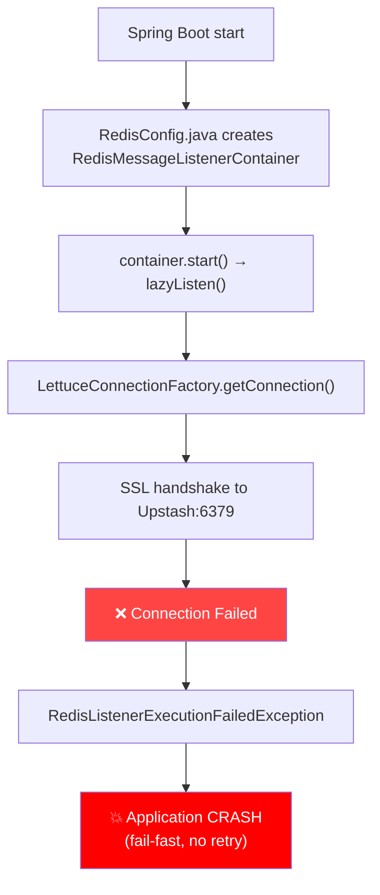

# Fix messaging-service Crash Loop + Gateway Redis SSL

## Root Cause Analysis

### Tại sao chạy local OK, production CRASH?

| Môi trường | Redis | SSL | Pub/Sub | Kết quả |
|------------|-------|-----|---------|---------|
| **Local** | Docker container `redis:7-alpine` | ❌ Off | ✅ Native | ✅ OK |
| **Production** | Upstash `up-primate-97930.upstash.io` | ✅ Required | ✅ Supported | 💥 CRASH |

### Chuỗi sự kiện crash



### Tại sao user-service (cũng dùng Upstash) lại healthy?

| Feature | user-service | messaging-service |
|---------|-------------|-------------------|
| Redis operations | `RedisTemplate` (lazy connection) | `RedisTemplate` + **`RedisMessageListenerContainer`** |
| Connection timing | Kết nối **khi cần** (first request) | Kết nối **ngay lúc startup** (blocking) |
| Failure behavior | Graceful — retry on next request | **Fail-fast** — crash app immediately |

> [!IMPORTANT]
> `RedisMessageListenerContainer` (dùng cho Pub/Sub `typing:*`, `presence:*`) yêu cầu kết nối Redis **ngay lập tức** khi Spring context khởi tạo. Nếu kết nối thất bại → crash toàn bộ app.

---

## 🔍 Phát hiện thêm: api-gateway Redis SSL cũng sai!

[application-prod.yml:41](file:///e:/UIT/cv/MiniDiscord/backend/api-gateway/src/main/resources/application-prod.yml#L41) hiện tại:

```yaml
ssl:
  enabled: false  # Redis container cùng mạng Docker, không cần TLS
```

> [!WARNING]
> Production **KHÔNG CÓ** Redis container. Tất cả service dùng **Upstash** (yêu cầu SSL). Comment nói "cùng mạng Docker" là **sai** — đây là config sai từ trước.
> 
> Gateway rate limiting đang **silently broken** vì không kết nối được Redis.

---

## Proposed Changes

### 1. Tạo `application-prod.yml` cho messaging-service

#### [NEW] [application-prod.yml](file:///e:/UIT/cv/MiniDiscord/backend/messaging-service/src/main/resources/application-prod.yml)

Tạo production profile với Redis SSL enabled và RabbitMQ SSL enabled:

```yaml
# === PRODUCTION PROFILE ===
spring:
  data:
    redis:
      host: ${REDIS_HOST}
      port: ${REDIS_PORT:6379}
      password: ${REDIS_PASSWORD}
      ssl:
        enabled: true
  rabbitmq:
    ssl:
      enabled: true

eureka:
  client:
    enabled: true
    service-url:
      defaultZone: ${EUREKA_URL:http://discovery-server:8761/eureka/}

server:
  port: ${PORT:8084}
```

---

### 2. Thêm resilience cho `RedisMessageListenerContainer`

#### [MODIFY] [RedisConfig.java](file:///e:/UIT/cv/MiniDiscord/backend/messaging-service/src/main/java/com/discordmini/messaging/config/RedisConfig.java)

Thêm `recoveryInterval` để container retry thay vì crash khi kết nối Redis thất bại lúc startup:

```diff
  RedisMessageListenerContainer container = 
      new RedisMessageListenerContainer();
  container.setConnectionFactory(connectionFactory);
+ // Retry every 5s on connection failure instead of crashing the app
+ container.setRecoveryInterval(5000L);
  container.addMessageListener(pubSubService, new PatternTopic("typing:*"));
  container.addMessageListener(pubSubService, new PatternTopic("presence:*"));
```

---

### 3. Fix api-gateway Redis SSL

#### [MODIFY] [application-prod.yml](file:///e:/UIT/cv/MiniDiscord/backend/api-gateway/src/main/resources/application-prod.yml)

```diff
  data:
    redis:
      host: ${REDIS_HOST:redis}
      port: ${REDIS_PORT:6379}
      password: ${REDIS_PASSWORD:}
      ssl:
-       enabled: false  # Redis container cùng mạng Docker, không cần TLS
+       enabled: ${REDIS_SSL:true}
```

---

## Verification Plan

### Automated Tests
```bash
# Build check — ensure no compilation errors
cd backend/messaging-service
mvn compile -q

# Existing tests should still pass (they use local/mock Redis)
mvn test -q
```

### Manual Verification (on server)
```bash
# After CI/CD builds new images:
cd /opt/minidiscord
docker compose -f docker-compose.prod.yml pull
docker compose -f docker-compose.prod.yml up -d

# Check messaging-service is healthy (not restarting)
docker ps | grep messaging
# Should show: (healthy) instead of (health: starting) or restarting

# Check logs for successful Redis connection
docker logs minidiscord-messaging --tail 50
# Should NOT show RedisConnectionFailureException

# Check gateway rate limiting works
docker logs minidiscord-gateway --tail 20
```
