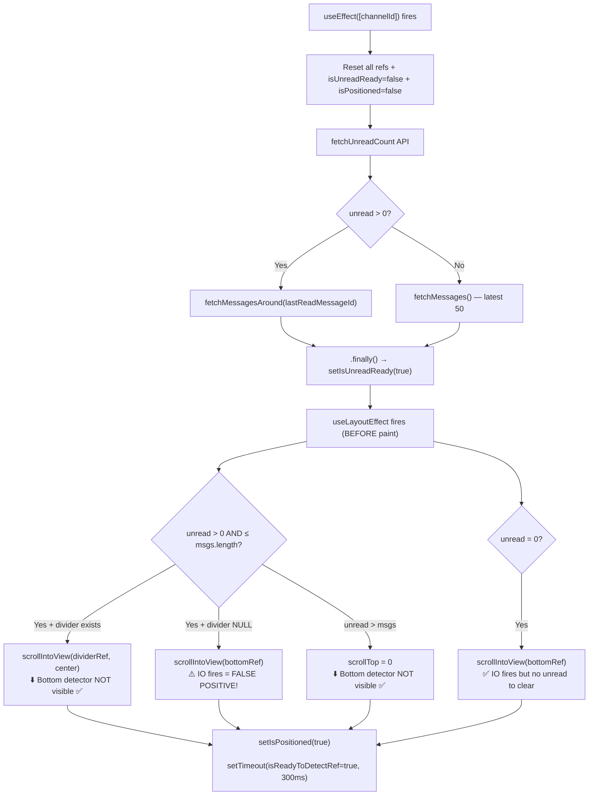

# Watermark Simplification — Implementation Plan v3

## Mục tiêu

**2 trigger duy nhất cập nhật watermark:**
1. **Scroll-to-bottom** — IntersectionObserver (zero re-render) + `isReadyToDetectRef` immunity gate
2. **Explicit "Đánh dấu đã đọc"** — click button trên banner

---

## Initial Load Sequence — Chi tiết



> [!CAUTION]
> **False-positive case**: Khi unread > 0 nhưng `unreadDividerRef.current === null` (divider chưa render kịp), code fallback xuống `scrollToBottom` → IO fire → xóa nhầm unread. **Fix**: `isReadyToDetectRef` gate block IO callback cho đến 300ms sau initial scroll.

---

## Proposed Changes

### Backend: chat-history-service

---

#### [MODIFY] [ReadReceiptRepository.java](file:///e:/UIT/cv/MiniDiscord/backend/chat-history-service/src/main/java/com/discordmini/chathistory/repository/ReadReceiptRepository.java)

**Xóa** [updateLastReadIfNewer](file:///e:/UIT/cv/MiniDiscord/backend/chat-history-service/src/main/java/com/discordmini/chathistory/repository/ReadReceiptRepository.java#17-21) custom query (string `$lt`). Logic chuyển sang [ReadReceiptService](file:///e:/UIT/cv/MiniDiscord/backend/chat-history-service/src/main/java/com/discordmini/chathistory/service/ReadReceiptService.java#17-111).

---

#### [MODIFY] [ReadReceiptService.java](file:///e:/UIT/cv/MiniDiscord/backend/chat-history-service/src/main/java/com/discordmini/chathistory/service/ReadReceiptService.java)

1. **Sửa [markAsRead()](file:///e:/UIT/cv/MiniDiscord/backend/chat-history-service/src/main/java/com/discordmini/chathistory/controller/MessageController.java#88-98)** — resolve UUID→ObjectId bằng [tryParseObjectId](file:///e:/UIT/cv/MiniDiscord/backend/chat-history-service/src/main/java/com/discordmini/chathistory/service/ReadReceiptService.java#102-110) + fallback lookup. So sánh ObjectId native thay vì string `$lt`.

2. **Thêm `markAsUnread(userId, roomId, channelId, targetMessageId)`**:
   - Verify membership → resolve targetMessageId → ObjectId
   - Tìm message **TRƯỚC** target (`_id < targetId`, sort desc, limit 1)
   - Update `ReadReceipt.lastReadMessageId = previousMessage._id`
   - Nếu target = message đầu tiên → delete ReadReceipt
   - Return [ReadReceiptResponse](file:///e:/UIT/cv/MiniDiscord/backend/chat-history-service/src/main/java/com/discordmini/chathistory/model/dto/ReadReceiptResponse.java#8-19)

---

#### [MODIFY] [MessageController.java](file:///e:/UIT/cv/MiniDiscord/backend/chat-history-service/src/main/java/com/discordmini/chathistory/controller/MessageController.java)

Thêm endpoint `PUT /rooms/{roomId}/channels/{channelId}/mark-unread` nhận `{ messageId }`, trả về [ReadReceiptResponse](file:///e:/UIT/cv/MiniDiscord/backend/chat-history-service/src/main/java/com/discordmini/chathistory/model/dto/ReadReceiptResponse.java#8-19).

---

### Frontend: Stores

---

#### [MODIFY] [chatStore.ts](file:///e:/UIT/cv/MiniDiscord/frontend/stores/chatStore.ts)

Thêm `markChannelAsUnread(roomId, channelId, messageId)` → gọi API + sync `notificationStore`.

#### [MODIFY] [notificationStore.ts](file:///e:/UIT/cv/MiniDiscord/frontend/stores/notificationStore.ts)

**Xóa** [setUnreadFromMessage](file:///e:/UIT/cv/MiniDiscord/frontend/stores/notificationStore.ts#74-82) — không còn tính unread từ frontend index.

---

### Frontend: MessageList.tsx — Core Refactor

#### [MODIFY] [MessageList.tsx](file:///e:/UIT/cv/MiniDiscord/frontend/components/chat/MessageList.tsx)

##### XÓA:
| Target | Lý do |
|---|---|
| `scrollDismissTimerRef` + 500ms timer (L105, L285-299) | Thay bằng IO |
| `initialScrollCompleteRef` (L94, L139, L228, L281, L303) | Thay bằng `isReadyToDetectRef` |
| `unreadCountRef` sync effect (L110-114) | Không subscribe scroll vào unread |
| `syncBackendRead` callback (L125-128) | Logic chuyển vào IO callback |
| `handleScroll` auto-dismiss portion (L281-299) | Xóa hoàn toàn |

##### GIỮ (rename cho rõ ràng):
| Ref | Mục đích |
|---|---|
| `hasReachedBottomRef` | Guard cleanup khi leave channel |
| `manuallyMarkedUnreadRef` *(rename)* | Bảo vệ "Mark as Unread" khỏi cleanup + IO |
| `isAtBottomRef` | Scroll-to-bottom button + auto-scroll new msgs |
| `isFetchingOlderRef` | Infinite scroll up lock |

##### THÊM — `isReadyToDetectRef` + IntersectionObserver:

```typescript
const bottomDetectorRef = useRef<HTMLDivElement>(null);
const isReadyToDetectRef = useRef(false);
```

**Trong `useLayoutEffect` initial scroll** — set immunity gate **sau khi scroll xong**:
```typescript
// Sau tất cả các branch scrollIntoView:
setIsPositioned(true);
setTimeout(() => { isReadyToDetectRef.current = true; }, 300);
```

**Trong channel reset `useEffect`** — reset gate:
```typescript
isReadyToDetectRef.current = false; // Reset immunity gate
```

**IntersectionObserver effect** — chỉ fire mark-as-read khi qua immunity gate:
```typescript
useEffect(() => {
    const el = bottomDetectorRef.current;
    if (!el) return;
    
    const observer = new IntersectionObserver(([entry]) => {
        if (entry.isIntersecting) {
            hasReachedBottomRef.current = true;
            isAtBottomRef.current = true;
            onScrollStateChange?.(true);
            
            // IMMUNITY GATE: Block auto mark-as-read during initial mount
            if (!isReadyToDetectRef.current) return;
            
            const cid = channelIdRef.current;
            if (cid && !manuallyMarkedUnreadRef.current) {
                const currentUnread = useNotificationStore.getState().getUnreadCount(cid);
                if (currentUnread > 0) {
                    markAsRead(cid);
                    setIsDismissed(true);
                    const rId = roomIdRef.current;
                    if (rId && latestMessageIdRef.current) {
                        onMarkAsReadBackend?.(rId, cid, latestMessageIdRef.current);
                    }
                }
            }
        } else {
            isAtBottomRef.current = false;
            onScrollStateChange?.(false);
        }
    }, { threshold: 0.1 });
    
    observer.observe(el);
    return () => observer.disconnect();
}, [channelId]);
```

**JSX** — detector div:
```html
<div ref={bottomDetectorRef} style={{ height: '1px' }} />
<div ref={bottomRef} />
```

##### SỬA — Cleanup:
```typescript
return () => {
    const cid = channelIdRef.current;
    const rId = roomIdRef.current;
    if (cid && rId && hasReachedBottomRef.current && !manuallyMarkedUnreadRef.current) {
        useNotificationStore.getState().markAsRead(cid);
        if (latestMessageIdRef.current) {
            onMarkAsReadBackend?.(rId, cid, latestMessageIdRef.current);
        }
    }
}
```

##### SỬA — `handleScroll` (chỉ giữ infinite scroll up):
```typescript
const handleScroll = useCallback(() => {
    const el = scrollContainerRef.current;
    if (!el || !isReadyToDetectRef.current) return;
    
    if (el.scrollTop < 100 && !isLoading && !isFetchingOlderRef.current
        && messagesRef.current.length > 0 && roomId && channelId) {
        // ... infinite scroll up logic giữ nguyên ...
    }
}, [isLoading, roomId, channelId, fetchMessages]);
```

##### SỬA — `onMarkUnread`:
```typescript
onMarkUnread={() => {
    if (channelId && roomId) {
        manuallyMarkedUnreadRef.current = true;
        setIsDismissed(false);
        useChatStore.getState().markChannelAsUnread(roomId, channelId, msg.id);
    }
}}
```

---

## Verification Plan

### Manual Testing Matrix

| # | Scenario | Initial load | IO fires? | Expected |
|---|---|---|---|---|
| 1 | Channel có unread, divider render OK | Scroll to divider (center) | ❌ (bottom hidden) | Banner hiện, giữ unread |
| 2 | Channel có unread, divider NULL | Scroll to bottom (fallback) | ⚠️ Yes nhưng `isReadyToDetect=false` | **Unread KHÔNG bị xóa** |
| 3 | Channel 0 unread | Scroll to bottom | ✅ Yes nhưng count=0 | Harmless, no action |
| 4 | User scroll đến bottom sau khi xem | IO fires + `isReadyToDetect=true` | ✅ | Mark-as-read + backend sync |
| 5 | Mark as Unread → switch channel | Cleanup checks `manuallyMarkedUnreadRef` | — | **Unread giữ nguyên** |
| 6 | Gửi tin nhắn (auto-scroll bottom) | IO fires via scroll | ✅ | Auto mark-as-read |
| 7 | Scroll gần bottom nhưng CHƯA chạm | IO NOT fires | — | Unread badge giữ nguyên |
| 8 | Mark as Unread → refresh trang | Backend persist | — | Banner vẫn hiện |
