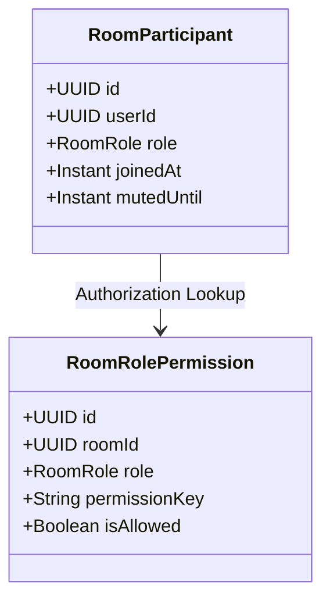

# MiniDiscord Permission System Scan & Gap Analysis Report

This report documents the current implementation progress and architectural status of the permission system in **MiniDiscord**. It reveals existing gaps between the current codebase and the target specifications, and sets forth a systematic technical implementation strategy.

---

## 📸 Overview of Current Implementation

### 1. Backend: Roles & Access Control
Currently, the system defines **three static roles** in `group-channel-service` (`com.discordmini.groupchannel.model.enums.RoomRole`):
- `OWNER`
- `ADMIN`
- `MEMBER`

There is **no dynamic permission model**. All authorization checks are hardcoded programmatically inside backend logic via helper methods in [MembershipService.java](file:///e:/UIT/cv/MiniDiscord/backend/group-channel-service/src/main/java/com/discordmini/groupchannel/service/MembershipService.java):
- [validateAdminOrOwner(roomId, userId)](file:///e:/UIT/cv/MiniDiscord/backend/group-channel-service/src/main/java/com/discordmini/groupchannel/service/MembershipService.java#37-45): Requires `OWNER` or `ADMIN` role.
- [validateOwner(roomId, userId)](file:///e:/UIT/cv/MiniDiscord/backend/group-channel-service/src/main/java/com/discordmini/groupchannel/service/MembershipService.java#56-64): Requires `OWNER` role.
- [checkPinPrivilege(roomId, userId)](file:///e:/UIT/cv/MiniDiscord/backend/group-channel-service/src/main/java/com/discordmini/groupchannel/service/MembershipService.java#46-55): Requires `OWNER` or `ADMIN` for server rooms; normal membership for DM rooms.

### 2. Frontend: Configuration Interface
- **[ServerSettingsModal.tsx](file:///e:/UIT/cv/MiniDiscord/frontend/components/server/ServerSettingsModal.tsx)**: Renders a "Roles" tab listing the [Admin](file:///e:/UIT/cv/MiniDiscord/backend/group-channel-service/src/main/java/com/discordmini/groupchannel/service/MembershipService.java#37-45) and [Member](file:///e:/UIT/cv/MiniDiscord/backend/group-channel-service/src/main/java/com/discordmini/groupchannel/service/MembershipService.java#65-95) roles. It contains a card labeled **"Default Permissions"** (`@everyone`) styled as a click target, but it lacks an `onClick` event handler and does **not** open any configuration view.
- **[EditChannelModal.tsx](file:///e:/UIT/cv/MiniDiscord/frontend/components/server/EditChannelModal.tsx)**: Renders a "Permissions" tab with a "Private Channel" toggle. However, it does not support granular channel settings (e.g., "Xem Kênh", "Quản lý kênh", etc.).

---

## 🚫 Key Gaps & Discrepancies (Target vs. Current Code)

| Requirement / expected feature | Current status in Codebase | Severity / Action Required |
| :--- | :--- | :--- |
| **Owner-only Permission Modifications** | **Not Implemented.** Dynamic role configurations do not exist in the database. Roles have hardcoded capabilities. | 🔴 **Critical Block** - Requires a new permission schema in the database. |
| **Channel Management** | **Partially Implemented.** [validateAdminOrOwner](file:///e:/UIT/cv/MiniDiscord/backend/group-channel-service/src/main/java/com/discordmini/groupchannel/service/MembershipService.java#37-45) checks apply to creation and updating, but [validateOwner](file:///e:/UIT/cv/MiniDiscord/backend/group-channel-service/src/main/java/com/discordmini/groupchannel/service/MembershipService.java#56-64) is hardcoded for channel deletion. Invite generation checks are also static. | 🟡 **Requires alignment** with the new dynamic permissions. |
| **Delete Specific Messages (Moderation)** | **Blocker in `chat-history-service`.** [MessageService.java](file:///e:/UIT/cv/MiniDiscord/backend/chat-history-service/src/main/java/com/discordmini/chathistory/service/MessageService.java) explicitly blocks non-senders: `if (!userId.equals(message.getSenderId())) { throw new ForbiddenException("Only the sender can delete this message..."); }` | 🔴 **Critical Block** - Must allow users with `DELETE_ANY_MESSAGE` permission (Admins/Owners) to delete any message. |
| **Ban Members (Purge Message History)** | **Not Implemented.** There is no ban table or ban service. Message history deletion does not support purging by user ID across a server room, and message masking (showing "Đã bị xóa" [Deleted]) is missing. | 🔴 **Critical Block** - Needs new ban model, worker handlers, and frontend message masking logic. |
| **Restrict Members (Timeout Mute)** | **Partially Defined but Unused.** [RoomParticipant](file:///e:/UIT/cv/MiniDiscord/backend/group-channel-service/src/main/java/com/discordmini/groupchannel/model/entity/RoomParticipant.java#11-42) entity contains a `mutedUntil` timestamp field, but it is never checked, set, or validated in any service, gateway, or WebSocket interceptor. | 🟡 **Needs full wiring** (set timeout API, check in Stomp interceptor/message routing). |
| **Allow Mentions (@everyone, @here)** | **Not Implemented.** The system does not inspect message contents for mentions or enforce restrictions on normal members. | 🟢 **Requires regex validation** on message send flow. |

---

## 🛠️ Proposed Technical Strategy & Architecture

To implement the target requirements cleanly without breaking the existing microservice structure, the following implementation strategy is proposed:

### 1. Database Schema Extensions (`group-channel-service`)
Introduce a dynamic permission mapping database table/entity called `RoomRolePermission` where the room owner can check/uncheck privileges.



```sql
CREATE TABLE room_role_permissions (
    id UUID PRIMARY KEY,
    room_id UUID NOT NULL,
    role VARCHAR(20) NOT NULL,
    permission_key VARCHAR(50) NOT NULL,
    is_allowed BOOLEAN NOT NULL,
    CONSTRAINT uq_room_role_permission UNIQUE (room_id, role, permission_key)
);
```

#### Proposed Granular Permission Enums (`PermissionKey`)
- `MANAGE_CHANNEL`: Create / Edit / Delete channels.
- `INVITE_MEMBER`: Generate server invite links.
- `DELETE_MEMBER_MESSAGE`: Delete messages sent by other members in channels.
- `BAN_MEMBER`: Ban users from a room and wipe history.
- `RESTRICT_MEMBER`: Put members under timeout/mute.
- `USE_MENTION`: Allow mentioning `@everyone` / `@here` / `@role`.

### 2. Implementation Flow for Banning & Mutting
- **Muting (Timeout)**: Provide an endpoint `PUT /rooms/{roomId}/members/{memberId}/mute` taking a duration. The endpoint sets `mutedUntil` in [RoomParticipant](file:///e:/UIT/cv/MiniDiscord/backend/group-channel-service/src/main/java/com/discordmini/groupchannel/model/entity/RoomParticipant.java#11-42). The `messaging-service` (Stomp interceptor or message router) must fetch membership status and throw a Forbidden error if `Instant.now().isBefore(mutedUntil)`.
- **Banning & History Wipe**: 
  1. Record ban in a `RoomBan` entity (checking that only `OWNER` or `ADMIN` with `BAN_MEMBER` permission triggers it).
  2. Emit a RabbitMQ routing event `room.member.banned` to the `chat-exchange`.
  3. `chat-history-service` listens to `room.member.banned`, queries all messages in that room sent by the banned user ID, and marks them `isDeleted = true` (or wipped), masking the text response so matching messages display as `"Đã bị xóa"` (Deleted).

### 3. Frontend UI Wiring
- **Server Settings Click Redirect**: Bind `activeTab` or modal routing in [ServerSettingsModal.tsx](file:///e:/UIT/cv/MiniDiscord/frontend/components/server/ServerSettingsModal.tsx). Clicking on the **Default Permissions** Card should set a state rendering the custom toggle list (e.g. `showPermissionEditor`).
- **Permission Editor Component**: Renders HSL-styled toggles matching the design system for the selected role (`ADMIN` or `MEMBER`). The toggles list general channel options, member management options, and message moderation flags.

---

## 📈 Next Phase Milestones (Planning)
1. **Milestone 1**: Implement backend schema & entity maps for `room_role_permissions` and setup the default permissions initializer for new servers.
2. **Milestone 2**: Refactor `chat-history-service` message deletion checks to respect roles and add event listeners for `room.member.banned` event.
3. **Milestone 3**: Wire STOMP websocket checks in `messaging-service` to enforce member mute timeouts (`mutedUntil`).
4. **Milestone 4**: Build the frontend Toggle Permissions panel in [ServerSettingsModal.tsx](file:///e:/UIT/cv/MiniDiscord/frontend/components/server/ServerSettingsModal.tsx) and integrate the HTTP API client bindings.
