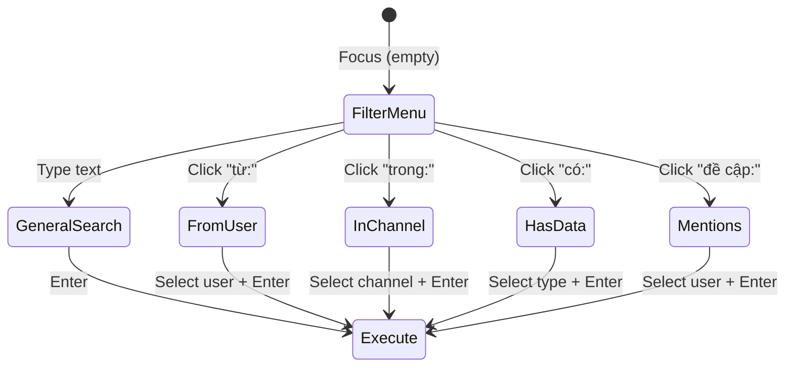

# Full-Stack Search Filter Integration (Refined)

> Updated based on [review.md](file:///e:/UIT/cv/MiniDiscord/review.md) gotchas and existing backend optimizations.

## Existing Backend Infrastructure (Already Deployed)

| Asset | Status | Detail |
|-------|--------|--------|
| `MongoTemplate` | ✅ Injected | [MessageService](file:///e:/UIT/cv/MiniDiscord/backend/chat-history-service/src/main/java/com/discordmini/chathistory/service/MessageService.java#27-208) already uses it for reactions/delete |
| `idx_content_text` | ✅ TextIndex | [MongoIndexConfig.java](file:///e:/UIT/cv/MiniDiscord/backend/chat-history-service/src/main/java/com/discordmini/chathistory/config/MongoIndexConfig.java) L56–61: `TextIndexDefinition` on `content` |
| `idx_sender_time` | ✅ Compound | `senderId ASC + createdAt DESC` — covers [from](file:///e:/UIT/cv/MiniDiscord/backend/chat-history-service/src/main/java/com/discordmini/chathistory/model/dto/MessageResponse.java#47-74) filter |
| `idx_channel_cursor` | ✅ Compound | `roomId + channelId + _id` — covers channel scoping |
| [searchByContent()](file:///e:/UIT/cv/MiniDiscord/backend/chat-history-service/src/main/java/com/discordmini/chathistory/repository/MessageRepository.java#34-37) | ✅ Repository | Uses `$text` operator (index-backed) |

---

## State Machine (6 Views)



---

## Phase 1: Frontend

### 1A. i18n — [MODIFY] [vi.json](file:///e:/UIT/cv/MiniDiscord/frontend/dictionaries/vi.json) / [en.json](file:///e:/UIT/cv/MiniDiscord/frontend/dictionaries/en.json)

```json
"searchAction": "Tìm kiếm {query}" / "Search {query}",
"searchFromUserHeader": "Từ Người Dùng" / "From User",
"searchInChannelHeader": "Trong Kênh" / "In Channel", 
"searchHasDataHeader": "Tin Nhắn Có Chứa" / "Messages Containing",
"searchMentionsHeader": "Người Dùng Đề Cập" / "Mentioned Users",
"searchHasImage": "hình ảnh" / "image",
"searchHasVideo": "video" / "video",
"searchHasLink": "link" / "link",
"searchHasFile": "tệp" / "file",
"searchHasAudio": "âm thanh" / "audio",
"searchHasSticker": "sticker" / "sticker"
```

### 1B. SearchDropdown Refactor — [MODIFY] [SearchDropdown.tsx](file:///e:/UIT/cv/MiniDiscord/frontend/components/chat/SearchDropdown.tsx)

**New props:**

```ts
interface SearchDropdownProps {
  type: "dm" | "channel";
  isOpen: boolean;
  activeFilter: "filters" | "general" | "from-user" | "in-channel" | "has-data" | "mentions";
  filterQuery: string;
  members: MemberDetailResponse[];
  channels?: Channel[];
  onSelectFilter?: (prefix: string) => void;
  onSelectUser?: (userId: string, username: string) => void;
  onSelectChannel?: (channelId: string, channelName: string) => void;
  onSelectDataType?: (dataType: string) => void;
  onSearchSubmit?: () => void;
  history?: string[];
  onClearHistory?: () => void;
}
```

**General Search (`"general"`) layout:**

```
🔍 Tìm kiếm {query}             ← Enter = text search
───────────────────────────────
TỪ NGƯỜI DÙNG                   ← Section
  👤 AAA  từ: rqzgon            ← Top 3 matching members
  👤 aDaniel  từ: ngozi2412
  👤 AFork9182  từ: afork060311
───────────────────────────────
TRONG KÊNH (server only)
  # trong: # | announcements     ← Top 3 matching channels
  # trong: # | leave
  # trong: # | download
───────────────────────────────
NGƯỜI DÙNG ĐỀ CẬP
  @ AAA  đề cập: rqzgon         ← Top 3 matching members
  @ aDaniel  đề cập: ngozi2412
  @ AFork9182  đề cập: afork...
```

### 1C. State parser — [MODIFY] [ChatHeader.tsx](file:///e:/UIT/cv/MiniDiscord/frontend/components/chat/ChatHeader.tsx) + [page.tsx (DM)](file:///e:/UIT/cv/MiniDiscord/frontend/app/(main)/channels/me/[userId]/page.tsx)

```ts
const getActiveFilter = (value: string): ActiveFilter => {
  if (!value.trim()) return "filters";
  if (value.startsWith("từ:") || value.startsWith("from:")) return "from-user";
  if (value.startsWith("trong:") || value.startsWith("in:")) return "in-channel";
  if (value.startsWith("có:") || value.startsWith("has:")) return "has-data";
  if (value.startsWith("đề cập:") || value.startsWith("mentions:")) return "mentions";
  return "general";
};

const getFilterQuery = (value: string) => {
  const colonIdx = value.indexOf(":");
  return colonIdx >= 0 ? value.slice(colonIdx + 1).trim() : value.trim();
};
```

Pass `roomStore.members[roomId]` and `roomStore.channels[serverId]` as props.

### 1D. Combined Filter Parser — [NEW] [parseSearchFilters()](file:///e:/UIT/cv/MiniDiscord/frontend/lib/searchParser.ts#16-64) utility

> [!IMPORTANT]
> **Giải quyết Gotcha 1 từ review**: Parser regex bóc tách chuỗi kết hợp thành object filters.

```ts
// e.g. "lỗi server từ: admin có: image" → { q: "lỗi server", from: "admin", has: "image" }
function parseSearchFilters(input: string): {
  q?: string; from?: string; has?: string; mentions?: string;
} {
  const filters: Record<string, string> = {};
  // Match Vietnamese and English filter prefixes
  const regex = /(?:từ|from|trong|in|có|has|đề cập|mentions)\s*:\s*(\S+)/gi;
  let remaining = input;
  
  let match;
  while ((match = regex.exec(input)) !== null) {
    const prefix = match[0].split(":")[0].trim().toLowerCase();
    const value = match[1];
    remaining = remaining.replace(match[0], "").trim();
    
    if (["từ", "from"].includes(prefix)) filters.from = value;
    else if (["trong", "in"].includes(prefix)) filters.channel = value;
    else if (["có", "has"].includes(prefix)) filters.has = value;
    else if (["đề cập", "mentions"].includes(prefix)) filters.mentions = value;
  }
  
  if (remaining.trim()) filters.q = remaining.trim();
  return filters;
}
```

---

## Phase 2: Backend

### 2A. Controller — [MODIFY] [MessageController.java](file:///e:/UIT/cv/MiniDiscord/backend/chat-history-service/src/main/java/com/discordmini/chathistory/controller/MessageController.java)

Replace current [searchMessages](file:///e:/UIT/cv/MiniDiscord/backend/chat-history-service/src/main/java/com/discordmini/chathistory/controller/MessageController.java#36-47) with extended params:

```java
@GetMapping("/rooms/{roomId}/channels/{channelId}/search")
public ResponseEntity<ApiResponse<List<MessageResponse>>> searchMessages(
        @RequestHeader("X-User-Id") String userId,
        @PathVariable String roomId,
        @PathVariable String channelId,
        @RequestParam(required = false) String q,
        @RequestParam(required = false) String from,
        @RequestParam(required = false) String has,
        @RequestParam(required = false) String mentions,
        @RequestParam(defaultValue = "50") int limit) {
    List<MessageResponse> results = messageService.advancedSearch(
        userId, roomId, channelId, q, from, has, mentions, limit);
    return ResponseEntity.ok(ApiResponse.ok(results));
}
```

### 2B. Service — [MODIFY] [MessageService.java](file:///e:/UIT/cv/MiniDiscord/backend/chat-history-service/src/main/java/com/discordmini/chathistory/service/MessageService.java)

> [!IMPORTANT]
> **Giải quyết Gotcha 2 từ review**: Dùng `TextCriteria` (index-backed `$text`) thay vì regex cho `q`.

```java
public List<MessageResponse> advancedSearch(
    String userId, String roomId, String channelId,
    String q, String from, String has, String mentions, int limit
) {
    membershipClient.verifyMembership(userId, roomId);
    int clamped = Math.min(Math.max(limit, 1), MAX_LIMIT);
    
    Criteria criteria = Criteria.where("roomId").is(roomId)
        .and("channelId").is(channelId)
        .and("isDeleted").is(false);
    
    // from: uses idx_sender_time
    if (from != null && !from.isBlank())
        criteria.and("senderId").is(from);
    
    // has: maps to type field (index-covered by compound)
    if (has != null && !has.isBlank()) {
        switch (has.toLowerCase()) {
            case "image", "hình ảnh" -> criteria.and("type").is("IMAGE");
            case "video"            -> criteria.and("type").is("VIDEO");
            case "link"             -> criteria.and("content").regex("https?://", "i");
            case "file", "tệp"     -> criteria.and("type").is("FILE");
            case "audio", "âm thanh"-> criteria.and("type").is("AUDIO");
            case "sticker"          -> criteria.and("type").is("STICKER");
        }
    }
    
    // mentions: regex on content for @username pattern
    if (mentions != null && !mentions.isBlank())
        criteria.and("content").regex("@" + Pattern.quote(mentions), "i");
    
    Query query = new Query(criteria)
        .with(Sort.by(Sort.Direction.DESC, "_id"))
        .limit(clamped);
    
    // q: use TextCriteria (backed by idx_content_text) — NOT regex!
    if (q != null && !q.isBlank()) {
        query.addCriteria(TextCriteria.forDefaultLanguage().matching(q));
    }
    
    return mongoTemplate.find(query, Message.class)
        .stream().map(MessageResponse::from).toList();
}
```

**Index utilization:**

| Filter | Index Used |
|--------|-----------|
| `q` (text) | `idx_content_text` (TextIndex) via `TextCriteria` ✅ |
| [from](file:///e:/UIT/cv/MiniDiscord/backend/chat-history-service/src/main/java/com/discordmini/chathistory/model/dto/MessageResponse.java#47-74) | `idx_sender_time` (compound) ✅ |
| `has: type` | `idx_channel_cursor` partial (roomId+channelId) + `type` scan |
| `mentions` | `idx_content_text` partial (requires regex, fallback) |

---

## Phase 3: Integration

### [MODIFY] [chatStore.ts](file:///e:/UIT/cv/MiniDiscord/frontend/stores/chatStore.ts) — Add [searchMessages()](file:///e:/UIT/cv/MiniDiscord/backend/chat-history-service/src/main/java/com/discordmini/chathistory/controller/MessageController.java#36-47)

```ts
searchMessages: async (roomId, channelId, filters) => {
  const params = new URLSearchParams();
  if (filters.q) params.set("q", filters.q);
  if (filters.from) params.set("from", filters.from);
  if (filters.has) params.set("has", filters.has);
  if (filters.mentions) params.set("mentions", filters.mentions);
  
  const res = await api.get(
    `/messages/rooms/${roomId}/channels/${channelId}/search?${params}`
  );
  return res.data.data as Message[];
}
```

Wire: `Enter` key → [parseSearchFilters(searchValue)](file:///e:/UIT/cv/MiniDiscord/frontend/lib/searchParser.ts#16-64) → `chatStore.searchMessages()` → display results.

---

## Verification Plan

### Phase 1
1. Type `a` → unified General Search shows top 3 users + channels + mentions
2. Click `từ:` → full filtered member list
3. Click `trong:` → channel list (server only)
4. Click `có:` → 6 data types

### Phase 2
1. `GET /search?q=hello` → uses `TextCriteria` (no collection scan)
2. `GET /search?from={userId}` → uses `idx_sender_time`
3. `GET /search?q=hello&from={userId}&has=image` → combined indexed query

### Phase 3
1. Type `lỗi server từ: admin có: image` → parser extracts `{q: "lỗi server", from: "admin", has: "image"}`
2. Enter → API call with all 3 params → filtered results

---

## Phase 5: Server Channel Empty Viewport Truncation Fix

### Problem
When a channel is newly created (`messages.length === 0`), `useLayoutEffect` has a fast-return that sets active states but does NOT trigger `bottomRef.current?.scrollIntoView({ behavior: "instant" })`.
Because `scrollTop` stays at `0`, the static `132px` spacer (`var(--floating-message-input-offset)`) remains hidden below the fold. The actual Welcome Banner at the bottom of the container is overlayed and obscured by the floating absolutely positioned [MessageInput](file:///e:/UIT/cv/MiniDiscord/frontend/components/chat/MessageInput.tsx#27-397) panel.

### Remedy
Trigger an instant scroll to the bottom spacer inside `useLayoutEffect` even when the channel has zero messages. This forces the scroll position to align the spacer element under the composer, successfully pushing the Welcome Banner up into high-visibility space.

#### [MODIFY] [MessageList.tsx](file:///e:/UIT/cv/MiniDiscord/frontend/components/chat/MessageList.tsx)
Update the empty messages clause:
```typescript
      const msgs = storeState.getChannelMessages(cid);
      if (msgs.length === 0) {
        // Empty channel (e.g. just created): show welcome header, scroll to bottom to prevent composer cover overlap
        setIsPositioned(true);
        isAtBottomRef.current = true;
        hasReachedBottomRef.current = true;
        onScrollStateChange?.(true);
        
        // Align bottom spacer
        bottomRef.current?.scrollIntoView({ behavior: "instant" });
        
        setTimeout(() => { isReadyToDetectRef.current = true; }, 300);
        return;
      }
```

---

## Phase 6: Server Channel Settings Refactoring

### 6A. Backend Schema & DTO Expansion — [MODIFY] [Channel.java](file:///e:/UIT/cv/MiniDiscord/backend/group-channel-service/src/main/java/com/discordmini/groupchannel/model/entity/Channel.java) / [ChannelResponse.java](file:///e:/UIT/cv/MiniDiscord/backend/group-channel-service/src/main/java/com/discordmini/groupchannel/model/dto/ChannelResponse.java) / [ChannelRequest.java](file:///e:/UIT/cv/MiniDiscord/backend/group-channel-service/src/main/java/com/discordmini/groupchannel/model/dto/ChannelRequest.java)
- Add `topic` (String, length 1000) and `isPrivate` (Boolean, default false) to [Channel.java](file:///e:/UIT/cv/MiniDiscord/backend/group-channel-service/src/main/java/com/discordmini/groupchannel/model/entity/Channel.java).
- Map new fields in DTO layers to receive and respond with edit updates.

### 6B. Backend Controller & Service API Expose — [MODIFY] [ChannelController.java](file:///e:/UIT/cv/MiniDiscord/backend/group-channel-service/src/main/java/com/discordmini/groupchannel/controller/ChannelController.java) / [ChannelService.java](file:///e:/UIT/cv/MiniDiscord/backend/group-channel-service/src/main/java/com/discordmini/groupchannel/service/ChannelService.java)
- Add `PUT /api/rooms/{roomId}/channels/{channelId}` for updating channel parameters (validates requester is Admin/Owner).
- Add `DELETE /api/rooms/{roomId}/channels/{channelId}` for channel deletion (validates requester matches access roles).

### 6C. Frontend Types & Room Store Actions — [MODIFY] [types/room.ts](file:///e:/UIT/cv/MiniDiscord/frontend/types/room.ts) / [stores/roomStore.ts](file:///e:/UIT/cv/MiniDiscord/frontend/stores/roomStore.ts)
- Extend frontend [Channel](file:///e:/UIT/cv/MiniDiscord/backend/group-channel-service/src/main/java/com/discordmini/groupchannel/model/entity/Channel.java#11-43) type to support `topic` and `isPrivate`.
- Add store actions: `updateChannel` (PUT request) and `deleteChannel` (DELETE request).

### 6D. Channel Settings Hover Button in Sidebar — [MODIFY] [ChannelList.tsx](file:///e:/UIT/cv/MiniDiscord/frontend/components/sidebar/ChannelList.tsx)
- Add settings cog icon in [ChannelItem](file:///e:/UIT/cv/MiniDiscord/frontend/components/sidebar/ChannelList.tsx#17-58) hover state, active only for Room Admins/Owners.
- Ensure the "Invite" icon is NOT rendered on hover.
- Prevent event bubbling on gear icon click, launching the `EditChannelModal`.

### 6E. Premium Channel Settings Overlay Modal — [NEW] `components/server/EditChannelModal.tsx`
- Build a Discord-equivalent fullscreen settings modal with split panel sidebar and main workspace layout:
  - Sidebar: Channel categorization title, tab lists (`Tổng quan`, `Quyền hạn`), and `Xóa kênh` in red with trash can icon.
  - Tab 1 Overview (`Tổng quan`): Rename title text input and topic description textarea.
  - Tab 2 Permissions (`Quyền hạn`): Private toggle card ("Kênh Riêng") without advanced permissions block.
  - Close: Large escape `ESC` button in top block.
  - Confirmation Dialog: Confirm deletion prompts to secure destructive changes.


