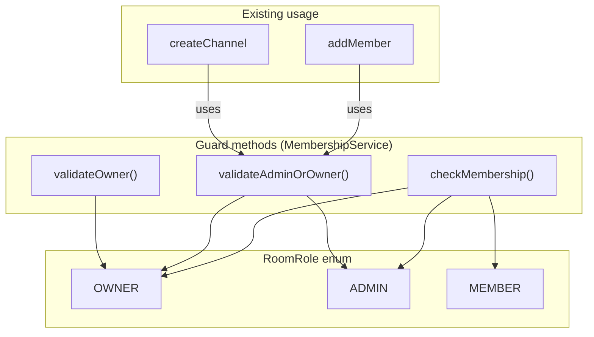
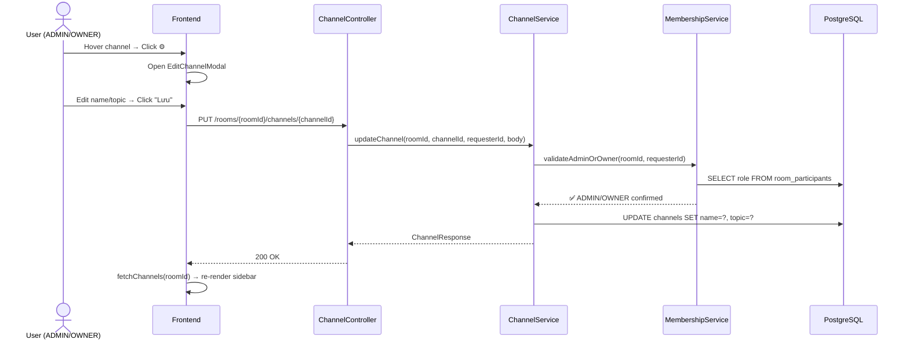

# Phase 6: Server Channel Settings — Chi tiết triển khai

---

## 1. Phân tích hệ thống phân quyền hiện tại

### 1A. Mô hình quyền hiện có (Room-level only)

Hệ thống hiện tại **chỉ có phân quyền ở cấp Room** (server), chưa có phân quyền riêng cho Channel.



| Guard Method | Cho phép | Dùng ở đâu |
|---|---|---|
| [validateOwner(roomId, userId)](file:///e:/UIT/cv/MiniDiscord/backend/group-channel-service/src/main/java/com/discordmini/groupchannel/service/MembershipService.java#41-49) | Chỉ OWNER | Chưa sử dụng thực tế |
| [validateAdminOrOwner(roomId, userId)](file:///e:/UIT/cv/MiniDiscord/backend/group-channel-service/src/main/java/com/discordmini/groupchannel/service/MembershipService.java#32-40) | ADMIN + OWNER | [createChannel](file:///e:/UIT/cv/MiniDiscord/frontend/stores/roomStore.ts#239-250), [addMember](file:///e:/UIT/cv/MiniDiscord/backend/group-channel-service/src/main/java/com/discordmini/groupchannel/controller/RoomController.java#48-56) |
| [checkMembership(roomId, userId)](file:///e:/UIT/cv/MiniDiscord/backend/group-channel-service/src/main/java/com/discordmini/groupchannel/service/MembershipService.java#100-105) | Bất kỳ thành viên | Verify membership (read access) |

### 1B. Entities liên quan

| Entity | Bảng | Trường chính |
|---|---|---|
| [Room.java](file:///e:/UIT/cv/MiniDiscord/backend/group-channel-service/src/main/java/com/discordmini/groupchannel/model/entity/Room.java) | `rooms` | id, name, description, type, ownerId |
| [RoomParticipant.java](file:///e:/UIT/cv/MiniDiscord/backend/group-channel-service/src/main/java/com/discordmini/groupchannel/model/entity/RoomParticipant.java) | `room_participants` | userId, roomId, role (OWNER/ADMIN/MEMBER) |
| [Channel.java](file:///e:/UIT/cv/MiniDiscord/backend/group-channel-service/src/main/java/com/discordmini/groupchannel/model/entity/Channel.java) | `channels` | id, room (FK), name, type, position |

### 1C. Đề xuất phân quyền cho Channel Settings

> [!IMPORTANT]
> **Quyết định thiết kế**: Giữ nguyên mô hình room-level permission, KHÔNG thêm channel-level ACL riêng. Lý do:
> - Hệ thống hiện tại đã có [validateAdminOrOwner](file:///e:/UIT/cv/MiniDiscord/backend/group-channel-service/src/main/java/com/discordmini/groupchannel/service/MembershipService.java#32-40) hoạt động ổn định
> - Discord cũng sử dụng server-level roles cho channel management
> - Tránh phức tạp hóa schema khi chưa cần thiết

| Hành động | Quyền yêu cầu | Guard sử dụng |
|---|---|---|
| **Xem cài đặt kênh** | ADMIN / OWNER | [validateAdminOrOwner](file:///e:/UIT/cv/MiniDiscord/backend/group-channel-service/src/main/java/com/discordmini/groupchannel/service/MembershipService.java#32-40) |
| **Sửa tên kênh / chủ đề** | ADMIN / OWNER | [validateAdminOrOwner](file:///e:/UIT/cv/MiniDiscord/backend/group-channel-service/src/main/java/com/discordmini/groupchannel/service/MembershipService.java#32-40) |
| **Bật/tắt kênh riêng** | ADMIN / OWNER | [validateAdminOrOwner](file:///e:/UIT/cv/MiniDiscord/backend/group-channel-service/src/main/java/com/discordmini/groupchannel/service/MembershipService.java#32-40) |
| **Xóa kênh** | Chỉ OWNER | [validateOwner](file:///e:/UIT/cv/MiniDiscord/backend/group-channel-service/src/main/java/com/discordmini/groupchannel/service/MembershipService.java#41-49) |
| **Hiện icon ⚙️ trên sidebar** | ADMIN / OWNER | Check `myRole` client-side |

> [!WARNING]
> **Kênh riêng (`isPrivate`)**: Ở phase này, `isPrivate` chỉ là cờ metadata UI — server sẽ lưu trạng thái nhưng **chưa thực thi access control ở tầng API** (tất cả member server vẫn đọc được tin nhắn). Việc thực thi ACL cho private channel sẽ là phase riêng sau khi có bảng `channel_members`.

---

## 2. Backend Changes

### 2A. [MODIFY] [Channel.java](file:///e:/UIT/cv/MiniDiscord/backend/group-channel-service/src/main/java/com/discordmini/groupchannel/model/entity/Channel.java) — Thêm `topic` + `isPrivate`

```java
// Thêm 2 field mới vào Channel entity
@Column(length = 1024)
private String topic;

@Column(name = "is_private", nullable = false)
@Builder.Default
private Boolean isPrivate = false;
```

> Hibernate `ddl-auto: update` sẽ tự thêm cột mới khi restart service.

### 2B. [MODIFY] [ChannelResponse.java](file:///e:/UIT/cv/MiniDiscord/backend/group-channel-service/src/main/java/com/discordmini/groupchannel/model/dto/ChannelResponse.java) — Expose `topic` + `isPrivate`

```diff
 public class ChannelResponse {
   private UUID id;
   private UUID roomId;
   private String name;
   private String type;
   private Integer position;
   private LocalDateTime createdAt;
+  private String topic;
+  private Boolean isPrivate;
 }
```

### 2C. [NEW] `UpdateChannelRequest.java` — DTO cho PUT endpoint

```java
@Data
public class UpdateChannelRequest {
    @Size(min = 1, max = 100)
    private String name;       // optional

    @Size(max = 1024)
    private String topic;      // optional

    private Boolean isPrivate; // optional
}
```

### 2D. [MODIFY] [ChannelService.java](file:///e:/UIT/cv/MiniDiscord/backend/group-channel-service/src/main/java/com/discordmini/groupchannel/service/ChannelService.java) — `updateChannel` + `deleteChannel`

```java
@Transactional
public ChannelResponse updateChannel(UUID roomId, UUID channelId, UUID requesterId, UpdateChannelRequest request) {
    membershipService.validateAdminOrOwner(roomId, requesterId);

    Channel channel = channelRepository.findById(channelId)
        .orElseThrow(() -> new RoomNotFoundException("Channel not found"));

    if (!channel.getRoom().getId().equals(roomId))
        throw new BaseException("Channel does not belong to this room", HttpStatus.BAD_REQUEST, "BAD_REQUEST");

    if (request.getName() != null) channel.setName(request.getName());
    if (request.getTopic() != null) channel.setTopic(request.getTopic());
    if (request.getIsPrivate() != null) channel.setIsPrivate(request.getIsPrivate());

    return toResponse(channelRepository.save(channel));
}

@Transactional
public void deleteChannel(UUID roomId, UUID channelId, UUID requesterId) {
    membershipService.validateOwner(roomId, requesterId);  // Chỉ OWNER mới xóa được

    Channel channel = channelRepository.findById(channelId)
        .orElseThrow(() -> new RoomNotFoundException("Channel not found"));

    if (!channel.getRoom().getId().equals(roomId))
        throw new BaseException("Channel does not belong to this room", HttpStatus.BAD_REQUEST, "BAD_REQUEST");

    // Ngăn xóa kênh "general" cuối cùng
    long count = channelRepository.countByRoomId(roomId);
    if (count <= 1)
        throw new BaseException("Cannot delete the last channel", HttpStatus.BAD_REQUEST, "BAD_REQUEST");

    channelRepository.delete(channel);
}
```

### 2E. [MODIFY] [ChannelController.java](file:///e:/UIT/cv/MiniDiscord/backend/group-channel-service/src/main/java/com/discordmini/groupchannel/controller/ChannelController.java) — Thêm PUT + DELETE endpoints

```java
@PutMapping("/rooms/{roomId}/channels/{channelId}")
public ResponseEntity<ApiResponse<ChannelResponse>> updateChannel(
        @RequestHeader("X-User-Id") UUID requesterId,
        @PathVariable UUID roomId,
        @PathVariable UUID channelId,
        @Valid @RequestBody UpdateChannelRequest request) {
    ChannelResponse response = channelService.updateChannel(roomId, channelId, requesterId, request);
    return ResponseEntity.ok(ApiResponse.ok("Channel updated", response));
}

@DeleteMapping("/rooms/{roomId}/channels/{channelId}")
public ResponseEntity<ApiResponse<Void>> deleteChannel(
        @RequestHeader("X-User-Id") UUID requesterId,
        @PathVariable UUID roomId,
        @PathVariable UUID channelId) {
    channelService.deleteChannel(roomId, channelId, requesterId);
    return ResponseEntity.ok(ApiResponse.ok("Channel deleted", null));
}
```

### 2F. [MODIFY] [toResponse()](file:///e:/UIT/cv/MiniDiscord/backend/group-channel-service/src/main/java/com/discordmini/groupchannel/service/ChannelService.java#52-62) trong ChannelService — Map `topic`, `isPrivate`

```diff
 private ChannelResponse toResponse(Channel channel) {
     return ChannelResponse.builder()
         .id(channel.getId())
         .roomId(channel.getRoom().getId())
         .name(channel.getName())
         .type(channel.getType().name())
         .position(channel.getPosition())
         .createdAt(channel.getCreatedAt())
+        .topic(channel.getTopic())
+        .isPrivate(channel.getIsPrivate())
         .build();
 }
```

---

## 3. Frontend Changes

### 3A. [MODIFY] [types/room.ts](file:///e:/UIT/cv/MiniDiscord/frontend/types/room.ts) — Mở rộng [Channel](file:///e:/UIT/cv/MiniDiscord/frontend/types/room.ts#20-27) type

```diff
 export interface Channel {
   id: string;
   roomId: string;
   name: string;
   type: "TEXT" | "VOICE";
   position: number;
+  topic?: string;
+  isPrivate?: boolean;
 }
```

### 3B. [MODIFY] [stores/roomStore.ts](file:///e:/UIT/cv/MiniDiscord/frontend/stores/roomStore.ts) — 2 actions mới

```typescript
updateChannel: async (roomId: string, channelId: string, data: { name?: string; topic?: string; isPrivate?: boolean }) => {
  const res = await api.put<{ data: Channel }>(`/rooms/${roomId}/channels/${channelId}`, data);
  await get().fetchChannels(roomId);  // Refresh local cache
  return res.data.data;
},

deleteChannel: async (roomId: string, channelId: string) => {
  await api.delete(`/rooms/${roomId}/channels/${channelId}`);
  clearCache();
  await get().fetchChannels(roomId);  // Refresh local cache
},
```

### 3C. [MODIFY] [dictionaries/vi.json](file:///e:/UIT/cv/MiniDiscord/frontend/dictionaries/vi.json) + [en.json](file:///e:/UIT/cv/MiniDiscord/frontend/dictionaries/en.json) — i18n keys

```json
"channelSettings": {
  "title": "Cài Đặt Kênh",
  "overview": "Tổng quan",
  "permissions": "Quyền hạn",
  "deleteChannel": "Xóa Kênh",
  "channelName": "Tên Kênh",
  "channelTopic": "Chủ Đề Kênh",
  "topicPlaceholder": "Thêm một chủ đề cho kênh",
  "privateChannel": "Kênh Riêng",
  "privateDesc": "Nếu đặt kênh ở chế độ riêng tư, chỉ có thành viên và vai trò được chọn mới có thể nhìn thấy kênh này.",
  "permissionsTitle": "Quyền Của Kênh",
  "permissionsDesc": "Sử dụng quyền để tùy chỉnh ai có thể thực hiện những gì trong kênh này.",
  "deleteConfirm": "Bạn có chắc chắn muốn xóa",
  "deleteConfirmSuffix": "? Hành động này không thể hoàn tác.",
  "deleteAction": "Xóa Kênh",
  "saveChanges": "Lưu Thay Đổi",
  "reset": "Đặt Lại",
  "unsavedWarning": "Hãy cẩn thận – bạn chưa lưu các thay đổi!",
  "textChannel": "KÊNH CHAT",
  "voiceChannel": "KÊNH THOẠI",
  "cannotDeleteLast": "Không thể xóa kênh cuối cùng của server"
}
```

### 3D. [MODIFY] [ChannelList.tsx](file:///e:/UIT/cv/MiniDiscord/frontend/components/sidebar/ChannelList.tsx) — Thêm ⚙️ icon hover

Trong component [ChannelItem](file:///e:/UIT/cv/MiniDiscord/frontend/components/sidebar/ChannelList.tsx#17-58):
- Thêm icon [Settings](file:///e:/UIT/cv/MiniDiscord/frontend/components/settings/SettingsOverlay.tsx#26-27) (lucide) xuất hiện khi hover vào channel item
- Chỉ hiển thị khi user có role ADMIN/OWNER (dùng [getMyRoleInRoom](file:///e:/UIT/cv/MiniDiscord/frontend/stores/roomStore.ts#251-256))
- **Không có icon Invite** theo yêu cầu
- Click vào ⚙️ mở `EditChannelModal`, chặn sự kiện lan truyền `e.stopPropagation()`

```tsx
{canEditChannel && (
  <button
    onClick={(e) => { e.stopPropagation(); onSettingsClick(channel); }}
    className="opacity-0 group-hover:opacity-100 text-muted-foreground hover:text-foreground transition-all"
  >
    <Settings className="h-4 w-4" />
  </button>
)}
```

### 3E. [NEW] [EditChannelModal.tsx](file:///e:/UIT/cv/MiniDiscord/frontend/components/server/EditChannelModal.tsx) — Full UI

Thiết kế fullscreen overlay chia đôi (tham khảo [SettingsOverlay.tsx](file:///e:/UIT/cv/MiniDiscord/frontend/components/settings/SettingsOverlay.tsx)):

**Left sidebar:**
```
# CHUNG KÊNH CHAT
├─ Tổng quan      ← active highlight
├─ Quyền hạn
└─ 🗑 Xóa kênh    ← red text + trash icon
```

**Right panel — Tab "Tổng quan":**
- Input "Tên kênh" (pre-filled, clearable)
- Textarea "Chủ đề kênh" (max 1024 chars, counter)
- Bottom save bar (sticky): "Đặt Lại" + "Lưu Thay Đổi" (chỉ hiển thị khi có thay đổi)

**Right panel — Tab "Quyền hạn":**
- Card "Kênh Riêng" với toggle switch + mô tả
- Không có phần "Quyền nâng cao"

**Xóa kênh:**
- Click "Xóa kênh" → Mở [ConfirmModal](file:///e:/UIT/cv/MiniDiscord/frontend/components/ui/ConfirmModal.tsx#14-69) (component có sẵn)
- Confirm → Gọi `deleteChannel(roomId, channelId)` → Navigate về kênh đầu tiên còn lại

---

## 4. Luồng xử lý end-to-end



---

## 5. Thứ tự triển khai

| Step | File(s) | Mô tả |
|------|---------|-------|
| 1 | [Channel.java](file:///e:/UIT/cv/MiniDiscord/backend/group-channel-service/src/main/java/com/discordmini/groupchannel/model/entity/Channel.java) | Thêm `topic`, `isPrivate` fields |
| 2 | [ChannelResponse.java](file:///e:/UIT/cv/MiniDiscord/backend/group-channel-service/src/main/java/com/discordmini/groupchannel/model/dto/ChannelResponse.java) | Expose fields mới |
| 3 | `UpdateChannelRequest.java` (NEW) | DTO cho PUT |
| 4 | [ChannelService.java](file:///e:/UIT/cv/MiniDiscord/backend/group-channel-service/src/main/java/com/discordmini/groupchannel/service/ChannelService.java) | `updateChannel()` + `deleteChannel()` + update [toResponse()](file:///e:/UIT/cv/MiniDiscord/backend/group-channel-service/src/main/java/com/discordmini/groupchannel/service/ChannelService.java#52-62) |
| 5 | [ChannelController.java](file:///e:/UIT/cv/MiniDiscord/backend/group-channel-service/src/main/java/com/discordmini/groupchannel/controller/ChannelController.java) | PUT + DELETE endpoints |
| 6 | [types/room.ts](file:///e:/UIT/cv/MiniDiscord/frontend/types/room.ts) | Mở rộng Channel type |
| 7 | [stores/roomStore.ts](file:///e:/UIT/cv/MiniDiscord/frontend/stores/roomStore.ts) | `updateChannel` + `deleteChannel` actions |
| 8 | [vi.json](file:///e:/UIT/cv/MiniDiscord/frontend/dictionaries/vi.json) + [en.json](file:///e:/UIT/cv/MiniDiscord/frontend/dictionaries/en.json) | i18n translations |
| 9 | [ChannelList.tsx](file:///e:/UIT/cv/MiniDiscord/frontend/components/sidebar/ChannelList.tsx) | ⚙️ hover icon |
| 10 | `EditChannelModal.tsx` (NEW) | Full settings modal |

---

## 6. Verification Plan

### Backend
1. Restart `group-channel-service` → Verify Hibernate auto-creates `topic` + `is_private` columns
2. `PUT /rooms/{roomId}/channels/{channelId}` with `X-User-Id` of ADMIN → 200 OK
3. Same PUT with MEMBER X-User-Id → 403 Forbidden
4. `DELETE` with OWNER → 200 OK, `DELETE` with ADMIN → 403 Forbidden
5. `DELETE` last channel → 400 "Cannot delete the last channel"

### Frontend
1. Hover channel as OWNER → ⚙️ icon appears
2. Hover channel as MEMBER → No ⚙️ icon
3. Open settings → Edit name → Save → Sidebar updates immediately
4. Click "Xóa kênh" → ConfirmModal → Confirm → Channel removed, navigate to first remaining
5. `npx tsc --noEmit` → Exit code 0
