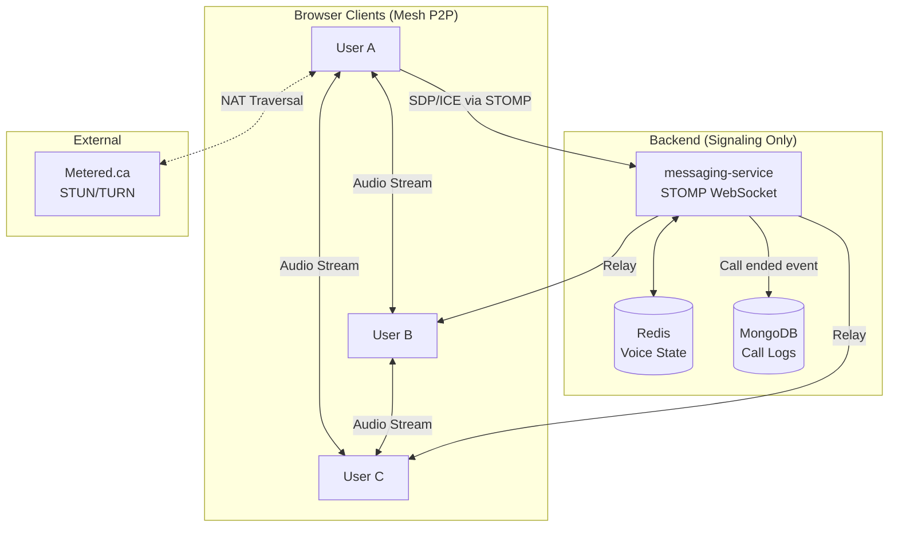
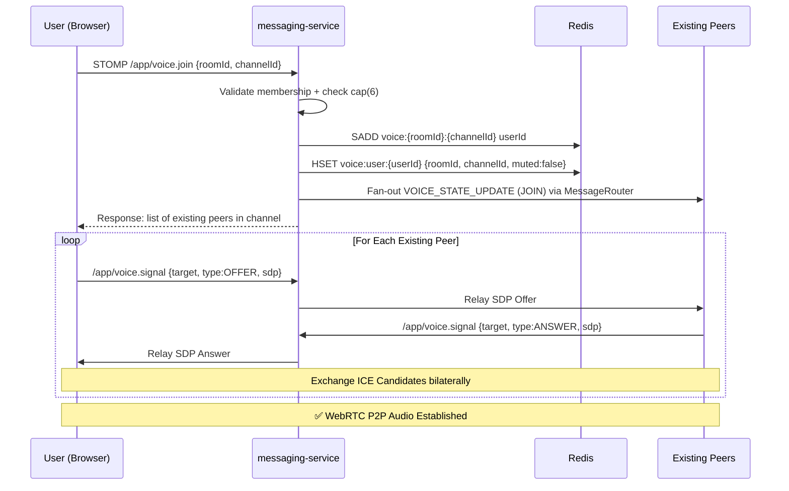
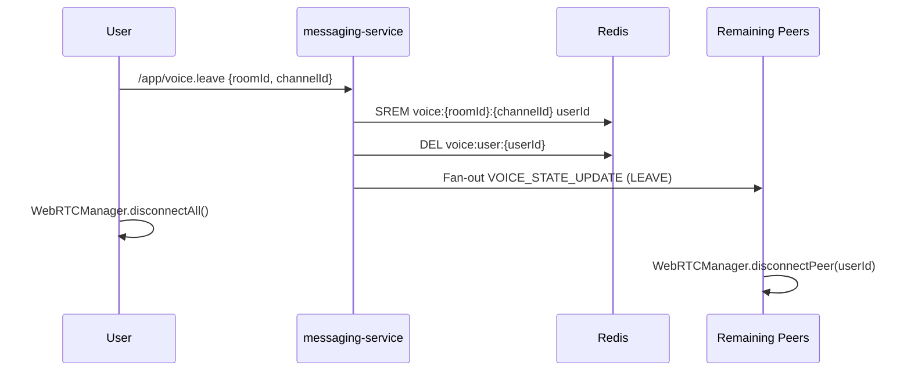
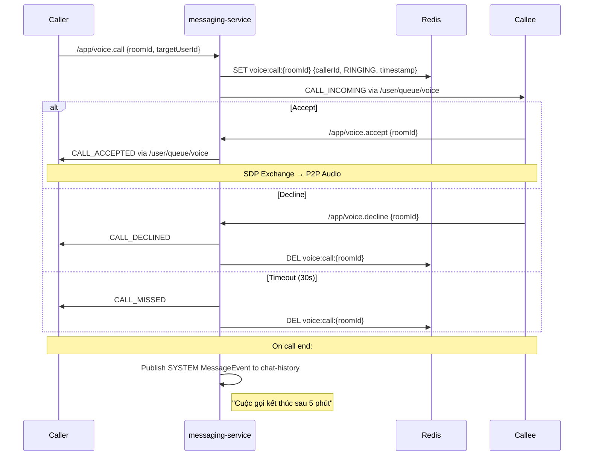
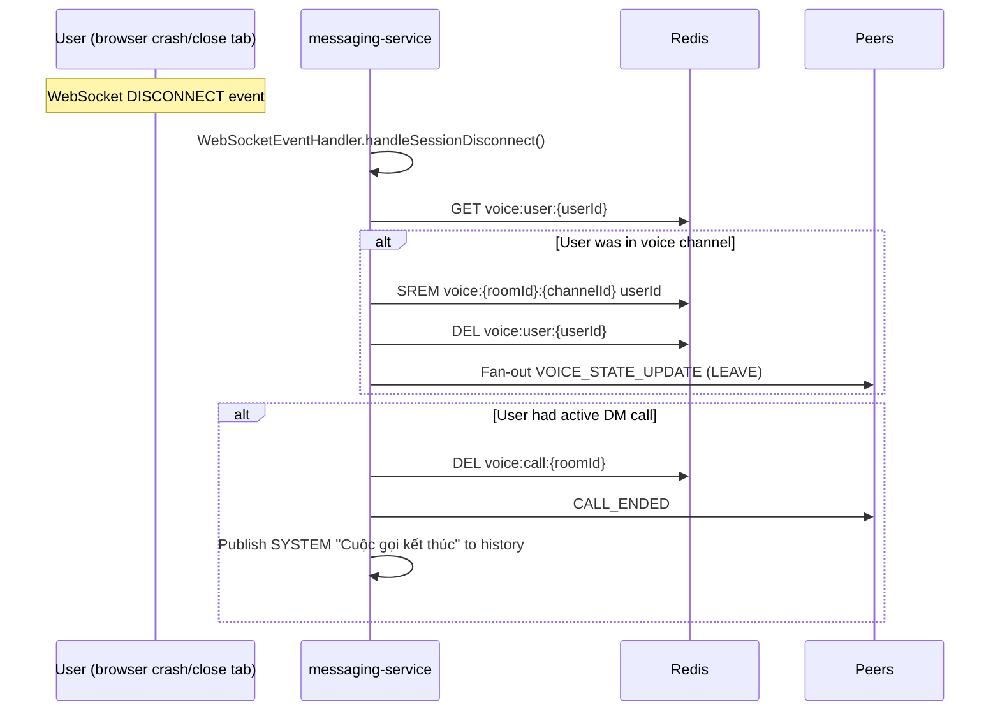

# Phase 7: Voice Channel — Detail Plan (Finalized)

> Tính năng cốt lõi của Discord: Phòng gọi thoại trong Server Channel và DM Room.
> Phiên bản này đã tích hợp toàn bộ quyết định từ [review.md](file:///e:/UIT/cv/MiniDiscord/review.md).

---

## Quyết Định Chốt Hạ

| Quyết định | Giá trị | Lý do |
|---|---|---|
| **Scope Phase 7** | **Audio-only** (Mic) | Kiểm soát lifecycle audio đã đủ phức tạp. Video/Screen dời sang Phase 8 |
| **Topology** | **Mesh P2P** | Không cần SFU server, backend chỉ làm signaling |
| **Max participants** | **Hard-cap 6 người** | An toàn cho mesh audio, tránh quá tải CPU/băng thông client |
| **TURN provider** | **Metered.ca** (Free tier) | API credential động via `RestTemplate`, không cần mở port UDP trên droplet |
| **Metered domain** | `minidiscord-webrtc.metered.live` | Đã cấu hình trong [.env](file:///e:/UIT/cv/MiniDiscord/backend/.env) + [.env.prod](file:///e:/UIT/cv/MiniDiscord/backend/.env.prod) |
| **Call logs** | **System Message** vào MongoDB | "Cuộc gọi kết thúc sau 15 phút" — cung cấp lịch sử context cho DM |
| **Signaling** | **Tái sử dụng STOMP** (`messaging-service`) | Kế thừa JWT auth, Room membership, ConnectionManager |

---

## 1. Kiến Trúc Tổng Quan



> [!NOTE]
> Backend **KHÔNG xử lý media stream**. Chỉ relay các chuỗi JSON signaling (SDP Offer/Answer, ICE Candidate) qua STOMP. Toàn bộ audio encoding/decoding xảy ra trên browser qua WebRTC.

---

## 2. Luồng Hoạt Động

### 2A. Server Voice Channel — Join Flow



### 2B. Server Voice Channel — Leave Flow



### 2C. DM Voice Call — Full Lifecycle



### 2D. Disconnect Safety — Automatic Cleanup



---

## 3. Backend Implementation Detail

> Tất cả file mới đặt trong `messaging-service` tại package `com.discordmini.messaging`.

---

### 3A. DTOs — [NEW] 4 files

#### [NEW] `model/dto/VoiceJoinRequest.java`

```java
@Data
public class VoiceJoinRequest {
    private String roomId;
    private String channelId;
}
```

#### [NEW] `model/dto/VoiceSignalMessage.java`

```java
@Data
public class VoiceSignalMessage {
    private String roomId;
    private String channelId;
    private String targetUserId;   // Peer đích
    private String type;           // "OFFER" | "ANSWER" | "ICE"
    private String payload;        // SDP hoặc ICE candidate (JSON string)
}
```

#### [NEW] `model/dto/VoiceStateUpdate.java`

```java
@Data @Builder
public class VoiceStateUpdate {
    private String eventType;      // "VOICE_STATE_UPDATE"
    private String roomId;
    private String channelId;
    private String userId;
    private String username;
    private String avatarUrl;
    private String action;         // "JOIN" | "LEAVE" | "MUTE" | "UNMUTE" | "DEAFEN" | "UNDEAFEN"
}
```

#### [NEW] `model/dto/VoiceCallEvent.java`

```java
@Data @Builder
public class VoiceCallEvent {
    private String eventType;      // "VOICE_CALL"
    private String roomId;
    private String callerId;
    private String callerName;
    private String callerAvatar;
    private String targetUserId;
    private String action;         // "RING" | "ACCEPT" | "DECLINE" | "END" | "MISSED"
}
```

---

### 3B. Redis Voice State Service — [NEW] `service/VoiceStateService.java`

```java
@Service
@RequiredArgsConstructor
public class VoiceStateService {

    private final StringRedisTemplate redisTemplate;
    private static final int MAX_PARTICIPANTS = 6;

    // ── Key Patterns ──
    // voice:channel:{roomId}:{channelId}  → SET<userId>
    // voice:user:{userId}                 → HASH {roomId, channelId, muted, deafened}
    // voice:call:{roomId}                 → HASH {callerId, status, startedAt}

    /**
     * Join a voice channel.
     * @throws IllegalStateException if channel is full (>= 6)
     * @throws IllegalStateException if user already in another channel
     */
    public Set<String> joinChannel(String userId, String roomId, String channelId) {
        String userKey = "voice:user:" + userId;
        String channelKey = "voice:channel:" + roomId + ":" + channelId;

        // 1. Check if already in a channel → force leave first
        if (Boolean.TRUE.equals(redisTemplate.hasKey(userKey))) {
            leaveCurrentChannel(userId);
        }

        // 2. Check capacity
        Long size = redisTemplate.opsForSet().size(channelKey);
        if (size != null && size >= MAX_PARTICIPANTS) {
            throw new IllegalStateException("Voice channel is full (max " + MAX_PARTICIPANTS + ")");
        }

        // 3. Add to channel
        redisTemplate.opsForSet().add(channelKey, userId);

        // 4. Track user → channel mapping
        Map<String, String> userState = Map.of(
            "roomId", roomId,
            "channelId", channelId,
            "muted", "false",
            "deafened", "false"
        );
        redisTemplate.opsForHash().putAll(userKey, userState);

        // 5. Return current participants for SDP negotiation
        Set<String> participants = redisTemplate.opsForSet().members(channelKey);
        return participants != null ? participants : Set.of();
    }

    public void leaveCurrentChannel(String userId) {
        String userKey = "voice:user:" + userId;
        Map<Object, Object> state = redisTemplate.opsForHash().entries(userKey);
        if (state.isEmpty()) return;

        String roomId = (String) state.get("roomId");
        String channelId = (String) state.get("channelId");
        String channelKey = "voice:channel:" + roomId + ":" + channelId;

        redisTemplate.opsForSet().remove(channelKey, userId);
        redisTemplate.delete(userKey);

        // Cleanup empty channel key
        Long remaining = redisTemplate.opsForSet().size(channelKey);
        if (remaining != null && remaining == 0) {
            redisTemplate.delete(channelKey);
        }
    }

    public void updateMuteState(String userId, boolean muted, boolean deafened) {
        String userKey = "voice:user:" + userId;
        redisTemplate.opsForHash().put(userKey, "muted", String.valueOf(muted));
        redisTemplate.opsForHash().put(userKey, "deafened", String.valueOf(deafened));
    }

    public Set<String> getChannelParticipants(String roomId, String channelId) {
        return redisTemplate.opsForSet().members("voice:channel:" + roomId + ":" + channelId);
    }

    /** Get all voice states for a server (used by REST endpoint on page load) */
    public Map<String, Set<String>> getAllVoiceStates(String roomId, List<String> channelIds) {
        Map<String, Set<String>> result = new HashMap<>();
        for (String chId : channelIds) {
            Set<String> members = getChannelParticipants(roomId, chId);
            if (members != null && !members.isEmpty()) {
                result.put(chId, members);
            }
        }
        return result;
    }

    public Map<Object, Object> getUserVoiceState(String userId) {
        return redisTemplate.opsForHash().entries("voice:user:" + userId);
    }

    // ── DM Call State ──
    public void setCallState(String roomId, String callerId, String status) {
        String key = "voice:call:" + roomId;
        redisTemplate.opsForHash().putAll(key, Map.of(
            "callerId", callerId,
            "status", status,
            "startedAt", String.valueOf(System.currentTimeMillis())
        ));
        redisTemplate.expire(key, Duration.ofSeconds(60)); // Auto-expire if no answer
    }

    public void clearCallState(String roomId) {
        redisTemplate.delete("voice:call:" + roomId);
    }

    public Map<Object, Object> getCallState(String roomId) {
        return redisTemplate.opsForHash().entries("voice:call:" + roomId);
    }
}
```

---

### 3C. STOMP Controller — [NEW] `controller/VoiceWebSocketController.java`

```java
@Slf4j
@Controller
@RequiredArgsConstructor
public class VoiceWebSocketController {

    private final VoiceStateService voiceStateService;
    private final MembershipClient membershipClient;
    private final MessageRouter messageRouter;
    private final SimpMessagingTemplate messagingTemplate;
    private final RabbitTemplate rabbitTemplate;

    @MessageMapping("/voice.join")
    public void joinVoice(VoiceJoinRequest request, Principal principal) {
        String userId = principal.getName();
        membershipClient.verifyMembership(userId, request.getRoomId());

        Set<String> participants = voiceStateService.joinChannel(
            userId, request.getRoomId(), request.getChannelId()
        );

        // Broadcast state update to room members
        VoiceStateUpdate update = VoiceStateUpdate.builder()
            .eventType("VOICE_STATE_UPDATE")
            .roomId(request.getRoomId())
            .channelId(request.getChannelId())
            .userId(userId)
            .action("JOIN")
            .build();
        messageRouter.fanOutSystemEvent(Map.of(
            "eventType", "VOICE_STATE_UPDATE",
            "data", update
        ), request.getRoomId());

        // Send existing participants list back to joiner
        // so they know who to create offers for
        participants.remove(userId); // Don't include self
        messagingTemplate.convertAndSendToUser(
            userId, "/queue/voice",
            Map.of("type", "VOICE_PEERS", "peers", participants,
                   "roomId", request.getRoomId(), "channelId", request.getChannelId())
        );
    }

    @MessageMapping("/voice.leave")
    public void leaveVoice(VoiceJoinRequest request, Principal principal) {
        String userId = principal.getName();
        voiceStateService.leaveCurrentChannel(userId);

        VoiceStateUpdate update = VoiceStateUpdate.builder()
            .eventType("VOICE_STATE_UPDATE")
            .roomId(request.getRoomId())
            .channelId(request.getChannelId())
            .userId(userId)
            .action("LEAVE")
            .build();
        messageRouter.fanOutSystemEvent(Map.of(
            "eventType", "VOICE_STATE_UPDATE",
            "data", update
        ), request.getRoomId());
    }

    @MessageMapping("/voice.signal")
    public void relaySignal(VoiceSignalMessage signal, Principal principal) {
        String fromUserId = principal.getName();
        // Relay directly to target user's personal queue
        messagingTemplate.convertAndSendToUser(
            signal.getTargetUserId(), "/queue/voice",
            Map.of(
                "type", "SIGNAL_" + signal.getType().toUpperCase(),
                "fromUserId", fromUserId,
                "payload", signal.getPayload(),
                "roomId", signal.getRoomId(),
                "channelId", signal.getChannelId()
            )
        );
    }

    @MessageMapping("/voice.mute")
    public void toggleMute(@Payload Map<String, Object> payload, Principal principal) {
        String userId = principal.getName();
        boolean muted = (boolean) payload.getOrDefault("muted", false);
        boolean deafened = (boolean) payload.getOrDefault("deafened", false);
        String roomId = (String) payload.get("roomId");
        String channelId = (String) payload.get("channelId");

        voiceStateService.updateMuteState(userId, muted, deafened);

        String action = deafened ? "DEAFEN" : muted ? "MUTE" : "UNMUTE";
        messageRouter.fanOutSystemEvent(Map.of(
            "eventType", "VOICE_STATE_UPDATE",
            "data", VoiceStateUpdate.builder()
                .eventType("VOICE_STATE_UPDATE").roomId(roomId)
                .channelId(channelId).userId(userId).action(action).build()
        ), roomId);
    }

    // ── DM Call Endpoints ──
    @MessageMapping("/voice.call")
    public void initiateCall(@Payload VoiceCallEvent event, Principal principal) {
        String callerId = principal.getName();
        voiceStateService.setCallState(event.getRoomId(), callerId, "RINGING");

        messagingTemplate.convertAndSendToUser(
            event.getTargetUserId(), "/queue/voice",
            VoiceCallEvent.builder()
                .eventType("VOICE_CALL").roomId(event.getRoomId())
                .callerId(callerId).callerName(event.getCallerName())
                .callerAvatar(event.getCallerAvatar())
                .action("RING").build()
        );
    }

    @MessageMapping("/voice.accept")
    public void acceptCall(@Payload Map<String, String> payload, Principal principal) {
        String roomId = payload.get("roomId");
        Map<Object, Object> callState = voiceStateService.getCallState(roomId);
        String callerId = (String) callState.get("callerId");

        voiceStateService.clearCallState(roomId);

        messagingTemplate.convertAndSendToUser(
            callerId, "/queue/voice",
            Map.of("type", "CALL_ACCEPTED", "roomId", roomId,
                   "acceptedBy", principal.getName())
        );
    }

    @MessageMapping("/voice.decline")
    public void declineCall(@Payload Map<String, String> payload, Principal principal) {
        String roomId = payload.get("roomId");
        Map<Object, Object> callState = voiceStateService.getCallState(roomId);
        String callerId = (String) callState.get("callerId");

        voiceStateService.clearCallState(roomId);

        messagingTemplate.convertAndSendToUser(
            callerId, "/queue/voice",
            Map.of("type", "CALL_DECLINED", "roomId", roomId)
        );
    }

    @MessageMapping("/voice.end")
    public void endCall(@Payload Map<String, String> payload, Principal principal) {
        String roomId = payload.get("roomId");
        Map<Object, Object> callState = voiceStateService.getCallState(roomId);

        // Calculate duration
        long startedAt = Long.parseLong((String) callState.getOrDefault("startedAt", "0"));
        long duration = (System.currentTimeMillis() - startedAt) / 1000;

        voiceStateService.clearCallState(roomId);

        // Notify all participants
        // (In DM, broadcast to the room)
        messageRouter.fanOutSystemEvent(Map.of(
            "eventType", "VOICE_CALL",
            "data", Map.of("action", "END", "roomId", roomId)
        ), roomId);

        // Persist call log as SYSTEM message
        String durationText = formatDuration(duration);
        MessageEvent logEvent = MessageEvent.builder()
            .id(new ObjectId().toHexString())
            .messageId(UUID.randomUUID().toString())
            .roomId(roomId)
            .senderId(principal.getName())
            .content("Cuộc gọi kết thúc sau " + durationText)
            .type("SYSTEM")
            .createdAt(Instant.now())
            .build();
        messageRouter.publishToHistory(logEvent);
    }

    private String formatDuration(long seconds) {
        if (seconds < 60) return seconds + " giây";
        long mins = seconds / 60;
        long secs = seconds % 60;
        return mins + " phút " + (secs > 0 ? secs + " giây" : "");
    }
}
```

---

### 3D. REST ICE Server Endpoint — [NEW] `controller/VoiceController.java`

> [!IMPORTANT]
> **Bảo mật**: API Key của Metered ẩn hoàn toàn dưới Backend. Frontend chỉ gọi `/api/voice/ice-servers` để nhận credential tạm, không bao giờ tiếp xúc trực tiếp với Metered API.

```java
@RestController
@RequestMapping("/api/voice")
@RequiredArgsConstructor
public class VoiceController {

    private final VoiceStateService voiceStateService;
    private final RestTemplate restTemplate = new RestTemplate();

    @Value("${voice.metered.domain:}")
    private String meteredDomain;

    @Value("${voice.metered.secret-key:}")
    private String meteredSecretKey;

    /**
     * Gọi API Metered.ca để lấy danh sách ICE servers (STUN + TURN)
     * kèm credential dùng một lần. Fallback về Google STUN nếu Metered lỗi.
     *
     * Metered trả về mảng JSON chuẩn RTCIceServer format:
     * [{"urls":"stun:...","username":"...","credential":"..."}]
     */
    @GetMapping("/ice-servers")
    public Object getIceServers() {
        if (meteredDomain != null && !meteredDomain.isEmpty()
            && meteredSecretKey != null && !meteredSecretKey.isEmpty()) {
            try {
                String meteredApiUrl = "https://" + meteredDomain
                    + "/api/v1/turn/credentials?apiKey=" + meteredSecretKey;
                return restTemplate.getForObject(meteredApiUrl, Object.class);
            } catch (Exception e) {
                log.warn("[VoiceController] Metered API failed, fallback to STUN: {}", e.getMessage());
            }
        }
        // Fallback: Google STUN miễn phí (không TURN → P2P chỉ qua mạng công)
        return List.of(Map.of("urls", "stun:stun.l.google.com:19302"));
    }

    /** Trả về voice participants cho toàn bộ server (page load) */
    @GetMapping("/rooms/{roomId}/states")
    public ApiResponse<Map<String, Set<String>>> getVoiceStates(
            @PathVariable String roomId,
            @RequestParam List<String> channelIds) {
        return ApiResponse.success("Voice states",
            voiceStateService.getAllVoiceStates(roomId, channelIds));
    }
}
```

---

### 3E. Config Injection

#### [MODIFY] [messaging-service/src/main/resources/application.yml](file:///e:/UIT/cv/MiniDiscord/backend/messaging-service/src/main/resources/application.yml)

Thêm configuration cho Metered.ca:

```yaml
# ── Voice Channel (Metered.ca TURN) ──
voice:
  metered:
    domain: ${METERED_DOMAIN:}
    secret-key: ${METERED_SECRET_KEY:}
```

#### [MODIFY] [docker-compose.yml](file:///e:/UIT/cv/MiniDiscord/backend/docker-compose.yml) — messaging-service environment

Thêm 2 biến môi trường vào block `messaging-service`:

```yaml
messaging-service:
  environment:
    # ... existing vars ...
    - METERED_DOMAIN=${METERED_DOMAIN:-}
    - METERED_SECRET_KEY=${METERED_SECRET_KEY:-}
```

#### [MODIFY] [docker-compose.prod.yml](file:///e:/UIT/cv/MiniDiscord/backend/docker-compose.prod.yml) — messaging-service environment

Tương tự, thêm cùng 2 biến.

---

### 3F. Disconnect Cleanup — [MODIFY] `handler/WebSocketEventHandler.java`

Thêm voice cleanup khi user đóng tab/mất kết nối:

```java
// Trong handleSessionDisconnect():
// AFTER existing user disconnect logic, ADD:

Map<Object, Object> voiceState = voiceStateService.getUserVoiceState(userId);
if (!voiceState.isEmpty()) {
    String roomId = (String) voiceState.get("roomId");
    String channelId = (String) voiceState.get("channelId");
    voiceStateService.leaveCurrentChannel(userId);

    // Broadcast LEAVE to room
    messageRouter.fanOutSystemEvent(Map.of(
        "eventType", "VOICE_STATE_UPDATE",
        "data", VoiceStateUpdate.builder()
            .eventType("VOICE_STATE_UPDATE").roomId(roomId)
            .channelId(channelId).userId(userId).action("LEAVE").build()
    ), roomId);
}

// Check DM call cleanup too
// (Iterate voice:call:* keys or store call room in user state)
```

---

## 4. Frontend Implementation Detail

### 4A. WebRTC Manager — [NEW] `lib/webrtc.ts`

```typescript
export class WebRTCManager {
  private peers = new Map<string, RTCPeerConnection>();
  private localStream: MediaStream | null = null;
  private iceServers: RTCIceServer[] = [];

  // Callbacks wired by voiceStore
  onRemoteStream: ((userId: string, stream: MediaStream) => void) | null = null;
  onIceCandidate: ((targetUserId: string, candidate: RTCIceCandidateInit) => void) | null = null;
  onPeerDisconnected: ((userId: string) => void) | null = null;

  /**
   * Gọi Backend để lấy ICE servers (Metered TURN credentials dùng một lần).
   * Backend ẩn API key, Frontend chỉ nhận kết quả chuẩn RTCIceServer.
   */
  async fetchIceServers(): Promise<void> {
    try {
      const response = await api.get('/voice/ice-servers');
      this.iceServers = response.data;
    } catch (error) {
      console.error('[WebRTC] Failed to fetch ICE servers, using fallback', error);
      this.iceServers = [{ urls: 'stun:stun.l.google.com:19302' }];
    }
  }

  async initLocalStream(): Promise<MediaStream> {
    // Fetch ICE servers trước khi tạo bất kỳ peer connection nào
    await this.fetchIceServers();

    this.localStream = await navigator.mediaDevices.getUserMedia({
      audio: {
        echoCancellation: true,
        noiseSuppression: true,
        autoGainControl: true,
      },
      video: false, // Phase 7: Audio only
    });
    return this.localStream;
  }

  private createPeerConnection(userId: string): RTCPeerConnection {
    const pc = new RTCPeerConnection({ iceServers: this.iceServers });

    // Add local audio tracks
    this.localStream?.getTracks().forEach(track => {
      pc.addTrack(track, this.localStream!);
    });

    // Handle remote stream
    pc.ontrack = (event) => {
      this.onRemoteStream?.(userId, event.streams[0]);
    };

    // Handle ICE candidates
    pc.onicecandidate = (event) => {
      if (event.candidate) {
        this.onIceCandidate?.(userId, event.candidate.toJSON());
      }
    };

    // Handle connection state
    pc.onconnectionstatechange = () => {
      if (pc.connectionState === "disconnected" || pc.connectionState === "failed") {
        this.onPeerDisconnected?.(userId);
      }
    };

    this.peers.set(userId, pc);
    return pc;
  }

  async createOffer(targetUserId: string): Promise<string> {
    const pc = this.createPeerConnection(targetUserId);
    const offer = await pc.createOffer();
    await pc.setLocalDescription(offer);
    return JSON.stringify(offer);
  }

  async handleOffer(fromUserId: string, sdpJson: string): Promise<string> {
    const pc = this.createPeerConnection(fromUserId);
    await pc.setRemoteDescription(JSON.parse(sdpJson));
    const answer = await pc.createAnswer();
    await pc.setLocalDescription(answer);
    return JSON.stringify(answer);
  }

  async handleAnswer(fromUserId: string, sdpJson: string) {
    const pc = this.peers.get(fromUserId);
    if (pc) await pc.setRemoteDescription(JSON.parse(sdpJson));
  }

  async handleIceCandidate(fromUserId: string, candidateJson: string) {
    const pc = this.peers.get(fromUserId);
    if (pc) await pc.addIceCandidate(JSON.parse(candidateJson));
  }

  toggleMute(): boolean {
    const audioTrack = this.localStream?.getAudioTracks()[0];
    if (audioTrack) {
      audioTrack.enabled = !audioTrack.enabled;
      return !audioTrack.enabled; // true = muted
    }
    return false;
  }

  disconnectPeer(userId: string) {
    const pc = this.peers.get(userId);
    if (pc) { pc.close(); this.peers.delete(userId); }
  }

  disconnectAll() {
    this.peers.forEach(pc => pc.close());
    this.peers.clear();
    this.localStream?.getTracks().forEach(t => t.stop());
    this.localStream = null;
  }
}

export const webrtcManager = new WebRTCManager();
```

---

### 4B. Voice Store — [NEW] `stores/voiceStore.ts`

```typescript
interface VoiceParticipant {
  userId: string;
  username: string;
  avatarUrl: string | null;
  muted: boolean;
  deafened: boolean;
}

interface VoiceStoreState {
  // Current user connection
  currentChannel: { roomId: string; channelId: string } | null;
  isMuted: boolean;
  isDeafened: boolean;
  connectionDuration: number; // seconds, ticked by interval

  // Remote streams
  remoteStreams: Record<string, MediaStream>; // userId → stream

  // ALL voice states for sidebar display (channelId → participants)
  channelParticipants: Record<string, VoiceParticipant[]>;

  // DM call
  incomingCall: VoiceCallEvent | null;
  activeCallRoomId: string | null;

  // Actions
  joinVoiceChannel: (roomId: string, channelId: string) => Promise<void>;
  leaveVoiceChannel: () => void;
  toggleMute: () => void;
  toggleDeafen: () => void;

  // DM
  startCall: (roomId: string, targetUserId: string) => void;
  acceptCall: () => void;
  declineCall: () => void;
  endCall: () => void;

  // State sync (called by useWebSocket)
  handleVoiceStateUpdate: (update: VoiceStateUpdate) => void;
  handleSignal: (signal: any) => void;
  handleCallEvent: (event: VoiceCallEvent) => void;

  // REST fetch on page load
  fetchVoiceStates: (roomId: string, channelIds: string[]) => Promise<void>;
}
```

---

### 4C. WebSocket Integration — [MODIFY] [hooks/useWebSocket.ts](file:///e:/UIT/cv/MiniDiscord/frontend/hooks/useWebSocket.ts)

```typescript
// In onConnect(), thêm:
client.subscribe("/user/queue/voice", handleVoiceMessage);

function handleVoiceMessage(msg: IMessage) {
  const data = JSON.parse(msg.body);

  switch (data.type || data.eventType) {
    case "VOICE_PEERS":
      // Received after joining: list of existing peers to create offers for
      data.peers.forEach((peerId: string) => {
        voiceStore.getState().handleSignal({ type: "INITIATE_OFFER", peerId });
      });
      break;
    case "SIGNAL_OFFER":
    case "SIGNAL_ANSWER":
    case "SIGNAL_ICE":
      voiceStore.getState().handleSignal(data);
      break;
    case "CALL_INCOMING":
      voiceStore.getState().handleCallEvent(data);
      break;
    case "CALL_ACCEPTED":
    case "CALL_DECLINED":
    case "CALL_ENDED":
      voiceStore.getState().handleCallEvent(data);
      break;
  }
}

// In handleRoomMessage(), thêm case cho VOICE_STATE_UPDATE:
case "VOICE_STATE_UPDATE":
  voiceStore.getState().handleVoiceStateUpdate(data.data);
  break;
```

---

## 5. Frontend UI Components

### 5A. Voice Channel Sidebar — [MODIFY] [ChannelList.tsx](file:///e:/UIT/cv/MiniDiscord/frontend/components/sidebar/ChannelList.tsx)

**Thay đổi cho voice channel rendering:**

| Trạng thái | Hiển thị |
|---|---|
| Voice channel trống | `🔊 Sảnh` (giống text, chỉ icon khác) |
| Voice channel có người | `🔊 Gaming  0:07` + danh sách participants dưới |
| Click voice channel | **Không navigate** → Gọi `voiceStore.joinVoiceChannel()` → Thêm participant tại chỗ |
| Đang trong voice | Hiển thị `VoiceConnectedPanel` ở đáy sidebar |

```
Kênh Thoại ∨                              +
  🔊 Sảnh
  🔊 Gaming            0:07     ← Duration badge (xanh lá)
     Đặt trạng thái kênh ✏️
     🟢 co doc vuong             ← VoiceParticipantItem
┌─────────────────────────────────┐
│ 🟢 Đã Kết Nối Giọng Nói    📶🔊│ ← VoiceConnectedPanel
│ Gaming / Server Name            │
│ [🚫📷] [🖥️] [👥] [🎭]         │ ← Audio-only phase (cam disabled)
└─────────────────────────────────┘
```

### 5B. [NEW] `components/voice/VoiceConnectedPanel.tsx`

Sticky bottom panel trong sidebar, chỉ hiện khi user đang trong voice:
- Dòng 1: Trạng thái kết nối + tên channel/server
- Dòng 2: Control buttons (mic toggle, disconnect, tắt camera nhưng disabled cho Phase 7)

### 5C. [NEW] `components/voice/VoiceChannelView.tsx`

Main content area khi navigate đến voice channel (ảnh 2):
- Grid layout hiển thị avatar/username của mỗi người trong phòng
- Bottom bar: Audio controls (Mic, Deafen, Disconnect)
- Side panel (optional): "Mời vào Kênh Thoại"

### 5D. [NEW] `components/voice/VoiceControlBar.tsx`

Shared component cho controls bar (mic/deafen/disconnect):
- Sử dụng lại cho cả `VoiceChannelView`, `VoiceConnectedPanel`, và `DmCallView`

### 5E. DM Call Components

| Component | Purpose |
|---|---|
| [NEW] `components/voice/IncomingCallModal.tsx` | Portal modal hiện khi nhận cuộc gọi DM |
| [NEW] `components/voice/DmCallView.tsx` | In-call UI overlay trên DM page |
| [MODIFY] [components/chat/ChatHeader.tsx](file:///e:/UIT/cv/MiniDiscord/frontend/components/chat/ChatHeader.tsx) | Thêm nút 📞 Phone trong DM header |

---

## 6. Localization Keys — [MODIFY] [vi.json](file:///e:/UIT/cv/MiniDiscord/frontend/dictionaries/vi.json) + [en.json](file:///e:/UIT/cv/MiniDiscord/frontend/dictionaries/en.json)

```json
"voice": {
  "connectedStatus": "Đã Kết Nối Giọng Nói / Voice Connected",
  "disconnect": "Ngắt kết nối / Disconnect",
  "mute": "Tắt tiếng / Mute",
  "unmute": "Bật tiếng / Unmute",
  "deafen": "Tắt âm / Deafen",
  "undeafen": "Bật âm / Undeafen",
  "channelFull": "Kênh thoại đã đầy / Voice channel is full",
  "joinVoice": "Tham gia kênh thoại / Join Voice Channel",
  "incomingCall": "Cuộc gọi đến / Incoming Call",
  "accept": "Chấp nhận / Accept",
  "decline": "Từ chối / Decline",
  "callEnded": "Cuộc gọi kết thúc / Call ended",
  "startCall": "Bắt đầu cuộc gọi / Start Call",
  "inviteToChannel": "Mời vào Kênh Thoại / Invite to Voice"
}
```

---

## 7. Phân Phase Triển Khai Chi Tiết

### Phase 7A: Backend Voice Signaling (Foundation)

| # | Task | File | Depend |
|---|------|------|--------|
| 1 | Tạo 4 DTOs | `model/dto/Voice*.java` | — |
| 2 | Tạo `VoiceStateService.java` | `service/` | 1 |
| 3 | Tạo `VoiceWebSocketController.java` | `controller/` | 1, 2 |
| 4 | Tạo `VoiceController.java` (REST + Metered ICE) | `controller/` | 2 |
| 5 | Mở rộng `WebSocketEventHandler` (disconnect cleanup) | `handler/` | 2 |
| 6 | Thêm `voice.metered.*` vào [application.yml](file:///e:/UIT/cv/MiniDiscord/backend/messaging-service/src/main/resources/application.yml) | [resources/application.yml](file:///e:/UIT/cv/MiniDiscord/backend/messaging-service/src/main/resources/application.yml) | — |
| 7 | Thêm `METERED_*` env vào [docker-compose.yml](file:///e:/UIT/cv/MiniDiscord/backend/docker-compose.yml) | [docker-compose.yml](file:///e:/UIT/cv/MiniDiscord/backend/docker-compose.yml) | — |
| 8 | Thêm `METERED_*` env vào [docker-compose.prod.yml](file:///e:/UIT/cv/MiniDiscord/backend/docker-compose.prod.yml) | [docker-compose.prod.yml](file:///e:/UIT/cv/MiniDiscord/backend/docker-compose.prod.yml) | — |
| 9 | `docker compose build messaging-service` | — | 1-8 |

### Phase 7B: Frontend Voice Infrastructure

| # | Task | File | Depend |
|---|------|------|--------|
| 1 | Tạo `lib/webrtc.ts` | `lib/` | — |
| 2 | Tạo `stores/voiceStore.ts` | `stores/` | 1 |
| 3 | Mở rộng [hooks/useWebSocket.ts](file:///e:/UIT/cv/MiniDiscord/frontend/hooks/useWebSocket.ts) | `hooks/` | 2 |
| 4 | Thêm i18n keys | `dictionaries/` | — |
| 5 | `npx tsc --noEmit` verification | — | 1-4 |

### Phase 7C: Server Voice Channel UI

| # | Task | File | Depend |
|---|------|------|--------|
| 1 | Tạo `VoiceControlBar.tsx` (shared controls) | `components/voice/` | 7B |
| 2 | Tạo `VoiceConnectedPanel.tsx` (sidebar bottom) | `components/voice/` | 1 |
| 3 | Cải tiến [ChannelList.tsx](file:///e:/UIT/cv/MiniDiscord/frontend/components/sidebar/ChannelList.tsx) (voice rendering) | `components/sidebar/` | 7B.2 |
| 4 | Tạo `VoiceChannelView.tsx` (main content) | `components/voice/` | 1 |
| 5 | Tích hợp voice page vào routing | `app/(main)/` | 4 |
| 6 | `npx tsc --noEmit` + manual test | — | 1-5 |

### Phase 7D: DM Voice Call UI

| # | Task | File | Depend |
|---|------|------|--------|
| 1 | Tạo `IncomingCallModal.tsx` | `components/voice/` | 7B |
| 2 | Tạo `DmCallView.tsx` | `components/voice/` | 7B, 7C.1 |
| 3 | Thêm nút call vào [ChatHeader.tsx](file:///e:/UIT/cv/MiniDiscord/frontend/components/chat/ChatHeader.tsx) | `components/chat/` | — |
| 4 | Tích hợp call log rendering vào [MessageList](file:///e:/UIT/cv/MiniDiscord/frontend/components/chat/MessageList.tsx#14-27) | `components/chat/` | — |
| 5 | Full E2E test (2 browser tabs) | — | 1-4 |

---

## 8. Verification Plan

### Automated
- `npx tsc --noEmit` — Frontend types
- `docker compose build messaging-service` — Backend compile

### Manual Test Matrix

| # | Scenario | Expected |
|---|----------|----------|
| 1 | User A click voice channel | Join → sidebar hiện avatar, VoiceConnectedPanel xuất hiện |
| 2 | User B join cùng channel | Both hear audio, sidebar cập nhật 2 participants |
| 3 | 7th user join | Bị reject "channel full" |
| 4 | User A mute | Icon mute hiện cho B, A không broadcast audio |
| 5 | User A leave | Peers cleanup, sidebar cập nhật |
| 6 | User A close tab | WebSocketEventHandler auto-cleanup, peers cập nhật |
| 7 | DM: A gọi B | B nhận IncomingCallModal |
| 8 | DM: B accept | SDP exchange → audio works |
| 9 | DM: B decline | A nhận DECLINED, cleanup |
| 10 | DM: Call end | System message "Cuộc gọi kết thúc sau X phút" persisted |
