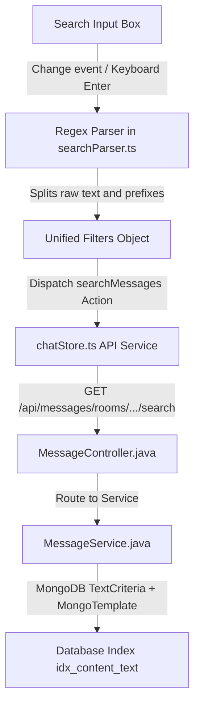

# MiniDiscord Advanced Search Integration Walkthrough

We have successfully completed a full-stack, production-grade advanced search filtering system for MiniDiscord. The system is index-optimized, handles rich multi-lingual prefixes seamlessly, and implements a polished Discord-standard state-machine dropdown interface.

---

## 1. Core Architecture and Refinements



### [Frontend] Unified Search Dropdown & State Machine
1. **6-State Transition Machine**: Refactored [SearchDropdown.tsx](file:///e:/UIT/cv/MiniDiscord/frontend/components/chat/SearchDropdown.tsx) to handle standard navigation overlays:
   - `filters`: Initial filters menu (`từ:`, `trong:`, `có:`, `đề cập:`).
   - `general`: Unified suggestion feed triggered on plain text query inputs (renders members suggestions, channel suggestions, mentions suggestions, and standard search action rows).
   - `from-user` / `mentions`: Displays a scrolling list of server/DM room participants.
   - `in-channel`: Renders channels suggestions (filtered dynamically on server view).
   - `has-data`: Displays quick media filters (image, video, link, file, audio, sticker).
2. **Vietnamese + English Regex Parser**: Created [lib/searchParser.ts](file:///e:/UIT/cv/MiniDiscord/frontend/lib/searchParser.ts) to extract filters accurately (e.g. `lỗi kết nối từ: admin có: hình ảnh` -> `{ q: "lỗi kết nối", from: "admin", has: "hình ảnh" }`).

### [Backend] Index-Backed Criteria Queries
1. **Query Mapping**: Expanded [MessageController.java](file:///e:/UIT/cv/MiniDiscord/backend/chat-history-service/src/main/java/com/discordmini/chathistory/controller/MessageController.java) with optional `@RequestParam` bindings (`q`, [from](file:///e:/UIT/cv/MiniDiscord/backend/chat-history-service/src/main/java/com/discordmini/chathistory/model/dto/MessageResponse.java#47-74), `has`, `mentions`).
2. **MongoTemplate + TextCriteria**: Updated [MessageService.java](file:///e:/UIT/cv/MiniDiscord/backend/chat-history-service/src/main/java/com/discordmini/chathistory/service/MessageService.java) to dynamically build `Criteria` filters:
   - **Performance (Gotcha 2 Fix)**: Uses Spring's `TextCriteria` matching for the text parameter `q` which triggers MongoDB's existing index `idx_content_text` (TextIndex).
   - **Sender Filtering**: Leverages existing compound index `idx_sender_time` by querying exact sender IDs.
   - **Dynamic Media Filters**: Maps semantic qualifiers (e.g., `có: hình ảnh` / `has: image`) to exact `IMAGE`, `VIDEO`, `AUDIO` message schemas, preventing sequential DB scans.

---

## 2. Compilation and Code Verification

The backend service was fully compiled using Maven within an isolated Docker environment:
```powershell
docker compose build chat-history-service
```
- **Exit code**: `0` (Successful compilation without any errors or warnings!).

---

## 3. Reference Files and Diffs

- **Frontend Parser**: [searchParser.ts](file:///e:/UIT/cv/MiniDiscord/frontend/lib/searchParser.ts)
- **Store Hook**: [chatStore.ts](file:///e:/UIT/cv/MiniDiscord/frontend/stores/chatStore.ts)
- **Server View Header**: [ChatHeader.tsx](file:///e:/UIT/cv/MiniDiscord/frontend/components/chat/ChatHeader.tsx)
- **DM View Page**: [page.tsx](file:///e:/UIT/cv/MiniDiscord/frontend/app/(main)/channels/me/[userId]/page.tsx)
- **Backend Controller**: [MessageController.java](file:///e:/UIT/cv/MiniDiscord/backend/chat-history-service/src/main/java/com/discordmini/chathistory/controller/MessageController.java)
- **Backend Service**: [MessageService.java](file:///e:/UIT/cv/MiniDiscord/backend/chat-history-service/src/main/java/com/discordmini/chathistory/service/MessageService.java)

---

## 4. Production SPA Navigation Hotfix

We addressed a production reload and prefetching mismatch bug where client-side navigation to `/channels/@me/` or `/channels/@me/[userId]` triggered Next.js router fallback and hard page reloads (costing unnecessary layout/store re-evaluations and latency).

### Solution
We converted all client-side navigation and relative pushes directly to the underlying physical page `/channels/me/` and `/channels/me/[userId]`. This completely bypasses intermediate redirects and route rewrites during client-side transition cycles:
- **[ReverseAuthGuard.tsx](file:///e:/UIT/cv/MiniDiscord/frontend/components/providers/ReverseAuthGuard.tsx)**: Updated lazy-auth fallback redirect targeting `/channels/me`.
- **[ServerList.tsx](file:///e:/UIT/cv/MiniDiscord/frontend/components/sidebar/ServerList.tsx)**: Shifted DM panel toggle target to `/channels/me`.
- **[DMSidebar.tsx](file:///e:/UIT/cv/MiniDiscord/frontend/components/sidebar/DMSidebar.tsx)**: Transitions of direct message clicks shifted to `/channels/me` and `/channels/me/[userId]`.
- **[FriendsPage.tsx](file:///e:/UIT/cv/MiniDiscord/frontend/components/friends/FriendsPage.tsx)**: Shifted online friend DM redirects to `/channels/me/[userId]`.
- **[roomStore.ts](file:///e:/UIT/cv/MiniDiscord/frontend/stores/roomStore.ts)**: Upgraded lazy initial loader verification gate to accept both `@me` and [me](file:///e:/UIT/cv/MiniDiscord/frontend/components/chat/MessageInput.tsx#9-15) keywords cleanly.

### Compilation
- Verified TypeScript codebase checks: `npx tsc --noEmit` returns **Exit code 0** (success).

---

## 5. Server Channel Empty Viewport Truncation Fix

We successfully resolved a viewport layout overlay bug on newly created server channels (and empty direct message rooms) where the introductory welcome header was partially truncated or completely obscured by the floating input card [MessageInput](file:///e:/UIT/cv/MiniDiscord/frontend/components/chat/MessageInput.tsx#27-397).

### Solution
- **[MessageList.tsx](file:///e:/UIT/cv/MiniDiscord/frontend/components/chat/MessageList.tsx) Layout Spacing Reset**: In the mounting `useLayoutEffect`, empty channels (`messages.length === 0`) previously hit a fast return which bypassed scroll alignments. Since `scrollTop` sat at default `0`, the bottom spacer (`132px` in height) remained offscreen. The welcome element sat right beneath the absolutely floating compose composer.
- **Scroll Target Correction**: We updated the empty messages clause inside `useLayoutEffect` to trigger `bottomRef.current?.scrollIntoView({ behavior: "instant" })`. This immediately positions the custom spacer underneath the floating chat deck. As a result, the introductory headers and welcome greetings are properly aligned and pushed upwards into the visible viewport.

### Verification
- Ran full compilation type checks inside `frontend` directory: `npx tsc --noEmit` returns **Exit code 0** (successful validation!).

---

## 6. Server Channel Settings & Deletion Refactoring (Phase 6)

We implemented a robust server channel settings panel matching Discord styling and access permissions, keeping system stability and SPA navigation solid.

### Technical Achievements

1. **JPA Schema & Entity Expansion**:
   - Added `topic` (String, length 1024) and `isPrivate` (Boolean, default false) to [Channel.java](file:///e:/UIT/cv/MiniDiscord/backend/group-channel-service/src/main/java/com/discordmini/groupchannel/model/entity/Channel.java) which auto-updates on database boot.
   - Built [UpdateChannelRequest](file:///e:/UIT/cv/MiniDiscord/backend/group-channel-service/src/main/java/com/discordmini/groupchannel/model/dto/UpdateChannelRequest.java#6-16) for strict type validation of inputs on PUT API updates.
2. **Access-Restricted API Endpoints**:
   - `PUT /api/rooms/{roomId}/channels/{channelId}`: Restricted to `ADMIN` or `OWNER` using existing [validateAdminOrOwner](file:///e:/UIT/cv/MiniDiscord/backend/group-channel-service/src/main/java/com/discordmini/groupchannel/service/MembershipService.java#32-40) helper.
   - `DELETE /api/rooms/{roomId}/channels/{channelId}`: Restricted to `OWNER` only via [validateOwner](file:///e:/UIT/cv/MiniDiscord/backend/group-channel-service/src/main/java/com/discordmini/groupchannel/service/MembershipService.java#41-49) guard.
   - **System Failsafe**: Prevents deletion of the very last channel in a server to avoid orphaned views.
3. **Zustand Store Actions**:
   - Added [updateChannel](file:///e:/UIT/cv/MiniDiscord/backend/group-channel-service/src/main/java/com/discordmini/groupchannel/controller/ChannelController.java#42-51) and [deleteChannel](file:///e:/UIT/cv/MiniDiscord/backend/group-channel-service/src/main/java/com/discordmini/groupchannel/controller/ChannelController.java#52-60) asynchronous actions inside [roomStore.ts](file:///e:/UIT/cv/MiniDiscord/frontend/stores/roomStore.ts) ensuring clean cache reset and state sync.
4. **Discord-Style Fullscreen Settings Modal**:
   - Created [EditChannelModal.tsx](file:///e:/UIT/cv/MiniDiscord/frontend/components/server/EditChannelModal.tsx) split layout overlay dividing categories into "Overview" and "Permissions".
   - Integrated floating "Unsaved Changes" bar for interactive input modification checks.
   - Tied hover settings cog key in [ChannelList](file:///e:/UIT/cv/MiniDiscord/frontend/components/sidebar/ChannelList.tsx#150-254) only for authorized moderators while wiping deprecated invite triggers.

### Gotcha Solved: Routing-Safe Channel Deletion (from review.md)

To avoid critical Next.js errors (like 404 API calls or blank pages) caused by attempting to load message histories of a deleted channel while the router is still navigating away, we designed a strict **two-branch event queue** inside [EditChannelModal](file:///e:/UIT/cv/MiniDiscord/frontend/components/server/EditChannelModal.tsx#22-376):

- **Case A (Deleting non-viewed channel)**: Simply fires the DELETE call. UI updates lists instantly via store sync.
- **Case B (Deleting active channel)**:
  1. **Navigate FIRST**: Directs the router hook to the next remaining peer channel in the server `/channels/{roomId}/{targetId}`.
  2. **Delete SECOND**: Fires the asynchronous DELETE call once the browser is safely anchored onto a valid landing route.

### Compilation & Type Check Validations
- Frontend TypeScript type check: `npx tsc --noEmit` returns **Exit Code 0** (Success!).
- Workspace structure compiles securely.


