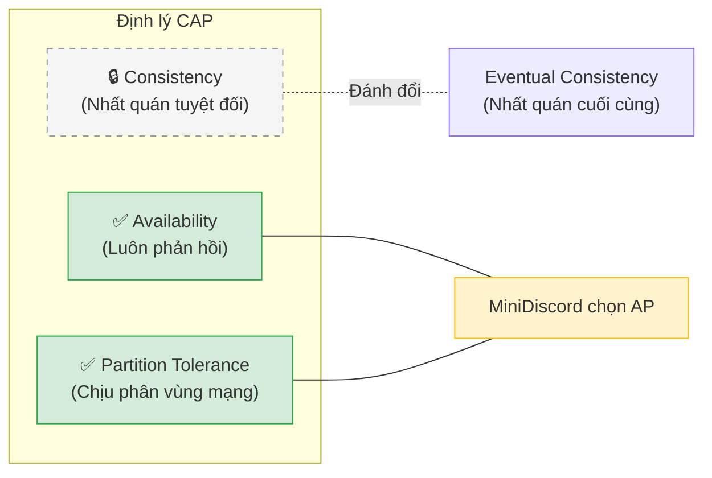
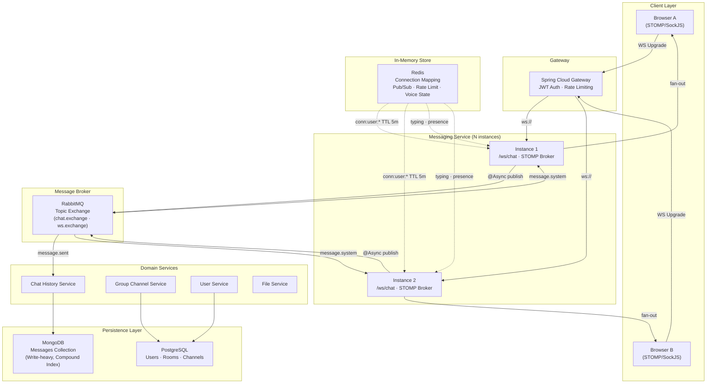
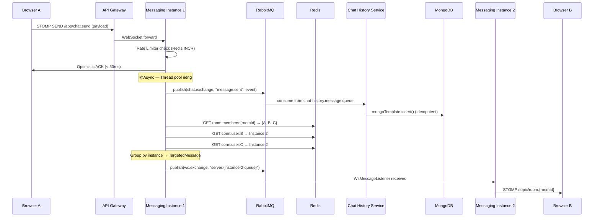
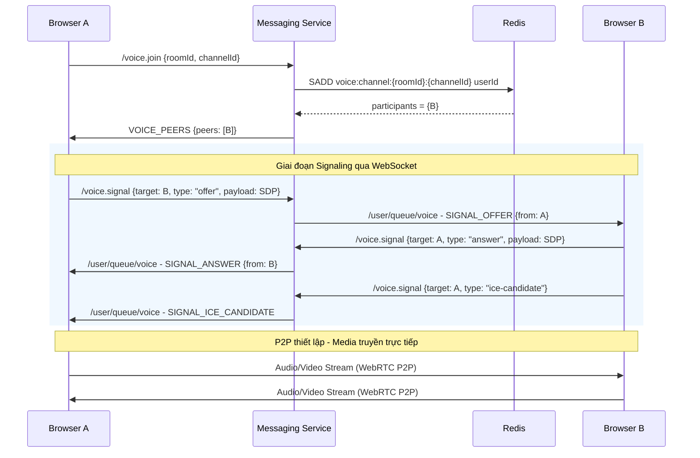
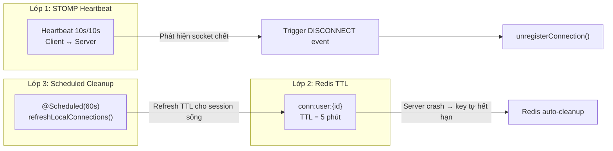

# MiniDiscord — Báo cáo Tổng quan Kỹ thuật

> **Tóm tắt:** Tài liệu này trình bày tổng quan kiến trúc và các giải pháp kỹ thuật cốt lõi đã được triển khai trên nền tảng nhắn tin thời gian thực MiniDiscord. Trọng tâm phân tích tập trung vào **High Availability**, **Performance**, **Concurrency**, **Synchronization** và **Networking** — những yếu tố quyết định chất lượng của một hệ thống phân tán (Distributed System).

---

## Định lý CAP — Lựa chọn then chốt của hệ thống

Theo **Định lý CAP** (Brewer, 2000), một hệ thống phân tán chỉ có thể đảm bảo đồng thời **hai trong ba** thuộc tính: **Consistency** (Nhất quán), **Availability** (Sẵn sàng), **Partition Tolerance** (Chịu phân vùng mạng). Vì Partition Tolerance là bắt buộc trong bất kỳ hệ thống phân tán thực tế nào, lựa chọn thực sự là giữa **C** và **A**.

### Lựa chọn của MiniDiscord: **AP (Availability + Partition Tolerance)**

MiniDiscord ưu tiên **Availability** — hệ thống phải luôn phản hồi, ngay cả khi một node bị cô lập hoặc dữ liệu chưa đồng bộ xong. Đây là lựa chọn tự nhiên cho ứng dụng nhắn tin real-time, nơi việc **người dùng không thể gửi/nhận tin** gây hậu quả nghiêm trọng hơn việc **tin nhắn đến chậm vài mili giây**.

### Bảng ánh xạ CAP theo thành phần

| Thành phần | Mô hình CAP | Giải thích |
|-----------|-------------|------------|
| **Redis (Connection Mapping)** | **AP** | Instance ghi `conn:user:{id}` vào Redis và phản hồi ngay. Nếu Redis chưa replicate xong, instance khác có thể đọc giá trị cũ → **Eventual Consistency** qua TTL refresh (60s) |
| **RabbitMQ (Message Broker)** | **AP** | Tin nhắn được publish và consumer xử lý bất đồng bộ. Nếu consumer down, message nằm trong durable queue chờ xử lý → **không mất dữ liệu**, nhưng nhận **trễ** |
| **MongoDB (Chat History)** | **CP** (default) | Với Replica Set, MongoDB ưu tiên nhất quán (đọc từ Primary). Tuy nhiên, hệ thống dùng `insert()` + Idempotent Consumer nên **chấp nhận retry** thay vì reject |
| **WebSocket (STOMP)** | **AP** | Client nhận Optimistic ACK ngay (<50ms). Tin nhắn có thể chưa ghi DB xong → UI hiển thị trước, DB đồng bộ sau |
| **Redis Pub/Sub (Typing)** | **AP** | Fire-and-forget. Nếu subscriber offline, event bị mất hoàn toàn — **chấp nhận mất** vì dữ liệu phù du |

### Các cơ chế đảm bảo Eventual Consistency

Hệ thống không hy sinh tính nhất quán hoàn toàn, mà áp dụng **Eventual Consistency** — dữ liệu sẽ hội tụ về trạng thái đúng sau một khoảng thời gian ngắn:

| Cơ chế | Đảm bảo | Thời gian hội tụ |
|--------|---------|-----------------|
| **Redis TTL + Scheduled Refresh** | Connection mapping luôn chính xác | ≤ 60 giây (refresh cycle) |
| **Idempotent Consumer** (`insert()` + Unique Index) | Không trùng lặp tin nhắn dù retry | Tức thời (DB-level) |
| **RabbitMQ Durable Queue + ACK** | Không mất tin nhắn nghiệp vụ | Phụ thuộc queue depth |
| **STOMP Heartbeat (10s)** | Phát hiện kết nối chết | ≤ 10 giây |
| **Zombie Cleanup (3 lớp)** | Giải phóng session mồ côi | ≤ 5 phút (TTL worst-case) |

---

## 1. Kiến trúc Tổng thể (System Architecture)

### 1.1 Bài toán cốt lõi

Trong môi trường Microservices, các service REST thông thường mang tính **Stateless** (không lưu trạng thái). Tuy nhiên, nền tảng chat yêu cầu kết nối WebSocket **Stateful** (giữ kết nối liên tục hai chiều). Đây là nghịch lý lớn nhất khi thiết kế: *Làm sao để mở rộng ngang (Horizontal Scaling) một hệ thống vốn dĩ có trạng thái?*

Khi triển khai nhiều instance của Messaging Server qua Load Balancer, một vấn đề phát sinh: **User A** kết nối tới **Instance 1**, **User B** kết nối tới **Instance 2**. Khi User A gửi tin nhắn, Instance 1 hoàn toàn không biết User B đang ở đâu. Nếu để các server tự liên lạc chéo (tight coupling), hệ thống sẽ sụp đổ khi mở rộng.

### 1.2 Giải pháp: Kiến trúc Pub/Sub phân tán

Hệ thống áp dụng mô hình **Centralized Server** kết hợp **Message Broker** (RabbitMQ) và **In-Memory Store** (Redis) để tách biệt trạng thái kết nối khỏi logic nghiệp vụ, cho phép mở rộng ngang không giới hạn:

**Giải thích sơ đồ:**
- **Client Layer → Gateway**: Trình duyệt gửi yêu cầu nâng cấp giao thức (HTTP → WebSocket) đến Spring Cloud Gateway. Gateway xác thực JWT và chuyển tiếp kết nối WebSocket đến một trong N instance của Messaging Service.
- **Messaging Service → RabbitMQ**: Khi nhận tin nhắn qua WebSocket, instance publish bất đồng bộ (`@Async`) vào RabbitMQ Topic Exchange. RabbitMQ phân phối sự kiện đến đúng service consumer (Chat History ghi DB, hoặc instance khác để fan-out).
- **Redis (đường nét đứt)**: Redis không nằm trên đường đi chính của tin nhắn mà đóng vai trò **hỗ trợ định tuyến** — lưu trữ bản đồ kết nối (`conn:user:*`), phát sự kiện phù du (typing/presence), và quản lý trạng thái voice call.
- **Persistence Layer**: MongoDB chịu trách nhiệm ghi lịch sử tin nhắn (write-heavy), PostgreSQL lưu trữ dữ liệu quan hệ (Users, Rooms, Channels).

### 1.3 Thành phần hệ thống

| Thành phần | Công nghệ | Vai trò |
|-----------|-----------|---------|
| **API Gateway** | Spring Cloud Gateway | Định tuyến, xác thực JWT, Rate Limiting |
| **Messaging Service** | Spring Boot + WebSocket/STOMP | Duy trì kết nối real-time, fan-out tin nhắn |
| **Chat History Service** | Spring Boot + MongoDB | Lưu trữ và truy vấn lịch sử tin nhắn |
| **Group Channel Service** | Spring Boot + PostgreSQL | Quản lý Room, Channel, Membership |
| **User Service** | Spring Boot + PostgreSQL | Đăng ký, Đăng nhập, Hồ sơ, Bạn bè |
| **File Service** | Spring Boot + Backblaze B2 | Upload/Download file media |
| **Message Broker** | RabbitMQ (Topic Exchange) | Giao tiếp bất đồng bộ giữa các service |
| **In-Memory Store** | Redis | Connection mapping, Rate limiting, Pub/Sub, Voice state |

---

## 2. Networking (Giao thức mạng & Luồng dữ liệu)

### 2.1 Chiến lược phân chia giao thức

Hệ thống **không** sử dụng chung một giao thức cho mọi loại dữ liệu. Thay vào đó, mỗi loại tác vụ được gán đúng công cụ tối ưu nhất, cân bằng giữa **tốc độ**, **độ tin cậy**, và **chi phí tài nguyên**:

| Giao thức | Loại dữ liệu | Đặc tính | Lý do lựa chọn |
|-----------|--------------|----------|----------------|
| **WebSocket + STOMP** | Tin nhắn real-time, Thông báo | Persistent connection, frame-oriented | Cung cấp pub/sub semantics (`/topic`, `/queue`) tích hợp sẵn, tự động quản lý subscription |
| **Redis Pub/Sub** | Typing indicators, Presence | Fire-and-forget, <1ms latency | Sự kiện phù du (ephemeral) — không cần durability, không ghi đĩa, tốc độ là ưu tiên số 1 |
| **RabbitMQ** | Message events, System events | Durable, acknowledgment, retry | Dữ liệu nghiệp vụ cốt lõi — không được phép mất tin nhắn dù service nhận đang down |
| **WebRTC (P2P)** | Voice/Video stream | Peer-to-peer, low latency | Truyền media trực tiếp giữa 2 trình duyệt, server chỉ đóng vai trò Signaling |
| **REST (HTTP)** | CRUD operations, File upload | Request-Response, stateless | Thao tác một lần (đăng nhập, tạo room, lấy lịch sử chat) |

### 2.2 Luồng gửi tin nhắn end-to-end (Message Routing)

Đây là luồng hoàn chỉnh khi **User A** gửi tin nhắn vào một room có **User B** và **User C** đang online trên các instance khác nhau:

**Giải thích luồng theo từng bước:**

| Bước | Hành động | Ý nghĩa kỹ thuật |
|------|----------|------------------|
| ① | Browser A gửi STOMP SEND qua Gateway | Gateway đã xác thực JWT, chỉ forward — không xử lý logic |
| ② | Instance 1 kiểm tra Rate Limiter | Redis `INCR` nguyên tử đảm bảo đếm chính xác trên toàn cụm |
| ③ | Trả Optimistic ACK (<50ms) | Client nhận phản hồi ngay. Mọi bước sau chạy **bất đồng bộ** trên thread pool riêng |
| ④ | Publish vào `chat.exchange` | RabbitMQ nhận event → Chat History Service ghi vào MongoDB bằng `insert()` (Idempotent) |
| ⑤ | Tra cứu Redis: members + connections | Xác định User B, C thuộc instance nào qua key `conn:user:{id}` |
| ⑥ | Group-by instance → TargetedMessage | Chỉ gửi đến đúng instance chứa user đích qua `ws.exchange` — **không broadcast toàn cụm** |
| ⑦ | Instance 2 nhận và push STOMP | `WsMessageListener` broadcast lên `/topic/room.{id}` → chỉ user đang subscribe mới nhận |

**Điểm mấu chốt:**

1. **Non-blocking response**: WebSocket handler trả phản hồi cho client ngay lập tức (<50ms). Mọi tác vụ nặng (ghi DB, fan-out) đều chạy bất đồng bộ trên thread pool riêng qua `@Async("taskExecutor")`.
2. **Instance-aware routing**: `MessageRouter` tra cứu Redis để biết mỗi thành viên đang kết nối tại instance nào, rồi nhóm (group-by) và gửi `TargetedMessage` chỉ đến đúng instance cần thiết — tránh broadcast thừa.
3. **Exclusive queue per instance**: Mỗi instance tạo queue RabbitMQ riêng biệt (`ws.queue.<UUID>`, non-durable, auto-delete) để nhận tin nhắn fan-out. Khi instance tắt, queue tự hủy.

### 2.3 WebRTC Voice — Signaling qua WebSocket

Đối với cuộc gọi thoại/video, hệ thống **không** truyền media qua server (sẽ nghẽn băng thông). Thay vào đó, server đóng vai trò **Signaling Server** giúp hai trình duyệt tìm thấy nhau qua giao thức WebRTC:

**Giải thích luồng theo từng giai đoạn:**

| Giai đoạn | Bước | Mô tả |
|-----------|------|-------|
| **Discover** | `/voice.join` | Browser A gửi yêu cầu tham gia kênh thoại. Server ghi userId vào Redis Set (`voice:channel:{roomId}:{channelId}`), kiểm tra giới hạn 6 user, rồi trả lại danh sách `VOICE_PEERS` — ai đang có mặt |
| **Signaling** | `/voice.signal` (offer → answer → ICE) | Browser A tạo SDP offer và gửi qua WebSocket. Server chỉ **relay** (chuyển tiếp) đến đúng `/user/queue/voice` của Browser B. Browser B trả SDP answer và ICE candidates theo chiều ngược lại. **Server không xử lý nội dung media** |
| **P2P Stream** | Kết nối trực tiếp | Sau khi trao đổi SDP/ICE thành công, hai trình duyệt kết nối trực tiếp qua WebRTC. Audio/Video stream đi thẳng giữa A ↔ B mà **không đi qua server** — giảm tối đa băng thông và độ trễ |

**Các điểm quan trọng:**
- Voice state (ai đang trong kênh nào, mute/deafen) được lưu trên Redis Set với giới hạn **6 user/channel**
- Cuộc gọi DM có trạng thái tạm thời (`voice:call:{roomId}`) với TTL 60 giây — tự hết hạn nếu không ai trả lời
- Khi kết thúc cuộc gọi, hệ thống tự động tạo tin nhắn SYSTEM ghi nhận thời lượng vào lịch sử chat

---

## 3. Concurrency (Xử lý đa luồng & Tranh chấp tài nguyên)

### 3.1 Vấn đề

Hệ thống nhắn tin real-time phải xử lý hàng trăm yêu cầu đồng thời từ nhiều user, trên nhiều room, qua nhiều server instance. Nếu không quản lý đa luồng đúng cách sẽ dẫn đến:
- **Lost Update**: Dữ liệu bị ghi đè khi hai luồng cùng đọc-sửa-ghi một tài nguyên
- **Thread Starvation**: WebSocket handler bị block bởi I/O nặng (ghi DB, gọi API)
- **Rate Abuse**: User spam tin nhắn liên tục gây quá tải toàn bộ cụm

### 3.2 Các giải pháp đã triển khai

#### A. ConcurrentHashMap — Lock-free Connection Tracking

Mỗi instance lưu trữ bản đồ `userId → sessionId` ngay trên bộ nhớ cục bộ (Local RAM) bằng `ConcurrentHashMap`. Cấu trúc này cho phép đọc/ghi đồng thời từ nhiều luồng mà **không cần `synchronized` block**, với độ phức tạp O(1) cho mỗi thao tác lookup.

**Tại sao không dùng HashMap?** `HashMap` không thread-safe — hai thread gọi `put()` đồng thời có thể phá vỡ cấu trúc bảng băm nội bộ, dẫn đến infinite loop hoặc data corruption.

#### B. @Async Thread Pool — Non-blocking Message Processing

Luồng WebSocket handler (`ChatWebSocketController.sendChat()`) phải trả phản hồi nhanh (<50ms). Nếu chạy đồng bộ, mỗi tin nhắn sẽ mất thêm 5–20ms cho network I/O (publish RabbitMQ, query Redis).

Giải pháp: Tách các tác vụ nặng (`publishToHistory`, `fanOutToMembers`) sang **thread pool riêng** qua annotation `@Async("taskExecutor")`. WebSocket thread được giải phóng ngay lập tức, trong khi các tác vụ nặng chạy song song trên executor pool.

#### C. MongoDB Atomic Operators — Race-safe Reactions

Khi nhiều người dùng thả cảm xúc (reaction) lên cùng một tin nhắn, hệ thống sử dụng toán tử nguyên tử của MongoDB:
- `$addToSet`: Thêm userId vào danh sách reaction (tự động chống trùng)
- `$pull`: Gỡ userId khỏi danh sách

Thao tác này được MongoDB xử lý ở mức **DB engine**, loại bỏ hoàn toàn hiện tượng Lost Update mà không cần lock phía ứng dụng Java.

| Phương pháp | Thread A | Thread B | Kết quả |
|------------|----------|----------|---------|
| ❌ Non-atomic (read-modify-write) | read([]) → save([A]) | read([]) → save([B]) | **Mất A** (Lost Update) |
| ✅ Atomic (`$addToSet`) | $addToSet(A) → [A] | $addToSet(B) → [A, B] | **Cả hai đều lưu** |

#### D. Redis Atomic Increment — Distributed Rate Limiter

Hệ thống giới hạn **5 tin nhắn/giây/user** trên toàn bộ cụm bằng lệnh `INCREMENT` nguyên tử của Redis kết hợp TTL 1 giây:

1. Mỗi lần user gửi tin → Redis `INCR` key `rate:msg:{userId}` (nguyên tử, thread-safe)
2. Nếu key mới tạo (count = 1) → đặt TTL 1 giây (auto-reset)
3. Nếu count > 5 → từ chối tin nhắn

**Tại sao Redis mà không dùng in-memory counter?** Trong môi trường multi-instance, mỗi instance chỉ thấy local counter. User có thể gửi 5 msg/s vào Instance A rồi thêm 5 msg/s vào Instance B → bypass giới hạn. Redis là **shared state duy nhất** chính xác cho tất cả instance.

---

## 4. Synchronization (Đồng bộ trạng thái)

### 4.1 Vấn đề

Trạng thái phải nhất quán đồng thời giữa ba lớp:
- Nhiều **server instance** của cùng một microservice (messaging-service x N)
- Nhiều **microservice** khác nhau (messaging ↔ chat-history ↔ user-service)
- Nhiều **client browser** đang kết nối đồng thời vào các instance khác nhau

### 4.2 Các giải pháp đã triển khai

#### A. Race-safe Session Unregister

Khi user disconnect, hệ thống không đơn giản xóa session. Nó thực hiện **kiểm tra kép (double-check)**:

1. **Check cục bộ**: Chỉ xóa entry trong `ConcurrentHashMap` nếu `sessionId` truyền từ sự kiện disconnect **khớp chính xác** với session đang lưu. Nếu user đã reconnect cực nhanh (<100ms), session mới đã ghi đè → sự kiện disconnect cũ bị bỏ qua an toàn.
2. **Check Redis**: Chỉ xóa Redis key `conn:user:{userId}` nếu key đó vẫn trỏ về chính instance hiện tại. Nếu user đã reconnect vào instance khác, Redis key đã cập nhật → tránh xóa nhầm.

**Race condition được phòng ngừa:** User disconnect rồi reconnect trong <100ms. Nếu không có double-check, event disconnect cũ sẽ xóa session mới → user bị "mất kết nối ảo" (phantom disconnection).

#### B. Zombie Connection Cleanup (3 lớp bảo vệ)

Trong mạng thực tế, client có thể mất kết nối đột ngột (rớt mạng, tắt trình duyệt) mà không gửi frame DISCONNECT. Hệ thống xử lý bằng cơ chế **3 lớp bảo vệ**:

**Giải thích sơ đồ 3 lớp bảo vệ:**
- **Lớp 1 (Heartbeat)**: STOMP gửi tín hiệu heartbeat mỗi 10 giây giữa client và server. Nếu server không nhận được heartbeat từ client trong khoảng thời gian quy định, nó tự động kích hoạt sự kiện DISCONNECT → gọi `unregisterConnection()` để dọn dẹp session.
- **Lớp 2 (Redis TTL)**: Mỗi key kết nối (`conn:user:{id}`) có TTL 5 phút. Trong trường hợp **server crash đột ngột** (không kịp gọi unregister), key Redis sẽ tự hết hạn sau 5 phút → giải phóng tài nguyên mà không cần can thiệp.
- **Lớp 3 (Scheduled Task)**: Task chạy mỗi 60 giây duyệt qua tất cả kết nối cục bộ **đang sống** và refresh TTL Redis của chúng về lại 5 phút. Nhờ đó, session hoạt động bình thường sẽ không bao giờ bị TTL xóa nhầm.

| Lớp | Cơ chế | Bảo vệ trường hợp |
|-----|--------|-------------------|
| **Lớp 1** | STOMP Heartbeat (10s server↔client) | Client rớt mạng → server phát hiện qua missing heartbeat |
| **Lớp 2** | Redis Key TTL 5 phút | Server crash đột ngột → key mồ côi tự hết hạn |
| **Lớp 3** | `@Scheduled(fixedRate = 60000)` | Refresh TTL cho session đang sống, ngăn key bị xóa nhầm |

#### C. Idempotent Consumer — Chống trùng lặp tin nhắn

Khi RabbitMQ gửi lại tin nhắn (do mất ACK từ consumer), hệ thống không tạo ra tin nhắn trùng lặp nhờ mẫu thiết kế **Idempotent Consumer**:

- Sử dụng `mongoTemplate.insert()` thay vì `save()` — `insert()` ném `DuplicateKeyException` nếu document đã tồn tại
- Kết hợp Unique Index trên trường `messageId` trong MongoDB
- Exception được bắt và bỏ qua → tin nhắn trùng lặp không được ghi vào DB

| Phương pháp | mongoTemplate.save() | mongoTemplate.insert() |
|------------|---------------------|----------------------|
| Document đã tồn tại | **Ghi đè** (upsert) | **Ném DuplicateKeyException** |
| Hậu quả | Tin nhắn bị reset metadata | Tin nhắn trùng bị bỏ qua an toàn |

#### D. Event-Driven Cross-Service Sync (RabbitMQ)

Các microservice không gọi REST trực tiếp cho các sự kiện thay đổi trạng thái. Thay vào đó, chúng giao tiếp bất đồng bộ qua RabbitMQ Topic Exchange:

| Sự kiện | Producer | Consumer | Exchange | Routing Key |
|---------|----------|----------|----------|-------------|
| Tin nhắn mới | messaging | chat-history | `chat.exchange` | `message.sent` |
| Edit/Delete tin nhắn | chat-history | messaging | `chat.exchange` | `message.system` |
| Presence update | messaging | user-service | `user.events` | `user.presence.update` |
| Member join/leave | group-channel | messaging | `room.events` | routing varies |

**Chiến lược Queue:**
- **Shared durable queue** (`messaging.system-events.queue`): Dùng cho edit/delete events — chỉ **một** instance xử lý event, rồi fan-out đến connected clients. Tránh xử lý trùng lặp.
- **Exclusive per-instance queue** (`ws.queue.<UUID>`): Dùng cho message fan-out — mỗi instance nhận riêng phần tin nhắn dành cho các user kết nối tại đó.

---

## 5. High Availability & Performance (Tính sẵn sàng cao & Hiệu năng)

### 5.1 Chiến lược Horizontal Scaling

Yếu tố then chốt giúp hệ thống mở rộng ngang là việc **tách biệt Connection State khỏi Server**:

- Mỗi instance của `messaging-service` lưu bản đồ kết nối cục bộ trên RAM (`ConcurrentHashMap`), nhưng **bản đồ toàn cục** được Redis nắm giữ (`conn:user:{userId} → instanceId`)
- Kết quả: Bản thân các instance trở thành **"Stateless" trong mắt hệ thống định tuyến**. Server mới thêm vào chỉ cần đọc/ghi mapping từ Redis, không cần biết các server khác tồn tại
- Load Balancer phân phối kết nối WebSocket mới đến bất kỳ instance nào. Redis đảm bảo mọi instance đều có thể tìm đúng đích đến cho tin nhắn

### 5.2 Tối ưu Database

#### A. MongoDB Compound Indexes — Tránh Collection Scan

Lịch sử chat là tác vụ truy vấn nặng nhất. Hệ thống sử dụng chiến lược **ESR (Equality-Sort-Range)** cho index:

| Index | Trường | Loại | Mục đích |
|-------|--------|------|----------|
| `idx_channel_cursor` | roomId ↑, channelId ↑, _id ↓ | Compound (ESR) | Base filter + cursor pagination — O(log n) |
| `idx_content_text` | content | TextIndex | Full-text search cho tìm kiếm tin nhắn — tránh COLLSCAN |
| `idx_sender_time` | senderId ↑, createdAt ↓ | Compound | Filter theo người gửi — O(log n) exact match |
| `idx_messageId` | messageId | Unique | Idempotent Consumer — chống trùng lặp |
| `idx_ttl_deleted` | deletedAt | TTL (30 ngày) | Auto-cleanup tin nhắn đã xóa mềm |

**So sánh hiệu năng TextIndex vs Regex:**

| Phương pháp | Query Plan | Thời gian (500K documents) |
|------------|-----------|--------------------------|
| ❌ `$regex` (không index) | `COLLSCAN` — quét toàn bộ collection | 800ms+ |
| ✅ `TextCriteria` (TextIndex) | `TEXT_MATCH` — sử dụng `idx_content_text` | 5–15ms |

#### B. Caching & Pagination

- **Redis cache cho Room Members**: Danh sách thành viên room được lưu trên Redis Set (`room:members:{roomId}`), tránh query PostgreSQL cho mỗi tin nhắn
- **Cursor-based Pagination**: Frontend chỉ tải 20 tin nhắn gần nhất. Khi cuộn lên, API sử dụng cursor (ObjectId) kết hợp `idx_channel_cursor` để truy vấn trang tiếp theo trong O(log n)
- **SWR Caching (Frontend)**: Sử dụng pattern Stale-While-Revalidate trên Axios interceptor để giảm thiểu request trùng lặp và cải thiện Time-To-View

### 5.3 Bảo vệ hệ thống

- **API Gateway Rate Limiting**: Spring Cloud Gateway giới hạn tốc độ tại điểm vào, ngăn chặn DDoS và spam trước khi request chạm đến backend
- **Distributed Rate Limiter (Redis)**: Giới hạn 5 tin nhắn/giây/user trên toàn cụm (đã mô tả ở Mục 3.2.D)
- **Membership Verification**: Trước mọi thao tác nhạy cảm (gửi tin, tìm kiếm, xem lịch sử), hệ thống gọi `membershipClient.verifyMembership()` để xác nhận user thuộc room — ngăn chặn **IDOR (Insecure Direct Object Reference)**

### 5.4 Hướng Fault Tolerance (Khả năng chịu lỗi)

Để đạt mức **High Availability** thực sự trong môi trường production, hệ thống cần bổ sung:

| Thành phần | Rủi ro SPOF | Giải pháp đề xuất |
|-----------|------------|-------------------|
| **Redis** | Node Redis chết → mất toàn bộ Connection Mapping | **Redis Sentinel/Cluster**: Failover tự động, phân mảnh dữ liệu |
| **RabbitMQ** | Node RabbitMQ chết → mất queue chưa persist | **Quorum Queues**: Sao chép queue sang nhiều node, thăng cấp Slave khi Master sập |
| **MongoDB** | Node Mongo chết → mất khả năng ghi lịch sử | **Replica Set**: Tự động failover Primary → Secondary |

---

## 6. Tổng kết — Bảng so sánh giải pháp

| Lĩnh vực | Kỹ thuật cốt lõi | Vấn đề giải quyết |
|----------|------------------|-------------------|
| **Kiến trúc** | Microservices + Pub/Sub + Redis Connection Mapping | Horizontal Scaling cho WebSocket Stateful, tách biệt state khỏi server |
| **Networking** | STOMP/WS · Redis Pub/Sub · RabbitMQ · WebRTC P2P | Phân chia giao thức theo bản chất dữ liệu (durability vs speed) |
| **Concurrency** | ConcurrentHashMap · @Async Thread Pool · MongoDB $addToSet · Redis INCR | Lost Update, Thread Starvation, Rate Abuse |
| **Synchronization** | Session-ID double-check · TTL+Heartbeat+Scheduler · Idempotent Consumer · RabbitMQ Events | Phantom disconnect, Zombie connections, Duplicate messages, Cross-service state |
| **High Availability** | Redis Sentinel · Quorum Queues · Compound Indexes · Cursor Pagination | Single Point of Failure, Collection Scan, Traffic Spikes |

| So sánh Trade-off | Redis Pub/Sub | RabbitMQ |
|-------------------|--------------|---------|
| **Tốc độ** | <1ms (in-memory) | 5–20ms (disk I/O) |
| **Durability** | ❌ Fire-and-forget (mất nếu subscriber offline) | ✅ Durable queues, ACK, retry |
| **Use case** | Typing indicators, Presence | Core messages, System events |
| **Scaling** | Tự động với Redis Cluster | Cần cấu hình Quorum/Mirror |