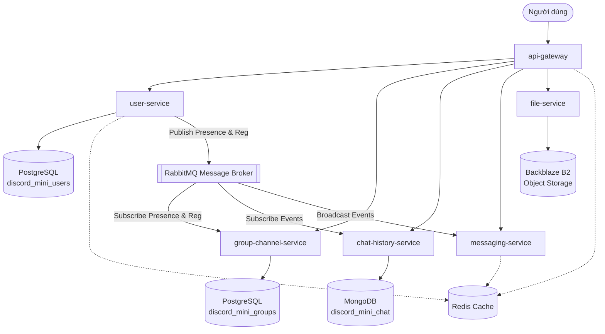
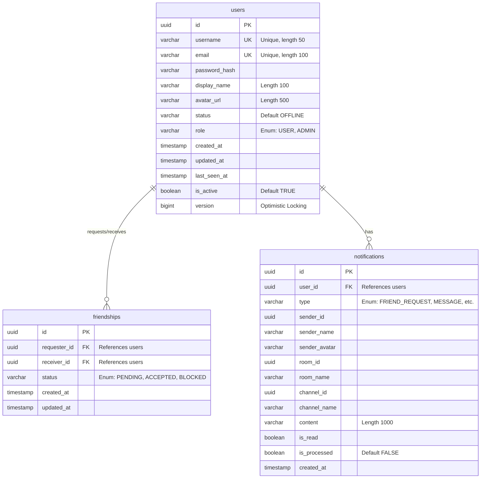
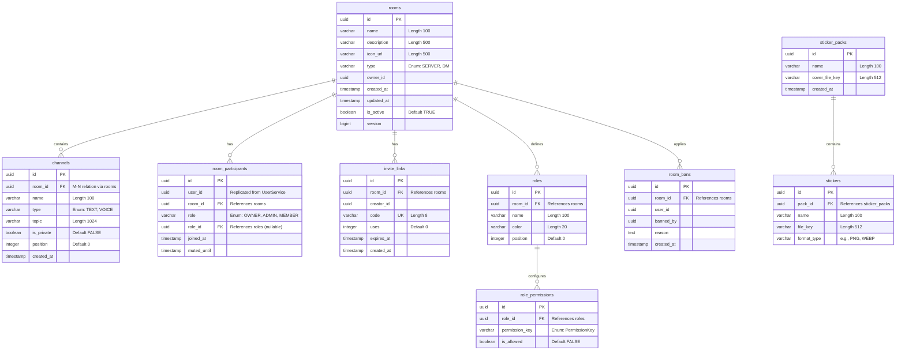
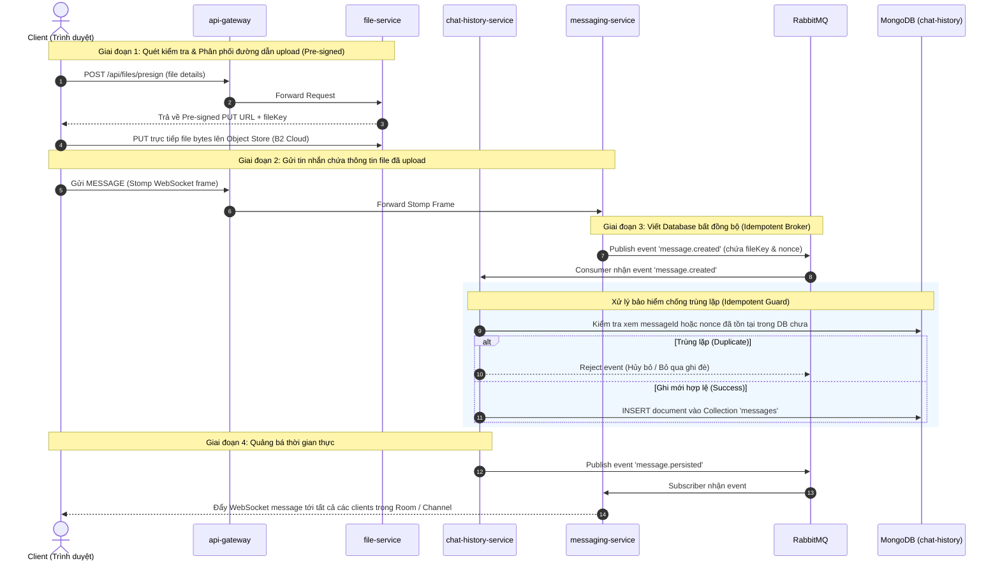

# BÁO CÁO KIẾN TRÚC VÀ LUỒNG DỮ LIỆU MICROSERVICES (DATABASE FLOWS)

Báo cáo này cung cấp cái nhìn tổng quan về thiết kế cơ sở dữ liệu, mối quan hệ giữa các thực thể (ERD) và luồng đồng bộ dữ liệu real-time giữa các dịch vụ (microservices) trong hệ thống MiniDiscord.

---

## 1. Tổng quan Kiến trúc Data-Store
Hệ thống MiniDiscord sử dụng mô hình **Database-per-Service** kết hợp đa dạng các giải pháp lưu trữ (Polyglot Persistence) để đáp ứng các nhu cầu nghiệp vụ khác nhau:

*   **PostgreSQL**: Cơ sở dữ liệu quan hệ, đảm bảo tính nhất quán (ACID). Được chia thành 2 cơ sở dữ liệu độc lập:
    *   `discord_mini_users`: Quản lý tài khoản, mối quan hệ bạn bè và thông báo.
    *   `discord_mini_groups`: Quản lý cấu trúc máy chủ (Rooms), kênh (Channels), phân quyền (Roles) và thành viên.
*   **MongoDB**: Cơ sở dữ liệu tài liệu (NoSQL), tối ưu hóa việc ghi chép lịch sử chat với tần suất cao, hỗ trợ phân trang hiệu quả bằng cursor.
    *   `discord_mini_chat`: Lưu trữ tin nhắn, phản ứng (reactions), câu trả lời (replies) và trạng thái đã đọc (read receipts).
*   **Redis**: Bộ nhớ đệm và lưu trữ cấu trúc dữ liệu trong RAM (In-Memory).
    *   Sử dụng cho hệ thống theo dõi trạng thái hoạt động (Presence) và hàng đợi phát nhạc (Music Queue).
*   **Backblaze B2 (S3-compatible)**: Lưu trữ đối tượng (Object Storage) để quản lý tệp đính kèm, ảnh đại diện và nhãn dán (stickers).

### Sơ đồ Vĩ mô Luồng dữ liệu hệ thống (Macro Data Flow)
Sơ đồ dưới đây minh họa cách các service giao tiếp trực tiếp với cơ sở dữ liệu của chúng và gián tiếp thông qua RabbitMQ:



---

## 2. Chi tiết luồng dữ liệu & Schema của các dịch vụ

### 2.1. User Service (`user-service`)
Chịu trách nhiệm quản lý tài khoản người dùng, hồ sơ cá nhân, quan hệ bạn bè và hệ thống thông báo.

#### Sơ đồ Quan hệ Thực thể (ERD) - PostgreSQL (`discord_mini_users`)


#### Luồng dữ liệu & Cơ chế Cache:
1.  **Trạng thái hoạt động (Presence)**:
    *   Khi người dùng kết nối WebSocket thông qua `messaging-service`, dịch vụ đó sẽ đặt khóa `presence:{userId}` vào **Redis** với giá trị `"ONLINE"` và TTL là **10 phút**.
    *   Sự kiện chuyển đổi trực tuyến/ngoại tuyến lập tức được đẩy qua RabbitMQ (`user.events` với routing key `user.presence.update`) để cập nhật thông tin trong cơ sở dữ liệu `users` của PostgreSQL.
    *   Hệ thống chạy định kỳ (zombie cleanup) mỗi 60 giây để làm mới thời gian hết hạn (TTL) của các session hoạt động cục bộ.

---

### 2.2. Group Channel Service (`group-channel-service`)
Quản lý thực thể Máy chủ (Rooms), các Kênh (Channels), phân quyền (Roles/Permissions) và danh sách Sticker.

#### Sơ đồ Quan hệ Thực thể (ERD) - PostgreSQL (`discord_mini_groups`)


#### Đồng bộ hóa dữ liệu không đồng bộ (Event-driven Replication)
Vì `user-service` và `group-channel-service` sử dụng hai DB độc lập, việc liên kết thông tin User được xử lý bất đồng bộ thông qua RabbitMQ Broker:
1.  **Đăng ký người dùng**:
    *   `user-service` đẩy thông báo tạo tài khoản thành công qua hàng đợi RabbitMQ `group-channel.user-registered`.
    *   `UserEventListener` trong `group-channel-service` bắt được sự kiện này và tự động thêm user mới vào Group chung mặc định hệ thống (`getOrCreateRootGroup()`).
2.  **Đồng bộ hiện diện (Presence Update)**:
    *   Khi có cập nhật qua topic exchange `user.events` với routing key `user.presence.update`, `group-channel-service` tìm toàn bộ các phòng chứa thành viên này (`findByUserId`), và chuyển tiếp thông tin cập nhật trạng thái trực tuyến của user tới tất cả các phòng liên quan thông qua exchange `room.events`.

---

### 2.3. Chat History Service (`chat-history-service`)
Lưu trữ toàn bộ nội dung tin nhắn và lịch sử hội thoại trong hệ thống nhằm mục đích truy vấn nhanh và chịu tải tốt.

#### Cấu trúc tài liệu MongoDB (NoSQL Schemas)

##### 1. Collection `messages`
Mỗi tài liệu (Document) đại diện cho một tin nhắn văn bản, tệp đính kèm hoặc hành động hệ thống.

```json
{
  "_id": "648a1c9eab8972df102a11b9",         // MongoDB ObjectId, sử dụng trực tiếp làm Cursor phân trang
  "messageId": "9b1deb4d-3b7d-4bad-9bdd-2b0d7b3dcb6d", // UUID duy nhất của tin nhắn, phục vụ Idempotency khi nhận tin nhắn
  "nonce": "optimistic-client-uid-9992",     // ID do client gửi đi để xử lý trùng lặp và phản hồi giao diện tức thì
  "roomId": "f3b392a8-12cd-4abc-baed-8c3bcf52bcbb",    // Indexed
  "channelId": "d718b537-8b0d-44aa-9ff2-78d123e421cd", // Indexed
  "senderId": "c5dae3d8-2d5d-6d3c-bd3c-3c4d5e6f7a8b",
  "senderName": "PhatNguyenTT",
  "senderAvatar": "https://api.minidiscord.com/avatars/phat.png",
  "type": "TEXT",                            // TEXT, IMAGE, FILE, SYSTEM
  "content": "Chào cả nhà!",
  "fileKey": "key/to/file/in/b2.jpg",        // Tùy chọn (Nếu có upload)
  "fileName": "avatar.jpg",
  "fileSize": 102456,
  "mentions": ["userId-1", "userId-2"],      // Indexed Array
  "isEdited": false,
  "isDeleted": false,
  "isPinned": false,
  "isForwarded": false,
  "deletedAt": null,                         // TTL index giúp xóa tự động nếu set
  "deletedForUsers": [],
  "createdAt": "2026-06-17T06:30:00Z",       // Indexed (Sắp xếp thời gian thực)
  "updatedAt": "2026-06-17T06:30:00Z",
  "replyTo": {                               // Tùy chọn (Trả lời tin nhắn khác)
    "messageId": "9b1deb4d-3b7d-4bad-9bdd-2b0d7b3dcb60",
    "content": "Chào bạn!",
    "senderName": "MinhAnh"
  },
  "reactions": [                             // Quản lý cảm xúc icon tin nhắn
    {
      "emoji": "👍",
      "userIds": ["c5dae3d8-2d5d-6d3c-bd3c-3c4d5e6f7a8b"]
    }
  ],
  "stickerIds": []
}
```

##### 2. Collection `read_receipts`
Theo dõi trạng thái đọc tin nhắn của từng thành viên trong mỗi kênh.

```json
{
  "_id": "648a1c9eab8972df102a11c0",
  "userId": "c5dae3d8-2d5d-6d3c-bd3c-3c4d5e6f7a8b",
  "roomId": "f3b392a8-12cd-4abc-baed-8c3bcf52bcbb",
  "channelId": "d718b537-8b0d-44aa-9ff2-78d123e421cd",
  "lastReadMessageId": "648a1c9eab8972df102a11b9", // ObjectId của tin nhắn cuối cùng đã đọc
  "lastReadAt": "2026-06-17T06:35:00.000"
}
```
*   **Compound Index cực kỳ quan trọng**: Tạo chỉ mục ghép duy nhất kích hoạt đồng thời `{'userId': 1, 'roomId': 1, 'channelId': 1}` nhằm ngăn chặn trùng lặp biên tiếp nhận đọc tin nhắn và tối ưu hóa truy vấn đếm số lượng tin nhắn chưa đọc.

---

### 2.4. Messaging Service (`messaging-service`)
Dịch vụ xử lý luồng WebSockets (STOMP/PubSub) chính, điều phối Voice và âm nhạc trực tuyến. Không lưu trữ cơ sở dữ liệu quan hệ hay tài liệu dài hạn mà tận dụng cấu trúc dữ liệu hiệu năng cao của **Redis**.

#### Thiết kế cấu trúc dữ liệu trên Redis

```
┌──────────────────────────────────────────────────────────────────┐
│                           REDIS CACHE                            │
├──────────────────────────────────────────────────────────────────┤
│                                                                  │
│  1. Trạng thái Trực tuyến (Presence)                             │
│     * Key: presence:{userId}                                     │
│     * Type: String                                               │
│     * Value: "ONLINE"                                            │
│     * TTL: 10 phút (600s)                                        │
│                                                                  │
│  2. Hàng đợi phát nhạc (Music Queue)                             │
│     * Key: room:music_queue:{roomId}                             │
│     * Type: List                                                 │
│     * Structure: [ {track_1_json}, {track_2_json}, ... ]         │
│     * Operations: LPUSH (nạp vào), RPOP (lấy bài kế tiếp)        │
│                                                                  │
│  3. Trạng thái đầu phát nhạc (Music Playing State)               │
│     * Key: room:music_state:{roomId}                             │
│     * Type: Hash                                                 │
│     * Fields & values:                                           │
│       ├── isBotActive : "true" | "false"                         │
│       ├── startTime   : "1781682000000" (Unix timestamp)         │
│       └── currentTrack: "{current_track_json_details}"           │
│                                                                  │
└──────────────────────────────────────────────────────────────────┘
```

---

### 2.5. File Service (`file-service`)
Dịch vụ cung cấp tải lên và tải xuống tài nguyên bảo mật cao (Object Storage).

*   Dịch vụ này **hoàn toàn khuyển dịch trạng thái cấu trúc cơ sở dữ liệu (Stateless)**. Nó không lưu trữ thông tin tệp tin trong database.
*   Nền tảng lưu trữ sử dụng **Backblaze B2** thông qua giao thức cổng tương thích S3 (MinIO Client).
*   **Sử dụng Pre-signed URL flow**:
    1.  Client gửi yêu cầu muốn upload file (kèm tên, size, mime type, mục đích).
    2.  `file-service` tạo **S3 Pre-signed PUT URL** kèm khóa file định dạng: `{userId}/{YearMonth}/{UUID}.{extension}`.
    3.  Đồng thời tạo **S3 Pre-signed GET URL** có chữ ký mã hóa cho phép truy xuất/hiển thị nhanh sau đó.
    4.  Client nhận được các URL này và tiến hành tải tệp trực tiếp lên cloud storage từ trình duyệt mà không cần thông qua băng thông máy chủ chính.

---

## 3. Quy trình Đồng bộ và Phối hợp Dữ liệu giữa các Dịch vụ

Bản đồ tuần tự dưới đây biểu diễn hành vi cơ sở dữ liệu và dòng luồng dữ liệu khi xảy ra vòng đời chính trong hệ thống: **Gửi tin nhắn kèm File đính kèm**.



Báo cáo này khái quát hóa toàn bộ luồng lưu trữ trên mô hình triển khai thực tế của hệ thống MiniDiscord. Tài liệu này đóng vai trò quan trọng trong việc hỗ trợ bảo trì, thiết kế tải trọng lớn và tối ưu hóa tốc độ truy xuất của toàn bộ hệ thống back-end.
