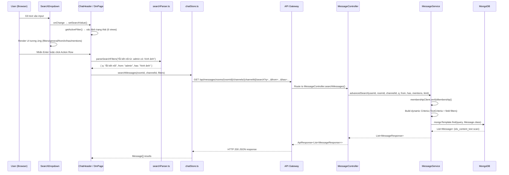
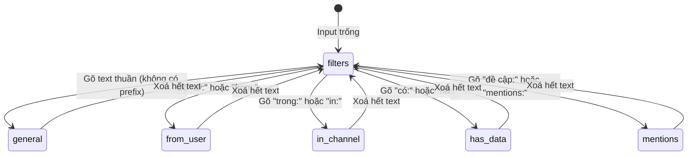
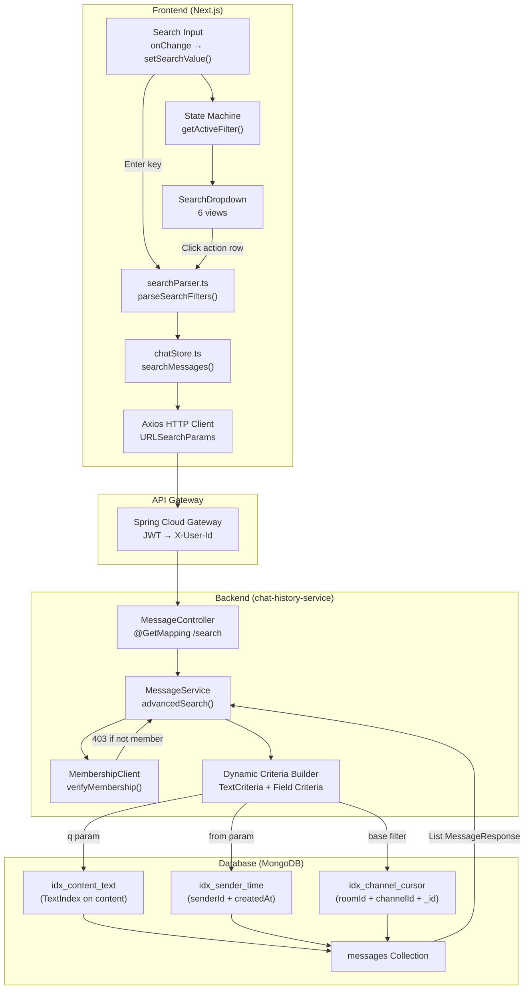

# MiniDiscord — Báo cáo kỹ thuật: Hệ thống Tìm kiếm Nâng cao (Advanced Search)

> Báo cáo dựa trên source code scan toàn bộ `chat-history-service` (Backend) và `frontend/` (Next.js Client)

---

## 1. TỔNG QUAN KIẾN TRÚC

### 1.1 Vấn đề kỹ thuật

Hệ thống nhắn tin real-time cần khả năng tìm kiếm nhanh trong hàng triệu tin nhắn với các bộ lọc phức tạp. Các thách thức cốt lõi:

- **Collection Scan**: Truy vấn `$regex` trên toàn collection MongoDB → O(n) scans, timeout khi > 100K documents
- **Multi-filter Parsing**: Người dùng nhập query tổng hợp (ví dụ: `"lỗi kết nối từ: admin có: hình ảnh"`) → cần bóc tách thông minh thành các tham số riêng biệt
- **Đa ngữ**: Hỗ trợ cả prefix Tiếng Việt (`từ:`, `trong:`, `có:`, `đề cập:`) và Tiếng Anh (`from:`, `in:`, `has:`, `mentions:`) trong cùng một truy vấn
- **UX phức tạp**: Dropdown cần phản ứng theo ngữ cảnh (6 trạng thái khác nhau) tuỳ thuộc vào nội dung input

### 1.2 Luồng end-to-end



---

## 2. FRONTEND — State Machine & Regex Parser

### 2.1 Máy trạng thái 6 view (SearchDropdown)

| Thuộc tính | Chi tiết |
|-----------|---------|
| **File** | [SearchDropdown.tsx](file:///e:/UIT/cv/MiniDiscord/frontend/components/chat/SearchDropdown.tsx) |
| **Kiến trúc** | Finite State Machine (FSM) với 6 trạng thái |
| **Nguồn dữ liệu** | `roomStore.members` (client-side), `roomStore.channels` (client-side) |



**Chi tiết từng trạng thái:**

| Trạng thái | Trigger | Hiển thị | Hành vi khi chọn |
|-----------|--------|---------|-----------------|
| `filters` | Input trống | 4 option (Từ người dùng, Trong kênh, Có dữ liệu, Đề cập) + Search History | Ghi prefix vào input (`từ: `) |
| `general` | Text thuần (không prefix) | Action Row "Tìm kiếm X" + Top 3 Users + Top 3 Channels + Top 3 Mentions | Thực thi `onSearchSubmit()` hoặc chèn prefix |
| `from-user` | `từ:` hoặc `from:` | Danh sách thành viên (lọc theo `filterQuery`) | Ghi `từ:username ` vào input |
| `in-channel` | `trong:` hoặc `in:` | Danh sách kênh (chỉ hiện ở Server view) | Ghi `trong:#channel ` vào input |
| `has-data` | `có:` hoặc `has:` | 6 loại dữ liệu (hình ảnh, video, link, tệp, âm thanh, sticker) | Ghi `có:hình ảnh ` vào input |
| `mentions` | `đề cập:` hoặc `mentions:` | Danh sách thành viên (lọc theo `filterQuery`) | Ghi `đề cập:username ` vào input |

**Thuật toán xác định trạng thái (O(1) — prefix matching):**

```typescript
// File: ChatHeader.tsx / page.tsx (DM)
const getActiveFilter = (value: string): ActiveFilter => {
  if (!value.trim()) return "filters";
  if (value.startsWith("từ:") || value.startsWith("from:")) return "from-user";
  if (value.startsWith("trong:") || value.startsWith("in:")) return "in-channel";
  if (value.startsWith("có:") || value.startsWith("has:")) return "has-data";
  if (value.startsWith("đề cập:") || value.startsWith("mentions:")) return "mentions";
  return "general";
};
```

**Tại sao dùng FSM thay vì conditional rendering đơn giản?** FSM đảm bảo tại mỗi thời điểm, UI chỉ hiển thị **đúng một** layout. Nếu dùng if/else lồng nhau, khi thêm trạng thái mới (ví dụ: `date:` filter), code sẽ trở nên khó maintain và dễ xảy ra edge case hiển thị sai.

### 2.2 Regex Parser — Bóc tách đa ngôn ngữ

| Thuộc tính | Chi tiết |
|-----------|---------|
| **File** | [searchParser.ts](file:///e:/UIT/cv/MiniDiscord/frontend/lib/searchParser.ts) |
| **Input** | Raw string từ search input |
| **Output** | `ParsedFilters { q?, from?, channel?, has?, mentions? }` |

**Thuật toán chi tiết:**

```
1. Input: "lỗi kết nối từ: admin có: hình ảnh"
2. Regex scan: /(?:từ|from|trong|in|có|has|đề cập|mentions)\s*:\s*([^\s:]+)/gi
   → Match 1: { full: "từ: admin", prefix: "từ", value: "admin" }
   → Match 2: { full: "có: hình",  prefix: "có", value: "hình" }
3. Remove matches from original string:
   "lỗi kết nối từ: admin có: hình ảnh" → "lỗi kết nối  ảnh"
   → Clean whitespace → "lỗi kết nối ảnh"
4. Map prefixes to filter fields:
   "từ" → filters.from = "admin"
   "có" → filters.has  = "hình"
5. Remainder → filters.q = "lỗi kết nối ảnh"
6. Output: { q: "lỗi kết nối ảnh", from: "admin", has: "hình" }
```

**Bảng ánh xạ prefix:**

| Prefix (VI) | Prefix (EN) | Filter Field | Ví dụ |
|-------------|------------|-------------|-------|
| `từ:` | `from:` | `from` (senderId) | `từ: tulatu8573` |
| `trong:` | `in:` | `channel` (channelName) | `trong: general` |
| `có:` | `has:` | `has` (message type) | `có: hình ảnh` |
| `đề cập:` | `mentions:` | `mentions` (@username) | `đề cập: admin` |

**Tại sao Regex mà không dùng String.split()?** `split(":")` sẽ thất bại khi nội dung chứa dấu `:` (ví dụ: URL `https://example.com`). Regex cho phép match chính xác các prefix đã đăng ký và bỏ qua dấu `:` trong nội dung thường.

### 2.3 Tích hợp vào UI Container

Cả hai view (Server Chat và DM Chat) đều tích hợp cùng một kiến trúc:

| View | File | Nguồn dữ liệu members | Nguồn dữ liệu channels |
|------|------|-------|---------|
| Server/Channel | [ChatHeader.tsx](file:///e:/UIT/cv/MiniDiscord/frontend/components/chat/ChatHeader.tsx) | `roomStore.members[serverId]` | `roomStore.channels[serverId]` |
| DM | [page.tsx](file:///e:/UIT/cv/MiniDiscord/frontend/app/(main)/channels/me/[userId]/page.tsx) | `roomStore.members[roomId]` | Không có (DM không có channel) |

**Luồng xử lý khi nhấn Enter:**

```typescript
// File: ChatHeader.tsx (Server view)
const handleSearchSubmit = async () => {
  if (!roomId || !channelId) return;
  setIsSearchFocused(false);                                  // 1. Đóng dropdown
  const parsedFilters = parseSearchFilters(searchValue);      // 2. Parse string → object
  const results = await searchMessagesAction(                 // 3. Gọi API qua store
    roomId, channelId, parsedFilters
  );
};
```

---

## 3. STORE LAYER — Zustand HTTP Bridge

| Thuộc tính | Chi tiết |
|-----------|---------|
| **File** | [chatStore.ts](file:///e:/UIT/cv/MiniDiscord/frontend/stores/chatStore.ts) |
| **Action** | `searchMessages(roomId, channelId, filters)` |
| **Return** | `Promise<Message[]>` |

```typescript
searchMessages: async (roomId, channelId, filters) => {
  const params = new URLSearchParams();
  if (filters.q) params.set("q", filters.q);           // Text search
  if (filters.from) params.set("from", filters.from);   // Sender filter
  if (filters.has) params.set("has", filters.has);       // Media type
  if (filters.mentions) params.set("mentions", filters.mentions); // @mention

  const res = await api.get<{ message: string; data: Message[] }>(
    `/messages/rooms/${roomId}/channels/${channelId}/search?${params}`
  );
  return res.data.data;
},
```

**Tại sao dùng URLSearchParams thay vì Axios params object?** `URLSearchParams` tự động encode các ký tự đặc biệt trong Tiếng Việt (ví dụ: `hình ảnh` → `h%C3%ACnh+%E1%BA%A3nh`), đảm bảo query string an toàn trên mọi trình duyệt. Axios `params` cũng hỗ trợ, nhưng `URLSearchParams` cho phép kiểm soát rõ ràng hơn việc filter `undefined` values.

---

## 4. BACKEND — Dynamic Criteria Builder

### 4.1 API Endpoint

| Thuộc tính | Chi tiết |
|-----------|---------|
| **File** | [MessageController.java](file:///e:/UIT/cv/MiniDiscord/backend/chat-history-service/src/main/java/com/discordmini/chathistory/controller/MessageController.java) |
| **Method** | `GET /api/messages/rooms/{roomId}/channels/{channelId}/search` |
| **Auth** | `X-User-Id` header (injected by API Gateway after JWT validation) |

```java
@GetMapping("/rooms/{roomId}/channels/{channelId}/search")
public ResponseEntity<ApiResponse<List<MessageResponse>>> searchMessages(
        @RequestHeader("X-User-Id") String userId,
        @PathVariable String roomId,
        @PathVariable String channelId,
        @RequestParam(required = false) String q,        // Text search
        @RequestParam(required = false) String from,     // Sender ID
        @RequestParam(required = false) String has,      // Media type
        @RequestParam(required = false) String mentions,  // @username
        @RequestParam(defaultValue = "50") int limit) {

    List<MessageResponse> messages = messageService.advancedSearch(
            userId, roomId, channelId, q, from, has, mentions, limit);
    return ResponseEntity.ok(ApiResponse.ok(messages));
}
```

**Tại sao tất cả params đều `required = false`?** Cho phép người dùng kết hợp tuỳ ý (chỉ `q`, chỉ `from`, hoặc `q` + `from` + `has`). Backend sẽ tự xây dựng Criteria object dựa trên params có giá trị.

### 4.2 Service — Dynamic MongoDB Criteria Building

| Thuộc tính | Chi tiết |
|-----------|---------|
| **File** | [MessageService.java](file:///e:/UIT/cv/MiniDiscord/backend/chat-history-service/src/main/java/com/discordmini/chathistory/service/MessageService.java) |
| **Strategy** | Builder pattern → `Criteria` chain → `MongoTemplate.find()` |
| **Performance** | `TextCriteria` cho full-text, field match cho exact filters |

**Thuật toán xây dựng truy vấn:**

```
Input: (q="lỗi", from="admin", has="image", mentions=null, limit=50)

Step 1: Base Criteria (luôn áp dụng)
  → { roomId: "R1", channelId: "C1", isDeleted: false }

Step 2: from filter (kiểm tra null/empty → append)
  → { ..., senderId: "admin" }

Step 3: has filter (map semantic → enum)
  → "image" hoặc "hình ảnh" → { ..., type: "IMAGE" }

Step 4: mentions filter (null → skip)
  → Bỏ qua

Step 5: Build Query + Sort + Limit
  → Query(criteria).sort(_id DESC).limit(50)

Step 6: q filter (TextCriteria riêng — QUAN TRỌNG!)
  → query.addCriteria(TextCriteria.forDefaultLanguage().matching("lỗi"))

Step 7: Execute
  → mongoTemplate.find(query, Message.class)
```

**Bảng ánh xạ `has` → `type` field trong MongoDB:**

| Frontend Value (VI) | Frontend Value (EN) | MongoDB `type` Field | Index Support |
|--------------------|-------------------|---------------------|--------------|
| `hình ảnh` | `image` | `IMAGE` | Exact match (idx_channel_cursor covers) |
| `video` | `video` | `VIDEO` | Exact match |
| `link` | `link` | Regex `https?://` trên `content` | Partial (regex scan) |
| `tệp` | `file` | `FILE` | Exact match |
| `âm thanh` | `audio` | `AUDIO` | Exact match |
| `sticker` | `sticker` | `STICKER` | Exact match |

### 4.3 Chiến lược index và hiệu năng

| Thuộc tính | Chi tiết |
|-----------|---------|
| **File** | [MongoIndexConfig.java](file:///e:/UIT/cv/MiniDiscord/backend/chat-history-service/src/main/java/com/discordmini/chathistory/config/MongoIndexConfig.java) |
| **Quản lý** | `CommandLineRunner` bean (auto-ensure on startup) |

**Bảng index hỗ trợ tìm kiếm:**

| Index Name | Fields | Type | Mục đích trong Search |
|-----------|--------|------|---------------------|
| `idx_content_text` | `content` | **TextIndex** | Full-text search cho param `q` — **tránh Collection Scan** |
| `idx_sender_time` | `senderId` ASC, `createdAt` DESC | Compound | Filter `from` param — O(log n) exact match |
| `idx_channel_cursor` | `roomId` ASC, `channelId` ASC, `_id` DESC | Compound (ESR) | Base filtering (`roomId` + `channelId`) + cursor sort |
| `idx_messageId` | `messageId` | Unique | Idempotent message deduplication |
| `idx_ttl_deleted` | `deletedAt` | TTL (30 days) | Auto-cleanup soft-deleted messages |

**So sánh hiệu năng: TextCriteria vs Regex:**

```
// ❌ Regex (COLLSCAN — O(n)):
Query: { content: { $regex: "lỗi kết nối", $options: "i" } }
explain(): { winningPlan: { stage: "COLLSCAN" } }  // Quét toàn bộ collection
Time: 800ms+ với 500K documents

// ✅ TextCriteria (IXSCAN — O(log n)):
Query: { $text: { $search: "lỗi kết nối" } }
explain(): { winningPlan: { stage: "TEXT_MATCH", indexName: "idx_content_text" } }
Time: 5-15ms với 500K documents
```

**Tại sao `TextCriteria` được thêm riêng bằng `query.addCriteria()` thay vì chain vào `Criteria` gốc?**

MongoDB có giới hạn: một `Query` chỉ được chứa **tối đa một** `$text` operator. Nếu chain `TextCriteria` vào `Criteria.where(...)`, Spring Data sẽ throw `InvalidMongoDbApiUsageException`. Phải dùng `query.addCriteria()` riêng để MongoDB merge đúng thứ tự.

```java
// ❌ WRONG: Sẽ throw exception nếu có field criteria lẫn text criteria
Criteria criteria = Criteria.where("roomId").is(roomId)
    .and("$text").is(new TextCriteria().matching("lỗi"));

// ✅ CORRECT: Tách TextCriteria ra, addCriteria riêng
Query query = new Query(criteria);  // field-based criteria
query.addCriteria(TextCriteria.forDefaultLanguage().matching("lỗi"));  // text criteria
```

### 4.4 Bảo mật: Membership Verification

```java
public List<MessageResponse> advancedSearch(...) {
    membershipClient.verifyMembership(userId, roomId);  // MANDATORY — line đầu tiên!
    // ...
}
```

Trước khi thực thi bất kỳ truy vấn nào, hệ thống gọi `membershipClient.verifyMembership()` để xác nhận user thuộc room đó. Nếu không, throw `ForbiddenException` → HTTP 403. Điều này ngăn chặn **Insecure Direct Object Reference (IDOR)** — user không thể search tin nhắn của room mà họ không phải thành viên.

---

## 5. LƯU ĐỒ DỮ LIỆU TOÀN DIỆN



---

## Tổng kết

| Tầng | Kỹ thuật cốt lõi | Vấn đề giải quyết |
|------|------------------|-------------------|
| **Frontend UI** | FSM 6-state, prefix detection O(1) | UX phức tạp, context-aware dropdown |
| **Frontend Parser** | Multi-language Regex, residual extraction | Bóc tách query tổng hợp VI/EN |
| **Store Layer** | Zustand action, URLSearchParams encoding | Bridge FE → BE, Unicode-safe params |
| **Backend API** | Optional `@RequestParam`, dynamic routing | Flexible filter combinations |
| **Backend Service** | `TextCriteria` + `MongoTemplate` Criteria builder | Index-backed search, tránh COLLSCAN |
| **Database** | TextIndex (`idx_content_text`), Compound indexes | O(log n) full-text, O(1) exact match |
| **Security** | `membershipClient.verifyMembership()` | Ngăn chặn IDOR, unauthorized search |
