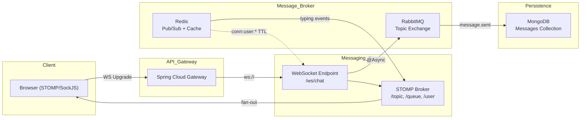

# MiniDiscord — Báo cáo kỹ thuật: Concurrency, Synchronization, Networking

> Báo cáo dựa trên source code scan toàn bộ `messaging-service` và `chat-history-service`

---

## 1. CONCURRENCY (Xử lý đa luồng)

### 1.1 Vấn đề
Hệ thống nhắn tin real-time phải xử lý hàng trăm tin nhắn đồng thời từ nhiều user, trên nhiều room, qua nhiều server instance. Nếu không quản lý đa luồng đúng cách sẽ dẫn đến:
- **Lost Update**: Dữ liệu bị ghi đè khi hai luồng cùng đọc-sửa-ghi
- **Thread Starvation**: WebSocket handler bị block bởi I/O nặng
- **Rate Abuse**: User spam tin nhắn gây quá tải hệ thống

### 1.2 Giải pháp đã triển khai

#### A. ConcurrentHashMap — Lock-free Connection Tracking

| Thuộc tính | Chi tiết |
|-----------|---------|
| **File** | [ConnectionManager.java](file:///e:/UIT/cv/MiniDiscord/backend/messaging-service/src/main/java/com/discordmini/messaging/service/ConnectionManager.java) |
| **Cấu trúc** | `ConcurrentHashMap<String, String>` (userId → sessionId) |
| **Ưu điểm** | Read/Write không cần synchronized block, O(1) lookup |

```java
// Lock-free reads for fast routing
private final ConcurrentHashMap<String, String> userToSession = new ConcurrentHashMap<>();
```

**Tại sao không dùng HashMap?** HashMap không thread-safe — hai thread gọi [put()](file:///e:/UIT/cv/MiniDiscord/frontend/components/chat/MessageInput.tsx#35-374) đồng thời có thể phá cấu trúc bảng băm, dẫn đến infinite loop hoặc data corruption trong Java.

#### B. @Async Thread Pool — Non-blocking Message Fanout

| Thuộc tính | Chi tiết |
|-----------|---------|
| **File** | [MessageRouter.java](file:///e:/UIT/cv/MiniDiscord/backend/messaging-service/src/main/java/com/discordmini/messaging/service/MessageRouter.java) |
| **Annotation** | `@Async("taskExecutor")` trên [publishToHistory()](file:///e:/UIT/cv/MiniDiscord/backend/messaging-service/src/main/java/com/discordmini/messaging/service/MessageRouter.java#25-31) và [fanOutToMembers()](file:///e:/UIT/cv/MiniDiscord/backend/messaging-service/src/main/java/com/discordmini/messaging/service/MessageRouter.java#32-58) |

```java
@Async("taskExecutor")
public void publishToHistory(MessageEvent event) { ... }

@Async("taskExecutor")
public void fanOutToMembers(ChatMessage message, String roomId) { ... }
```

**Tại sao?** WebSocket handler `ChatWebSocketController.sendChat()` phải return nhanh (< 50ms). Nếu gọi RabbitMQ publish đồng bộ, mỗi tin nhắn mất 5–20ms network I/O. `@Async` đẩy công việc nặng sang thread pool riêng, giải phóng WebSocket thread ngay lập tức.

#### C. MongoDB Atomic Operators — Race-safe Reactions

| Thuộc tính | Chi tiết |
|-----------|---------|
| **File** | [MessageService.java](file:///e:/UIT/cv/MiniDiscord/backend/chat-history-service/src/main/java/com/discordmini/chathistory/service/MessageService.java) *(Plan Phase 11)* |
| **Operator** | `$addToSet` để thêm userId, `$pull` để gỡ userId |

```java
// ATOMIC — không cần lock, DB xử lý concurrency
Update update = new Update().addToSet("reactions.$.userIds", userId);
mongoTemplate.updateFirst(query, update, Message.class);
```

**So sánh Lost Update scenario:**
```
// ❌ Non-atomic (Lost Update)     // ✅ Atomic ($addToSet)
Thread A: read(reactions=[])       Thread A: $addToSet(userA) → [userA]
Thread B: read(reactions=[])       Thread B: $addToSet(userB) → [userA, userB]
Thread A: save([userA])            // Cả hai đều được lưu chính xác
Thread B: save([userB])  ← MẤT userA!
```

#### D. Redis Atomic Increment — Distributed Rate Limiter

| Thuộc tính | Chi tiết |
|-----------|---------|
| **File** | [RateLimiter.java](file:///e:/UIT/cv/MiniDiscord/backend/messaging-service/src/main/java/com/discordmini/messaging/service/RateLimiter.java) |
| **Giới hạn** | 5 tin nhắn / giây / user |

```java
public boolean isAllowed(String userId) {
    String key = "rate:msg:" + userId;
    Long count = redisTemplate.opsForValue().increment(key);  // ATOMIC
    if (count != null && count == 1) {
        redisTemplate.expire(key, Duration.ofSeconds(1));     // Auto-reset
    }
    return count != null && count <= MAX_MESSAGES_PER_SECOND;
}
```

**Tại sao Redis mà không dùng in-memory counter?** Trong môi trường multi-instance, mỗi instance chỉ thấy local counter. User có thể gửi 5 msg/s vào instance A, rồi thêm 5 msg/s vào instance B → bypass giới hạn. Redis là shared state duy nhất chính xác cho tất cả instance.

---

## 2. SYNCHRONIZATION (Đồng bộ trạng thái)

### 2.1 Vấn đề
Trạng thái phải nhất quán giữa:
- Nhiều **server instance** của cùng một microservice
- Nhiều **microservice** khác nhau (messaging, chat-history, user-service)
- Nhiều **client browser** đang kết nối đồng thời

### 2.2 Giải pháp đã triển khai

#### A. Race-safe Session Unregister

| Thuộc tính | Chi tiết |
|-----------|---------|
| **File** | [ConnectionManager.java](file:///e:/UIT/cv/MiniDiscord/backend/messaging-service/src/main/java/com/discordmini/messaging/service/ConnectionManager.java#L36-L47) |

```java
public void unregisterConnection(String userId, String sessionId) {
    // Only remove if session ID matches — prevents race condition
    if (userToSession.remove(userId, sessionId)) {
        String key = CONN_KEY_PREFIX + userId;
        String currentInstance = redisTemplate.opsForValue().get(key);
        if (INSTANCE_ID.equals(currentInstance)) {
            redisTemplate.delete(key);
        }
    }
}
```

**Race condition được phòng ngừa:** User disconnect rồi reconnect nhanh (< 100ms). Nếu không check `sessionId`, event disconnect cũ sẽ xóa session mới → user bị "mất kết nối ảo".

#### B. Zombie Session Cleanup

| Thuộc tính | Chi tiết |
|-----------|---------|
| **File** | [PresenceService.java](file:///e:/UIT/cv/MiniDiscord/backend/messaging-service/src/main/java/com/discordmini/messaging/service/PresenceService.java#L48-L58) |
| **Mechanism** | `@Scheduled(fixedRate = 60000)` + Redis TTL 5min |

```java
@Scheduled(fixedRate = 60000)
public void cleanZombieSessions() {
    connectionManager.refreshLocalConnections();
}
```

**Kịch bản:** Server crash đột ngột → không gọi được [unregisterConnection()](file:///e:/UIT/cv/MiniDiscord/backend/messaging-service/src/main/java/com/discordmini/messaging/service/ConnectionManager.java#36-49). Redis key `conn:user:{id}` vẫn tồn tại nhưng trỏ đến instance đã chết. TTL 5 phút tự động xóa key mồ côi. Scheduled task refresh TTL cho session còn sống.

#### C. Event-Driven Cross-Service Sync (RabbitMQ)

| Event | Producer | Consumer | Exchange | Routing Key |
|-------|----------|----------|----------|-------------|
| Message Sent | messaging | chat-history | `chat.exchange` | `message.sent` |
| Message Edited | chat-history | messaging | `chat.exchange` | `message.system` |
| Message Deleted | chat-history | messaging | `chat.exchange` | `message.system` |
| Presence Update | messaging | user-service | `user.events` | `user.presence.update` |
| Member Joined | group-channel | messaging | `room.events` | routing varies |

```java
// SystemEventListener.java — shared durable queue across messaging instances
@RabbitListener(bindings = @QueueBinding(
    value = @Queue(name = "messaging.system-events.queue", durable = "true"),
    exchange = @Exchange(name = "chat.exchange", type = ExchangeTypes.TOPIC),
    key = "message.system"))
public void onSystemEvent(Map<String, Object> event) { ... }
```

**Tại sao durable shared queue?** Edit/Delete event chỉ cần xử lý một lần bởi một instance, rồi fan-out đến connected clients. Nếu mỗi instance có exclusive queue riêng → event bị xử lý trùng lặp nhiều lần.

---

## 3. NETWORKING (Giao thức mạng)

### 3.1 Kiến trúc tổng thể



### 3.2 Giao thức chi tiết

#### A. STOMP over WebSocket

| Thuộc tính | Chi tiết |
|-----------|---------|
| **File** | [WebSocketConfig.java](file:///e:/UIT/cv/MiniDiscord/backend/messaging-service/src/main/java/com/discordmini/messaging/config/WebSocketConfig.java) |
| **Endpoint** | `/ws/chat` |
| **Broker** | SimpleBroker (`/topic`, `/queue`) |
| **Client prefix** | `/app` (e.g. `/app/chat.send`) |
| **User prefix** | `/user` (e.g. `/user/queue/notifications`) |

**Tại sao STOMP mà không dùng raw WebSocket?**
- STOMP cung cấp pub/sub semantics: subscribe to `/topic/room.{id}` → nhận tất cả tin nhắn room đó
- Hỗ trợ user-specific queues (`/user/queue/notifications`) cho friend requests, presence updates
- Message framing tự động (header + body), không cần tự parse binary

#### B. Redis Pub/Sub — Typing Events

| Thuộc tính | Chi tiết |
|-----------|---------|
| **File** | [RedisPubSubService.java](file:///e:/UIT/cv/MiniDiscord/backend/messaging-service/src/main/java/com/discordmini/messaging/service/RedisPubSubService.java) |
| **Channel** | `typing:{roomId}` |

```java
public void publishTypingEvent(String roomId, TypingEvent event) {
    String payload = objectMapper.writeValueAsString(event);
    redisTemplate.convertAndSend(TYPING_CHANNEL_PREFIX + roomId, payload);
}
```

**Tại sao Redis Pub/Sub mà không dùng RabbitMQ?** Typing events là **fire-and-forget** — không cần durability, acknowledgment, hay retry. Redis Pub/Sub có latency < 1ms, phù hợp cho tín hiệu tạm thời. RabbitMQ thêm overhead không cần thiết (persist to disk, consumer ACK).

#### C. Instance-Aware Fan-out (RabbitMQ)

| Thuộc tính | Chi tiết |
|-----------|---------|
| **File** | [RabbitMQConfig.java](file:///e:/UIT/cv/MiniDiscord/backend/messaging-service/src/main/java/com/discordmini/messaging/config/RabbitMQConfig.java) |
| **Architecture** | Mỗi instance tạo exclusive queue với UUID random |

```java
// Mỗi instance có routing key riêng
public static final String INSTANCE_QUEUE = "ws.queue." + UUID.randomUUID().toString();

@Bean
public Queue instanceQueue() {
    return new Queue(INSTANCE_QUEUE, false, true, true); // non-durable, exclusive, auto-delete
}
```

**Luồng fan-out chi tiết:**

```
User gửi tin → messaging-service instance-A
    ↓
MessageRouter.fanOutToMembers()
    ↓
Redis lookup: room:members:{roomId} → {userA, userB, userC}
    ↓
Redis lookup: conn:user:{userId} → instance-id cho mỗi user
    ↓
Group by instance:
  instance-A: [userA]      → local STOMP broadcast
  instance-B: [userB, userC] → RabbitMQ → ws.exchange → server.{instance-B-queue}
    ↓
instance-B:WsMessageListener nhận TargetedMessage
    ↓
messagingTemplate.convertAndSend("/topic/room." + roomId, message)
    ↓
Chỉ userB, userC (đang subscribe /topic/room.X trên instance-B) nhận tin
```

#### D. REST Inter-service Communication

| Call | From | To | Purpose |
|------|------|----|---------|
| `GET /api/rooms/{id}/members/{userId}` | messaging | group-channel | Verify membership trước khi cho gửi tin |
| `GET /api/users/ids` | group-channel | user-service | Cross-fetch user details cho member list |
| `GET /api/messages/rooms/{roomId}/channels/{channelId}` | frontend | chat-history | Load lịch sử chat với cursor pagination |

**Service Discovery:** Sử dụng Spring Cloud Gateway làm API Gateway chung. Tất cả inter-service calls đi qua hostname nội bộ Docker network.

---

## Tổng kết

| Lĩnh vực | Kỹ thuật cốt lõi | Vấn đề giải quyết |
|----------|------------------|-------------------|
| **Concurrency** | ConcurrentHashMap, @Async, $addToSet, Redis INCR | Lost Update, Thread Starvation, Rate Abuse |
| **Synchronization** | Session-ID matching, TTL cleanup, RabbitMQ events | Zombie sessions, Cross-service state, Duplicate processing |
| **Networking** | STOMP/WS, Redis Pub/Sub, RabbitMQ Topic Exchange | Real-time delivery, Multi-instance fan-out, Typing indicators |
