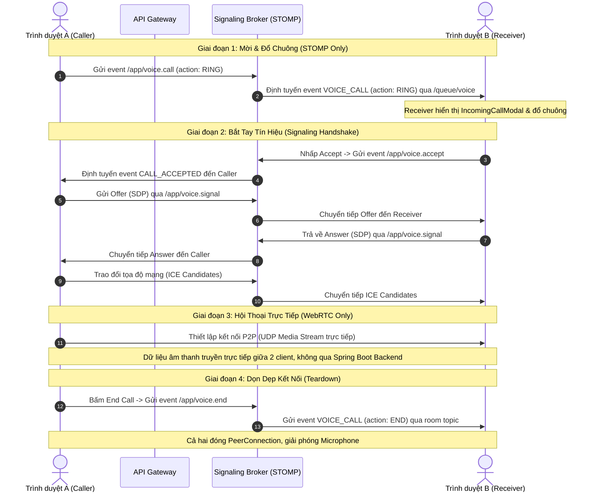

# Báo Cáo Kỹ Thuật: Bản Chất Luồng Hoạt Động & Sự Cố Tín Hiệu Voice Call

Báo cáo này làm rõ bản chất hoạt động của tính năng Voice Call (Cuộc gọi thoại) trên MiniDiscord dựa trên sự kết hợp giữa giao tiếp thời gian thực STOMP/WebSocket và giao thức P2P WebRTC, đồng thời phân tích sự cố lỗi tín hiệu cuộc gọi đến mới phát hiện và phương án khắc phục đã triển khai.

---

## 1. Bản Chất Luồng Hoạt Động Của Voice Call

Tính năng Voice Call trên MiniDiscord được chia tách rõ ràng thành hai lớp giao tiếp có trách nhiệm khác nhau:

### A. Lớp Tín Hiệu (Signaling Layer - STOMP/WebSocket)
- **Vai trò:** Hoạt động như một "tổng đài viên" phối hợp và định tuyến thông điệp điều khiển.
- **Tính chất:** TCP-based, đi qua API Gateway và Backend Spring Boot.
- **Trách nhiệm:** 
  - Điều khiển vòng đời cuộc gọi (Báo cuộc gọi đến, Chấp nhận, Từ chối, Cúp máy).
  - Làm trung gian "bà mối" (Signaling Broker) để truyền tải thông tin cấu hình **SDP** (Session Description Protocol) và địa chỉ kết nối mạng **ICE Candidates** giữa hai đối tác (Peers) trước khi cuộc gọi P2P bắt đầu.
  - **Lưu ý:** Lớp này tuyệt đối **không** truyền tải dữ liệu âm thanh (audio stream) để tránh gây trễ (latency), nghẽn mạng và quá tải server.

### B. Lớp Truyền Tải Âm Thanh (Media Layer - WebRTC P2P)
- **Vai trò:** Thiết lập kết nối truyền phát dữ liệu âm thanh trực tiếp giữa hai trình duyệt.
- **Tính chất:** UDP-based, truyền thông trực tiếp Peer-to-Peer (P2P).
- **Trách nhiệm:**
  - Sau khi kết nối thành công, dữ liệu âm thanh đã mã hóa được truyền trực tiếp giữa trình duyệt A và trình duyệt B, bỏ qua hoàn toàn máy chủ Spring Boot.
  - Áp dụng các kỹ thuật khử tiếng ồn (Noise Suppression), chống tiếng vang (Echo Cancellation) và tự động bù độ lợi âm (Auto Gain Control).

---

## 2. Chi Tiết Lộ Trình 4 Giai Đoạn Vòng Đời Cuộc Gọi (Lifecycle Phases)

### 📍 Giai đoạn 1: Lời Mời & Đổ Chuông (The Invitation - STOMP Only)
1. **Người gọi (Caller):** Nhấp vào biểu tượng gọi thoại trong DM với đối tác. Client gửi STOMP Message với `action: RING` lên endpoint `/app/voice.call`.
2. **Backend:** Nhận yêu cầu, thiết lập trạng thái cuộc gọi tạm thời vào Redis (`RINGING`) và định tuyến (forward) thông điệp qua STOMP queue cá nhân `/queue/voice` của người nhận với `eventType: "VOICE_CALL"` và `action: "RING"`.
3. **Người nhận (Receiver):** Trình duyệt nhận được sự kiện, kích hoạt hiển thị [IncomingCallModal.tsx](file:///e:/UIT/cv/MiniDiscord/frontend/components/voice/IncomingCallModal.tsx) và gọi `soundEngine.playLoop("call_ringing")` để phát chuông nhận dạng cuộc gọi.

### 📍 Giai đoạn 2: Bắt Tay Tín Hiệu (Signaling Handshake - WebRTC + STOMP)
1. **Nhấc máy:** Người nhận bấm **Accept**. Client gửi STOMP message lên `/app/voice.accept`. Backend chuyển tiếp thông báo `CALL_ACCEPTED` đến Người gọi để tắt chuông chờ và ra hiệu bắt đầu thỏa thuận WebRTC.
2. **SDP Offer:** Người gọi khởi tạo đối tượng `RTCPeerConnection`, bật microphone để lấy [LocalStream](file:///e:/UIT/cv/MiniDiscord/frontend/lib/webrtc.ts#35-49), tạo bản mô tả SDP Offer và gửi lên `/app/voice.signal`. Backend định tuyến Offer này đến Người nhận.
3. **SDP Answer:** Người nhận nhận được Offer, thiết lập cấu hình từ xa, bật micro của mình, tạo SDP Answer gửi ngược lại qua `/app/voice.signal`.
4. **ICE Candidate Exchange:** Trong lúc đó, cả hai client tự liên hệ với ICE/TURN Servers (Metered.ca) để tìm kiếm các địa chỉ mạng Public (tọa độ IP công cộng). Các thông tin "tọa độ" (ICE Candidates) này được gửi chéo qua kênh STOMP để đối phương thử kết nối.

### 📍 Giai đoạn 3: Hội Thoại Trực Tiếp (Media Streaming - WebRTC P2P)
1. **Kết nối P2P:** Khi cả hai bên đã nạp đầy đủ SDP (Offer/Answer) và tọa độ mạng (ICE Candidates) của nhau, WebRTC tự động thử nghiệm và thiết lập đường kết nối trực tiếp tối ưu nhất (sử dụng giao thức UDP).
2. **Stream âm thanh:** Sau khi bắt tay kết nối P2P thành công, STOMP được đưa về trạng thái rảnh. Luồng âm thanh thời gian thực đi trực tiếp giữa thiết bị của A và B mà không chạy qua máy chủ trung gian.

### 📍 Giai đoạn 4: Dọn Dẹp Kết Nối (Teardown - WebRTC + STOMP)
1. **Gác máy:** Một trong hai bên nhấn nút **End Call (Ngắt kết nối)**. Client gửi sự kiện đến `/app/voice.end`.
2. **Đồng bộ hóa:** Backend xóa trạng thái cuộc gọi trong Redis, tính toán thời lượng đàm thoại gửi message lưu trữ log hệ thống và đồng thời gửi sự kiện `VOICE_CALL` với `action: "END"` qua kênh room topic để thông báo cho bên còn lại.
3. **Giải phóng tài nguyên:** Cả hai trình duyệt tắt truy cập Microphone, hủy liên kết `MediaStream`, gọi `peerConnection.close()` để đóng hoàn toàn kết nối WebRTC và dọn dẹp bộ nhớ RAM.

---