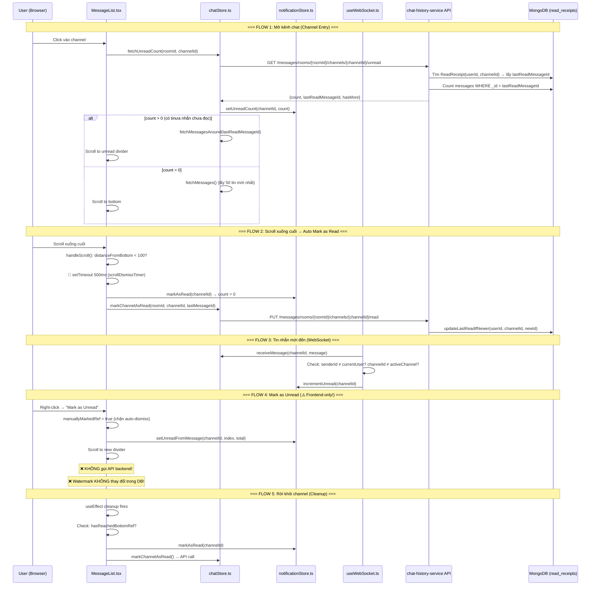

# Watermark (Read/Unread) Flow — Full Trace & Analysis

## Kiến trúc tổng quan



---

## File Map — Ai làm gì?

| File | Vai trò |
|------|---------|
| [MessageList.tsx](file:///e:/UIT/cv/MiniDiscord/frontend/components/chat/MessageList.tsx) | Scroll detection, auto-dismiss timer, initial scroll positioning, mark-as-unread trigger |
| [chatStore.ts](file:///e:/UIT/cv/MiniDiscord/frontend/stores/chatStore.ts) | [fetchUnreadCount](file:///e:/UIT/cv/MiniDiscord/frontend/stores/chatStore.ts#79-94), [markChannelAsRead](file:///e:/UIT/cv/MiniDiscord/frontend/stores/chatStore.ts#95-108), [fetchMessagesAround](file:///e:/UIT/cv/MiniDiscord/frontend/stores/chatStore.ts#148-184) — Bridge to backend API |
| [notificationStore.ts](file:///e:/UIT/cv/MiniDiscord/frontend/stores/notificationStore.ts) | In-memory unread counter (`Record<channelId, number>`) |
| [useWebSocket.ts](file:///e:/UIT/cv/MiniDiscord/frontend/hooks/useWebSocket.ts#L175-L186) | Incoming message → [incrementUnread](file:///e:/UIT/cv/MiniDiscord/frontend/stores/notificationStore.ts#53-61) (skip own msgs, skip active channel) |
| [MessageController.java](file:///e:/UIT/cv/MiniDiscord/backend/chat-history-service/src/main/java/com/discordmini/chathistory/controller/MessageController.java#L88-L107) | REST endpoints: `PUT .../read`, `GET .../unread` |
| [ReadReceiptService.java](file:///e:/UIT/cv/MiniDiscord/backend/chat-history-service/src/main/java/com/discordmini/chathistory/service/ReadReceiptService.java) | Core logic: [markAsRead()](file:///e:/UIT/cv/MiniDiscord/backend/chat-history-service/src/main/java/com/discordmini/chathistory/service/ReadReceiptService.java#28-54), [getUnreadCount()](file:///e:/UIT/cv/MiniDiscord/backend/chat-history-service/src/main/java/com/discordmini/chathistory/controller/MessageController.java#99-108) |
| [ReadReceiptRepository.java](file:///e:/UIT/cv/MiniDiscord/backend/chat-history-service/src/main/java/com/discordmini/chathistory/repository/ReadReceiptRepository.java) | MongoDB query: [updateLastReadIfNewer](file:///e:/UIT/cv/MiniDiscord/backend/chat-history-service/src/main/java/com/discordmini/chathistory/repository/ReadReceiptRepository.java#17-21) with `$lt` string comparison |
| [ReadReceipt.java](file:///e:/UIT/cv/MiniDiscord/backend/chat-history-service/src/main/java/com/discordmini/chathistory/model/document/ReadReceipt.java) | Document: `{userId, roomId, channelId, lastReadMessageId, lastReadAt}` |

---

## 🚨 Các vấn đề chính

### 1. Mark as Unread chỉ là frontend-only — Không persist backend

**Vị trí**: [MessageList.tsx:405-418](file:///e:/UIT/cv/MiniDiscord/frontend/components/chat/MessageList.tsx#L405-L418)

```typescript
onMarkUnread={() => {
  manuallyMarkedRef.current = true;
  setIsDismissed(false);
  useNotificationStore.getState().setUnreadFromMessage(channelId, i, messages.length);
  // ❌ KHÔNG có API call nào → Backend watermark KHÔNG thay đổi
}}
```

**Hậu quả**: Khi refresh trang, "Mark as Unread" biến mất vì backend vẫn giữ watermark cũ. Đây là lý do **Mark as Unread chỉ hoạt động khi có trigger frontend** (scroll nhẹ) — vì nó chỉ set state trên RAM, không lưu DB.

---

### 2. Scroll-coordinate auto-dismiss — Quá phức tạp, gây lag

**Vị trí**: [MessageList.tsx:269-320](file:///e:/UIT/cv/MiniDiscord/frontend/components/chat/MessageList.tsx#L269-L320)

Logic hiện tại:
- **8 refs** đang quản lý scroll state (`isAtBottomRef`, `hasReachedBottomRef`, `initialScrollCompleteRef`, `isFetchingOlderRef`, `scrollDismissTimerRef`, `unreadCountRef`, `manuallyMarkedRef`, `messagesRef`)
- `handleScroll()` fires on **mỗi scroll frame** → check `distanceFromBottom < 100` → start 500ms timer → auto-clear unread
- Timer 500ms dễ bị clear/restart liên tục khi scroll jittery
- `document.hasFocus()` check thêm một layer phức tạp

---

### 3. Backend [updateLastReadIfNewer](file:///e:/UIT/cv/MiniDiscord/backend/chat-history-service/src/main/java/com/discordmini/chathistory/repository/ReadReceiptRepository.java#17-21) dùng string `$lt` — Tiềm ẩn bug

**Vị trí**: [ReadReceiptRepository.java:18-20](file:///e:/UIT/cv/MiniDiscord/backend/chat-history-service/src/main/java/com/discordmini/chathistory/repository/ReadReceiptRepository.java#L18-L20)

```java
@Query("{ 'userId': ?0, 'channelId': ?1, 'lastReadMessageId': { '$lt': ?2 } }")
```

Đang dùng `$lt` trên **string** thay vì ObjectId. MongoDB string comparison dùng lexicographic order. ObjectId hex strings tăng dần theo thời gian nên thường work, nhưng **nếu `lastReadMessageId` là UUID** (như từ WebSocket) thì comparison sẽ sai. Service đã handle fallback cho UUID→ObjectId lookup trong [getUnreadCount](file:///e:/UIT/cv/MiniDiscord/backend/chat-history-service/src/main/java/com/discordmini/chathistory/controller/MessageController.java#99-108) nhưng **KHÔNG** handle trong [updateLastReadIfNewer](file:///e:/UIT/cv/MiniDiscord/backend/chat-history-service/src/main/java/com/discordmini/chathistory/repository/ReadReceiptRepository.java#17-21).

---

### 4. Cleanup effect có thể mark-as-read SAI

**Vị trí**: [MessageList.tsx:168-182](file:///e:/UIT/cv/MiniDiscord/frontend/components/chat/MessageList.tsx#L168-L182)

Khi user rời channel, cleanup gọi [markAsRead](file:///e:/UIT/cv/MiniDiscord/backend/chat-history-service/src/main/java/com/discordmini/chathistory/service/ReadReceiptService.java#28-54) + backend sync chỉ khi `hasReachedBottomRef.current === true`. Nhưng:
- Nếu user scroll gần bottom (< 100px) → `hasReachedBottomRef = true` → cleanup fires → backend watermark updated
- Nếu user chỉ nhìn unread divider ở giữa rồi switch channel → watermark KHÔNG update (đúng)
- **Edge case**: User scroll xuống bottom, scroll lên lại, rồi switch channel → vẫn mark as read dù chưa xem hết tin nhắn mới nhất

---

### 5. [incrementUnread](file:///e:/UIT/cv/MiniDiscord/frontend/stores/notificationStore.ts#53-61) trong useWebSocket.ts — Race condition với active channel

**Vị trí**: [useWebSocket.ts:175-186](file:///e:/UIT/cv/MiniDiscord/frontend/hooks/useWebSocket.ts#L175-L186)

```typescript
if (data.channelId !== activeChannelId || !isFocused) {
  useNotificationStore.getState().incrementUnread(data.channelId);
}
```

Check `activeChannelId` via `useUIStore` — nhưng giá trị này có thể stale nếu WS message đến trong lúc user đang switch channel (race condition giữa `setActiveChannelId` và message arrival).

---

### 6. Re-render cascade từ `unreadCount` state

[MessageList](file:///e:/UIT/cv/MiniDiscord/frontend/components/chat/MessageList.tsx#14-27) subscribe trực tiếp vào [getUnreadCount(channelId)](file:///e:/UIT/cv/MiniDiscord/backend/chat-history-service/src/main/java/com/discordmini/chathistory/controller/MessageController.java#99-108) ở line 74. Mỗi khi [incrementUnread](file:///e:/UIT/cv/MiniDiscord/frontend/stores/notificationStore.ts#53-61) hoặc [markAsRead](file:///e:/UIT/cv/MiniDiscord/backend/chat-history-service/src/main/java/com/discordmini/chathistory/service/ReadReceiptService.java#28-54) fire → **toàn bộ MessageList re-render** kể cả khi user đang ở đúng channel đó. Đây là nguyên nhân chính gây **giật lag**.

---

### 7. `isPositioned` / `isUnreadReady` — Double gate gây flicker

Hai boolean gates (`isUnreadReady` + `isPositioned`) tạo opacity transition `0 → 1`. Nếu [fetchUnreadCount](file:///e:/UIT/cv/MiniDiscord/frontend/stores/chatStore.ts#79-94) chậm → user thấy màn hình trống rồi flash nội dung.

---

## Tóm tắt: Logic cần loại bỏ

| Logic hiện tại | Vấn đề | Giải pháp đề xuất |
|---|---|---|
| Scroll-coordinate auto-dismiss (500ms timer) | Giật, phức tạp, nhiều refs | **Bỏ hoàn toàn.** Watermark chỉ update khi user thao tác explicit |
| `hasReachedBottomRef` guard | Edge cases sai | Bỏ. Dùng explicit actions thay thế |
| `initialScrollCompleteRef` timing | Race condition | Bỏ. Không cần block scroll detection |
| `scrollDismissTimerRef` debounce | Gây lag, re-render | Bỏ. Không auto-dismiss |
| `manuallyMarkedRef` | Workaround cho auto-dismiss | Bỏ — không cần nếu không có auto-dismiss |
| Opacity gate (`isPositioned`) | Flicker | Có thể giữ nhưng simplified |
| Mark as Unread frontend-only | Không persist | Cần thêm backend API hoặc chấp nhận chỉ local |
